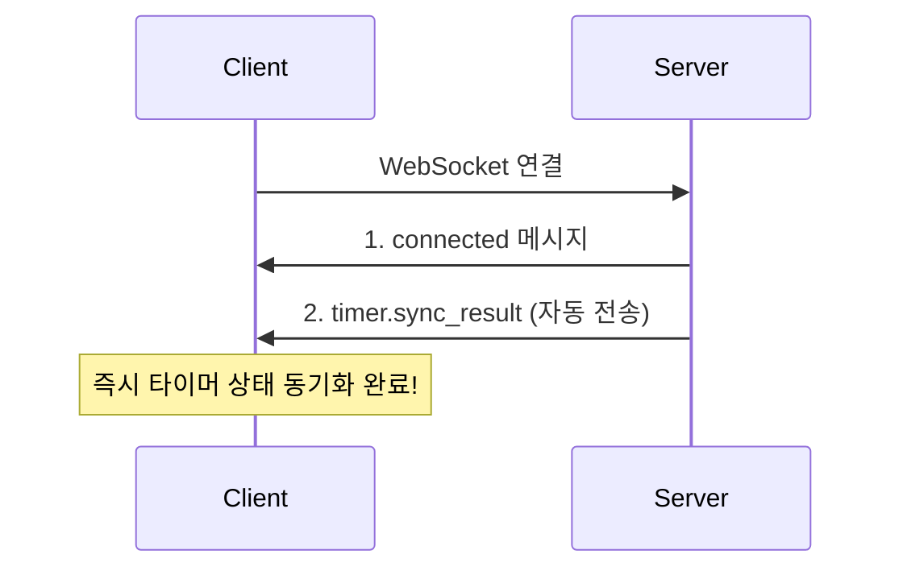

# Timer API 가이드 (프론트엔드 개발자용)

> **최종 업데이트**: 2026-01-28
> **중요 변경**: 타이머 제어 작업이 WebSocket 기반으로 전환되었습니다.

## 목차

1. [개요](#개요)
2. [아키텍처 변경 (2026-01-28)](#아키텍처-변경-2026-01-28)
3. [데이터 모델](#데이터-모델)
4. [WebSocket API](#websocket-api)
5. [REST API (조회/삭제만)](#rest-api-조회삭제만)
6. [TypeScript 타입 정의](#typescript-타입-정의)
7. [사용 예시](#사용-예시)
8. [주의사항](#주의사항)

---

## 개요

Timer API는 **일정(Schedule)**, **할 일(Todo)**, 또는 **독립적으로** 타이머를 생성하고 관리할 수 있습니다.

### 핵심 개념

| 개념 | 설명 |
|------|------|
| **Timer** | 시간 측정 세션. Schedule, Todo, 또는 둘 다에 연결 가능. 독립 타이머도 가능. |
| **Schedule** | 캘린더 일정. 타이머를 통해 작업 시간 측정 가능. |
| **Todo** | 할 일 항목. 타이머를 통해 작업 시간 측정 가능. |

---

## 아키텍처 변경 (2026-01-28)

### 변경 이유

1. **일시정지 이력 추적**: 단일 `paused_at` 컬럼으로는 여러 번의 일시정지/재개 이력 저장 불가
2. **멀티 플랫폼 동기화**: REST 폴링 방식으로는 실시간 동기화 어려움
3. **친구 알림**: 친구의 타이머 활동을 실시간으로 알림

### 새로운 아키텍처

```
┌─────────────────────────────────────────────────────────────────────┐
│  멀티 플랫폼 실시간 동기화                                            │
│                                                                     │
│  ┌──────────┐   ┌──────────┐   ┌──────────┐                        │
│  │   Web    │   │  Mobile  │   │ Desktop  │                        │
│  └────┬─────┘   └────┬─────┘   └────┬─────┘                        │
│       │              │              │                               │
│       └──────────────┼──────────────┘                               │
│                      │                                              │
│                      ▼                                              │
│              ┌───────────────┐                                      │
│              │   WebSocket   │                                      │
│              │  /v1/ws/timers   │                                      │
│              └───────┬───────┘                                      │
│                      │                                              │
│       ┌──────────────┼──────────────┐                               │
│       ▼              ▼              ▼                               │
│  ┌─────────┐   ┌──────────┐   ┌──────────┐                         │
│  │ 내 기기  │   │ 다른 기기 │   │  친구    │                         │
│  │ 동기화   │   │  동기화   │   │  알림    │                         │
│  └─────────┘   └──────────┘   └──────────┘                         │
└─────────────────────────────────────────────────────────────────────┘
```

### API 변경 요약

| 작업 | 이전 (REST) | 현재 (WebSocket) |
|------|-------------|------------------|
| 타이머 생성 | `POST /v1/timers` | `timer.create` 메시지 |
| 일시정지 | `PATCH /v1/timers/{id}/pause` | `timer.pause` 메시지 |
| 재개 | `PATCH /v1/timers/{id}/resume` | `timer.resume` 메시지 |
| 종료 | `POST /v1/timers/{id}/stop` | `timer.stop` 메시지 |
| 조회 | `GET /v1/timers/*` | **유지** (REST) |
| 삭제 | `DELETE /v1/timers/{id}` | **유지** (REST) |
| 업데이트 | `PATCH /v1/timers/{id}` | **유지** (REST) |

---

## 데이터 모델

### Timer

```typescript
interface Timer {
  id: string;                   // UUID
  schedule_id?: string;         // Schedule ID (Optional)
  todo_id?: string;             // Todo ID (Optional)
  title?: string;               // 타이머 제목
  description?: string;         // 타이머 설명
  allocated_duration: number;   // 할당 시간 (초 단위)
  elapsed_time: number;         // 경과 시간 (초 단위)
  status: TimerStatus;          // 상태
  started_at?: string;          // 시작 시간 (ISO 8601)
  paused_at?: string;           // 마지막 일시정지 시간 (ISO 8601)
  ended_at?: string;            // 종료 시간 (ISO 8601)
  pause_history: PauseEvent[];  // 일시정지/재개 이력 (NEW!)
  created_at: string;           // 생성 시간 (ISO 8601)
  updated_at: string;           // 수정 시간 (ISO 8601)
  schedule?: Schedule;          // Schedule 정보
  todo?: Todo;                  // Todo 정보
  tags: Tag[];                  // 연결된 태그 목록
  owner_id?: string;            // 소유자 ID
  is_shared: boolean;           // 공유된 타이머인지
}

type TimerStatus = 
  | "RUNNING"    // 실행 중
  | "PAUSED"     // 일시정지
  | "COMPLETED"  // 완료
  | "CANCELLED"; // 취소됨

interface PauseEvent {
  action: "start" | "pause" | "resume" | "stop" | "cancel";
  at: string;           // ISO 8601 시간
  elapsed?: number;     // 경과 시간 (pause, stop 시)
}
```

### pause_history 예시

```json
[
  { "action": "start", "at": "2026-01-28T10:00:00Z" },
  { "action": "pause", "at": "2026-01-28T10:30:00Z", "elapsed": 1800 },
  { "action": "resume", "at": "2026-01-28T10:35:00Z" },
  { "action": "pause", "at": "2026-01-28T10:50:00Z", "elapsed": 2700 },
  { "action": "resume", "at": "2026-01-28T11:00:00Z" },
  { "action": "stop", "at": "2026-01-28T11:30:00Z", "elapsed": 4500 }
]
```

---

## WebSocket API

### 연결

**개발 환경:**
```
ws://localhost:8000/v1/ws/timers?token=<JWT_TOKEN>&timezone=Asia/Seoul
```

**프로덕션 환경:**
```
wss://your-domain.com/v1/ws/timers?token=<JWT_TOKEN>&timezone=Asia/Seoul
```

**쿼리 파라미터:**
- `token`: JWT 인증 토큰 (필수)
- `timezone`: 타임존 (선택, 예: `UTC`, `+09:00`, `Asia/Seoul`)
  - 지정하지 않으면 UTC naive datetime으로 반환
  - 지정하면 모든 응답의 datetime 필드가 해당 타임존으로 변환됨

또는 Sec-WebSocket-Protocol 헤더 사용:

```javascript
const ws = new WebSocket('ws://localhost:8000/v1/ws/timers?timezone=Asia/Seoul', [
  `authorization.bearer.${jwtToken}`
]);
```

### 연결 후 자동 동기화 (NEW!) 🔥

**연결 즉시 활성 타이머가 자동으로 전송됩니다!**



**특징:**
- ✅ **자동 전송**: 연결 즉시 활성 타이머(RUNNING/PAUSED) 자동 수신
- ✅ **빠른 초기화**: 별도 sync 요청 불필요
- ✅ **멀티 디바이스**: 새 기기 연결 시 즉시 동기화

### ⚠️ 중요: CORS 설정

WebSocket 연결이 작동하려면 **백엔드 서버의 `CORS_ALLOWED_ORIGINS` 환경변수에 WebSocket URL을 반드시 추가**해야 합니다:

**개발 환경:**
```bash
CORS_ALLOWED_ORIGINS=http://localhost:3000,http://localhost:8000,http://127.0.0.1:3000,http://127.0.0.1:8000,ws://localhost:8000,ws://127.0.0.1:8000
```

**프로덕션 환경:**
```bash
CORS_ALLOWED_ORIGINS=https://example.com,https://app.example.com,wss://api.example.com
```

> 💡 **Tip**: `ws://`는 HTTP용, `wss://`는 HTTPS용입니다. 프로덕션에서는 반드시 `wss://`를 사용하세요.

### 연결 성공 응답

**1. 연결 확인 메시지:**

```json
{
  "type": "connected",
  "payload": {
    "user_id": "user-uuid",
    "message": "Connected to timer WebSocket"
  },
  "timestamp": "2026-01-28T10:00:00Z"
}
```

**2. 자동 동기화 메시지 (즉시 전송):**

```json
{
  "type": "timer.sync_result",
  "payload": {
    "timers": [
      {
        "id": "timer-uuid",
        "title": "작업 중인 타이머",
        "status": "RUNNING",
        "elapsed_time": 1234,
        ...
      }
    ],
    "count": 1
  },
  "from_user": "user-uuid",
  "timestamp": "2026-01-28T10:00:00Z"
}
```

> **참고**: `timers` 배열이 비어있으면(`count: 0`) 활성 타이머가 없는 상태입니다.

---

### 클라이언트 → 서버 메시지

#### 타이머 생성 (timer.create)

```json
{
  "type": "timer.create",
  "payload": {
    "allocated_duration": 3600,
    "title": "작업 타이머",
    "description": "프로젝트 작업",
    "schedule_id": "uuid-or-null",
    "todo_id": "uuid-or-null",
    "tag_ids": ["tag-uuid-1"]
  }
}
```

| 필드 | 타입 | 필수 | 설명 |
|------|------|------|------|
| `allocated_duration` | number | ✅ | 할당 시간 (초 단위, 양수 필수) |
| `title` | string | ❌ | 타이머 제목 |
| `description` | string | ❌ | 타이머 설명 |
| `schedule_id` | UUID | ❌ | Schedule ID |
| `todo_id` | UUID | ❌ | Todo ID |
| `tag_ids` | UUID[] | ❌ | 태그 ID 리스트 |

#### 타이머 일시정지 (timer.pause)

```json
{
  "type": "timer.pause",
  "payload": {
    "timer_id": "timer-uuid"
  }
}
```

#### 타이머 재개 (timer.resume)

```json
{
  "type": "timer.resume",
  "payload": {
    "timer_id": "timer-uuid"
  }
}
```

#### 타이머 종료 (timer.stop)

```json
{
  "type": "timer.stop",
  "payload": {
    "timer_id": "timer-uuid"
  }
}
```

#### 타이머 동기화 요청 (timer.sync)

**수동 동기화가 필요한 경우에만 사용:**

```json
{
  "type": "timer.sync",
  "payload": {
    "timer_id": "timer-uuid",  // 선택: 특정 타이머 조회
    "scope": "active"           // 선택: "active" (기본값) | "all"
  }
}
}
```

| 필드 | 타입 | 기본값 | 설명 |
|------|------|--------|------|
| `timer_id` | UUID | - | 특정 타이머 ID (생략 시 목록 조회) |
| `scope` | string | active | `active`: 활성 타이머만, `all`: 모든 타이머 |

**응답:**

- 단건 조회 (timer_id 지정): `timer.updated` 메시지
- 목록 조회 (timer_id 생략): `timer.sync_result` 메시지

> **💡 Tip**: 연결 시 자동 동기화가 되므로, 수동 sync는 **재연결 후 상태 확인**이 필요한 경우에만 사용하세요.

---

### 서버 → 클라이언트 메시지

#### 타이머 생성됨 (timer.created)

```json
{
  "type": "timer.created",
  "payload": {
    "timer": { /* Timer 객체 */ },
    "action": "start"
  },
  "from_user": "user-uuid",
  "timestamp": "2026-01-28T10:00:00Z"
}
```

#### 타이머 업데이트됨 (timer.updated)

```json
{
  "type": "timer.updated",
  "payload": {
    "timer": { /* Timer 객체 */ },
    "action": "pause"  // "pause" | "resume" | "stop" | "sync"
  },
  "from_user": "user-uuid",
  "timestamp": "2026-01-28T10:30:00Z"
}
```

#### 타이머 동기화 결과 (timer.sync_result)

```json
{
  "type": "timer.sync_result",
  "payload": {
    "timers": [ /* Timer 객체 배열 */ ],
    "count": 2
  },
  "from_user": "user-uuid",
  "timestamp": "2026-01-28T10:30:00Z"
}
```

#### 친구 활동 알림 (timer.friend_activity)

```json
{
  "type": "timer.friend_activity",
  "payload": {
    "friend_id": "friend-user-uuid",
    "action": "start",
    "timer_id": "timer-uuid",
    "timer_title": "친구의 작업"
  },
  "from_user": "friend-user-uuid",
  "timestamp": "2026-01-28T10:00:00Z"
}
```

#### 에러 (error)

```json
{
  "type": "error",
  "payload": {
    "code": "PAUSE_FAILED",
    "message": "Cannot pause timer with status completed"
  },
  "timestamp": "2026-01-28T10:00:00Z"
}
```

---

## REST API (조회/삭제만)

> **주의**: 타이머 생성, 일시정지, 재개, 종료는 WebSocket으로만 가능합니다.

### Base URL

```
/v1
```

### 타이머 목록 조회

```http
GET /v1/timers
```

**Query Parameters:**

| 파라미터 | 타입 | 기본값 | 설명 |
|---------|------|--------|------|
| `scope` | string | mine | 조회 범위: mine, shared, all |
| `status` | string[] | - | 상태 필터 (RUNNING, PAUSED, COMPLETED, CANCELLED) |
| `type` | string | - | 타입 필터: independent, schedule, todo |
| `start_date` | datetime | - | 시작 날짜 필터 |
| `end_date` | datetime | - | 종료 날짜 필터 |
| `include_schedule` | boolean | false | Schedule 정보 포함 |
| `include_todo` | boolean | false | Todo 정보 포함 |
| `tag_include_mode` | string | none | 태그 포함 모드 |
| `timezone` | string | UTC | 타임존 |

### 현재 활성 타이머 조회

```http
GET /v1/timers/active
```

활성 타이머가 없으면 **404 Not Found** 반환

### 타이머 상세 조회

```http
GET /v1/timers/{timer_id}
```

### 타이머 메타데이터 업데이트

```http
PATCH /v1/timers/{timer_id}
Content-Type: application/json

{
  "title": "업데이트된 제목",
  "description": "업데이트된 설명",
  "tag_ids": ["tag-uuid"]
}
```

### 타이머 삭제

```http
DELETE /v1/timers/{timer_id}
```

---

## TypeScript 타입 정의

```typescript
// ============================================================
// Enums
// ============================================================

export type TimerStatus = "RUNNING" | "PAUSED" | "COMPLETED" | "CANCELLED";
export type TimerAction = "start" | "pause" | "resume" | "stop" | "cancel" | "sync";
export type WSMessageType = 
  | "timer.create" | "timer.pause" | "timer.resume" | "timer.stop" | "timer.sync"
  | "timer.created" | "timer.updated" | "timer.deleted" | "timer.sync_result" | "timer.friend_activity"
  | "connected" | "error";

// ============================================================
// Timer Types
// ============================================================

export interface PauseEvent {
  action: TimerAction;
  at: string;
  elapsed?: number;
}

export interface Timer {
  id: string;
  schedule_id?: string;
  todo_id?: string;
  title?: string;
  description?: string;
  allocated_duration: number;
  elapsed_time: number;
  status: TimerStatus;
  started_at?: string;
  paused_at?: string;
  ended_at?: string;
  pause_history: PauseEvent[];
  created_at: string;
  updated_at: string;
  schedule?: Schedule;
  todo?: Todo;
  tags: Tag[];
  owner_id?: string;
  is_shared: boolean;
}

export interface TimerCreate {
  schedule_id?: string;
  todo_id?: string;
  title?: string;
  description?: string;
  allocated_duration: number;
  tag_ids?: string[];
}

// ============================================================
// WebSocket Messages
// ============================================================

export interface WSClientMessage {
  type: WSMessageType;
  payload: Record<string, unknown>;
}

export interface WSServerMessage {
  type: WSMessageType;
  payload: Record<string, unknown>;
  from_user?: string;
  timestamp: string;
}

export interface TimerUpdatedPayload {
  timer: Timer;
  action: TimerAction;
}

export interface FriendActivityPayload {
  friend_id: string;
  action: TimerAction;
  timer_id: string;
  timer_title?: string;
}

export interface TimerSyncResultPayload {
  timers: Timer[];
  count: number;
}

export interface ErrorPayload {
  code: string;
  message: string;
}
```

---

## 사용 예시

### WebSocket 연결 및 타이머 제어

```typescript
class TimerWebSocket {
  private ws: WebSocket | null = null;
  private reconnectAttempts = 0;
  private maxReconnectAttempts = 5;
  
  constructor(
    private token: string,
    private onMessage: (msg: WSServerMessage) => void,
    private onError?: (error: Event) => void,
    private timezone?: string,  // 타임존 (예: "Asia/Seoul", "+09:00")
  ) {}

  connect(): void {
    // 환경에 따라 ws:// 또는 wss:// 사용
    const protocol = window.location.protocol === 'https:' ? 'wss:' : 'ws:';
    const host = window.location.host; // 또는 명시적으로 API 서버 주소 지정
    
    // 타임존 파라미터 추가
    const params = new URLSearchParams({ token: this.token });
    if (this.timezone) {
      params.append('timezone', this.timezone);
    }
    const wsUrl = `${protocol}//${host}/v1/ws/timers?${params.toString()}`;
    
    this.ws = new WebSocket(wsUrl);

    this.ws.onopen = () => {
      console.log('Timer WebSocket connected');
      this.reconnectAttempts = 0;
    };

    this.ws.onmessage = (event) => {
      const message: WSServerMessage = JSON.parse(event.data);
      this.onMessage(message);
    };

    this.ws.onerror = (error) => {
      console.error('WebSocket error:', error);
      this.onError?.(error);
    };

    this.ws.onclose = () => {
      console.log('WebSocket closed');
      this.attemptReconnect();
    };
  }

  private attemptReconnect(): void {
    if (this.reconnectAttempts < this.maxReconnectAttempts) {
      this.reconnectAttempts++;
      const delay = Math.pow(2, this.reconnectAttempts) * 1000;
      setTimeout(() => this.connect(), delay);
    }
  }

  private send(message: WSClientMessage): void {
    if (this.ws?.readyState === WebSocket.OPEN) {
      this.ws.send(JSON.stringify(message));
    }
  }

  createTimer(data: TimerCreate): void {
    this.send({
      type: 'timer.create',
      payload: data,
    });
  }

  pauseTimer(timerId: string): void {
    this.send({
      type: 'timer.pause',
      payload: { timer_id: timerId },
    });
  }

  resumeTimer(timerId: string): void {
    this.send({
      type: 'timer.resume',
      payload: { timer_id: timerId },
    });
  }

  stopTimer(timerId: string): void {
    this.send({
      type: 'timer.stop',
      payload: { timer_id: timerId },
    });
  }

  syncTimer(timerId?: string): void {
    this.send({
      type: 'timer.sync',
      payload: timerId ? { timer_id: timerId } : {},
    });
  }

  disconnect(): void {
    this.ws?.close();
    this.ws = null;
  }
}
```

### React Hook 예시

```typescript
import { useState, useEffect, useCallback, useRef } from 'react';

function useTimerWebSocket(token: string, timezone?: string) {
  const [activeTimers, setActiveTimers] = useState<Timer[]>([]);
  const [friendActivity, setFriendActivity] = useState<FriendActivityPayload | null>(null);
  const [connected, setConnected] = useState(false);
  const [synced, setSynced] = useState(false);  // 초기 동기화 완료 여부
  const [error, setError] = useState<string | null>(null);
  const wsRef = useRef<TimerWebSocket | null>(null);

  useEffect(() => {
    const handleMessage = (msg: WSServerMessage) => {
      switch (msg.type) {
        case 'connected':
          setConnected(true);
          break;
        case 'timer.sync_result':
          // 자동 동기화 또는 수동 sync 응답
          const syncPayload = msg.payload as TimerSyncResultPayload;
          setActiveTimers(syncPayload.timers);
          setSynced(true);
          break;
        case 'timer.created':
        case 'timer.updated':
          const payload = msg.payload as TimerUpdatedPayload;
          // 활성 타이머 목록 업데이트
          setActiveTimers(prev => {
            const filtered = prev.filter(t => t.id !== payload.timer.id);
            if (payload.timer.status === 'RUNNING' || payload.timer.status === 'PAUSED') {
              return [...filtered, payload.timer];
            }
            return filtered;
          });
          break;
        case 'timer.friend_activity':
          setFriendActivity(msg.payload as FriendActivityPayload);
          setTimeout(() => setFriendActivity(null), 3000);
          break;
        case 'error':
          const errorPayload = msg.payload as ErrorPayload;
          setError(errorPayload.message);
          break;
      }
    };

    wsRef.current = new TimerWebSocket(token, handleMessage, undefined, timezone);
    wsRef.current.connect();

    return () => {
      wsRef.current?.disconnect();
    };
  }, [token, timezone]);

  const createTimer = useCallback((data: TimerCreate) => {
    wsRef.current?.createTimer(data);
  }, []);

  const pauseTimer = useCallback((timerId: string) => {
    wsRef.current?.pauseTimer(timerId);
  }, []);

  const resumeTimer = useCallback((timerId: string) => {
    wsRef.current?.resumeTimer(timerId);
  }, []);

  const stopTimer = useCallback((timerId: string) => {
    wsRef.current?.stopTimer(timerId);
  }, []);

  const syncTimer = useCallback((scope: 'active' | 'all' = 'active') => {
    wsRef.current?.send({
      type: 'timer.sync',
      payload: { scope },
    });
  }, []);

  return {
    activeTimers,  // 활성 타이머 목록
    friendActivity,
    connected,
    synced,  // 초기 동기화 완료 여부
    error,
    createTimer,
    pauseTimer,
    resumeTimer,
    stopTimer,
    syncTimer,
  };
}

// 사용 예시
function TimerComponent() {
  const {
    activeTimers,
    friendActivity,
    connected,
    synced,
    createTimer,
    pauseTimer,
    resumeTimer,
    stopTimer,
  } = useTimerWebSocket(authToken, 'Asia/Seoul');  // 타임존 지정

  if (!connected) return <div>연결 중...</div>;
  if (!synced) return <div>동기화 중...</div>;

  return (
    <div>
      {friendActivity && (
        <div className="notification">
          친구 {friendActivity.friend_id}가 타이머를 {friendActivity.action}했습니다!
        </div>
      )}

      {activeTimers.length > 0 ? (
        <div>
          <h3>활성 타이머 ({activeTimers.length}개)</h3>
          {activeTimers.map(timer => (
            <div key={timer.id}>
              <h4>{timer.title || '타이머'}</h4>
              <p>상태: {timer.status}</p>
              <p>경과: {Math.floor(timer.elapsed_time / 60)}분</p>
              {/* datetime 필드는 이미 Asia/Seoul 타임존으로 변환됨 */}
              <p>시작: {new Date(timer.started_at).toLocaleString('ko-KR')}</p>
              
              {timer.status === 'RUNNING' && (
                <button onClick={() => pauseTimer(timer.id)}>일시정지</button>
              )}
              {timer.status === 'PAUSED' && (
                <>
                  <button onClick={() => resumeTimer(timer.id)}>재개</button>
                  <button onClick={() => stopTimer(timer.id)}>종료</button>
                </>
              )}
            </div>
          ))}
        </div>
      ) : (
        <button onClick={() => createTimer({
          allocated_duration: 1800,
          title: '포모도로'
        })}>
          타이머 시작
        </button>
      )}
    </div>
  );
}
```

---

## 주의사항

### 1. WebSocket 연결 필수

타이머 제어 작업(생성, 일시정지, 재개, 종료)은 **WebSocket 연결이 필수**입니다.
REST API로는 조회/삭제/메타데이터 업데이트만 가능합니다.

### 2. CORS 설정 필수 ⚠️

WebSocket 연결이 작동하지 않는다면 **백엔드의 CORS 설정을 확인하세요**:

**문제 증상:**
- WebSocket 연결 시 에러 코드 1006 (비정상 종료)
- 브라우저 콘솔에 CORS 에러
- 연결이 즉시 끊김

**해결 방법:**

백엔드 서버의 `.env` 파일 또는 환경변수에서 `CORS_ALLOWED_ORIGINS`를 설정하세요:

```bash
# 개발 환경
CORS_ALLOWED_ORIGINS=http://localhost:3000,http://localhost:8000,http://127.0.0.1:3000,http://127.0.0.1:8000,ws://localhost:8000,ws://127.0.0.1:8000

# 프로덕션 환경
CORS_ALLOWED_ORIGINS=https://example.com,https://app.example.com,wss://api.example.com
```

> 💡 **핵심**: WebSocket URL(`ws://` 또는 `wss://`)도 반드시 포함해야 합니다!

### 3. 멀티 플랫폼 동기화

같은 사용자가 여러 기기에서 접속한 경우:
- 한 기기에서 타이머를 일시정지하면 다른 기기에도 즉시 반영됩니다
- **새 기기 연결 시 자동으로 활성 타이머가 전송됩니다** (수동 sync 불필요)
- WebSocket 연결이 끊어진 기기는 재연결 시 자동 동기화로 상태를 복구합니다

### 4. 친구 알림

- 친구가 타이머를 시작/일시정지/재개/종료하면 `timer.friend_activity` 메시지를 받습니다
- 알림은 WebSocket에 연결된 온라인 친구에게만 전송됩니다

### 5. pause_history 활용

```typescript
// 총 작업 시간 계산
function getTotalWorkTime(history: PauseEvent[]): number {
  let totalWork = 0;
  let lastStart: Date | null = null;

  for (const event of history) {
    if (event.action === 'start' || event.action === 'resume') {
      lastStart = new Date(event.at);
    } else if ((event.action === 'pause' || event.action === 'stop') && lastStart) {
      const endTime = new Date(event.at);
      totalWork += (endTime.getTime() - lastStart.getTime()) / 1000;
      lastStart = null;
    }
  }

  return totalWork;
}

// 일시정지 횟수 계산
function getPauseCount(history: PauseEvent[]): number {
  return history.filter(e => e.action === 'pause').length;
}
```

### 6. 연결 재시도

WebSocket 연결이 끊어진 경우 지수 백오프로 재연결을 시도하세요:

```typescript
const delay = Math.pow(2, attempt) * 1000;  // 2초, 4초, 8초, 16초...
```

### 7. 타이머 상태 전이

```
           ┌──────────────────────────────────────┐
           │                                      │
           ↓                                      │
  ┌────────────────┐                              │
  │    RUNNING     │←──────────────┐              │
  └────────────────┘               │              │
           │                       │              │
           ↓ pause                 │ resume       │
  ┌────────────────┐               │              │
  │    PAUSED      │───────────────┘              │
  └────────────────┘                              │
           │                                      │
           ↓ stop                                 │ cancel
  ┌────────────────┐               ┌──────────────┴───┐
  │   COMPLETED    │               │    CANCELLED     │
  └────────────────┘               └──────────────────┘
```

---

## API 요약

### WebSocket API

| 방향 | 메시지 타입 | 설명 |
|------|-------------|------|
| → | `timer.create` | 타이머 생성 |
| → | `timer.pause` | 타이머 일시정지 |
| → | `timer.resume` | 타이머 재개 |
| → | `timer.stop` | 타이머 종료 |
| → | `timer.sync` | 타이머 동기화 요청 |
| ← | `connected` | 연결 성공 |
| ← | `timer.sync_result` | 타이머 목록 (자동/수동) |
| ← | `timer.created` | 타이머 생성됨 |
| ← | `timer.updated` | 타이머 업데이트됨 |
| ← | `timer.friend_activity` | 친구 활동 알림 |
| ← | `error` | 에러 |

### REST API

| Method | Endpoint | 설명 |
|--------|----------|------|
| GET | `/v1/timers` | 타이머 목록 조회 |
| GET | `/v1/timers/active` | 현재 활성 타이머 조회 |
| GET | `/v1/timers/{id}` | 타이머 상세 조회 |
| PATCH | `/v1/timers/{id}` | 타이머 메타데이터 업데이트 |
| DELETE | `/v1/timers/{id}` | 타이머 삭제 |
| GET | `/v1/schedules/{id}/timers` | Schedule의 타이머 조회 |
| GET | `/v1/todos/{id}/timers` | Todo의 타이머 조회 |

---

이 가이드를 참고하여 프론트엔드에서 WebSocket 기반 Timer 기능을 구현하세요!
