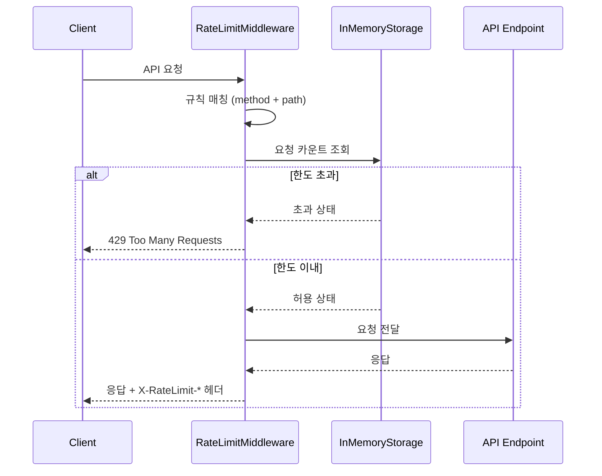

# Rate Limit 가이드

이 문서는 백엔드 API의 Rate Limit(요청 제한) 시스템에 대한 가이드입니다.

## 목차

1. [Rate Limit 개요](#1-rate-limit-개요)
2. [환경변수 설정](#2-환경변수-설정)
3. [활성화/비활성화](#3-활성화비활성화)
4. [엔드포인트별 규칙](#4-엔드포인트별-규칙)
5. [응답 헤더](#5-응답-헤더)
6. [429 에러 처리](#6-429-에러-처리)
7. [규칙 커스터마이징](#7-규칙-커스터마이징)

---

## 1. Rate Limit 개요

Rate Limit은 API 남용을 방지하고 서버 안정성을 보장하기 위한 요청 제한 시스템입니다.

### 동작 방식



### 핵심 개념

| 용어 | 설명 |
|------|------|
| **Window** | 요청 카운트를 측정하는 시간 윈도우 (기본 60초) |
| **Max Requests** | 윈도우 내 허용되는 최대 요청 수 |
| **User Identifier** | 사용자 식별 방법 (JWT sub 또는 IP 주소) |
| **Sliding Window** | 슬라이딩 윈도우 방식으로 정확한 요청 제한 |

### 사용자 식별

Rate Limit은 사용자별로 독립적으로 적용됩니다:

| 인증 상태 | 식별자 |
|-----------|--------|
| 인증됨 | JWT의 `sub` claim (OIDC 사용자 ID) |
| 미인증 | 클라이언트 IP 주소 (`X-Forwarded-For` 또는 직접 연결 IP) |

---

## 2. 환경변수 설정

### 환경변수 목록

| 환경변수 | 필수 | 기본값 | 설명 |
|----------|------|--------|------|
| `RATE_LIMIT_ENABLED` | X | `true` | Rate Limit 활성화 여부 |
| `RATE_LIMIT_DEFAULT_WINDOW` | X | `60` | 기본 윈도우 크기 (초) |
| `RATE_LIMIT_DEFAULT_REQUESTS` | X | `60` | 기본 최대 요청 수 |

### 예시 설정 (.env)

```bash
# Rate Limit 설정
RATE_LIMIT_ENABLED=true
RATE_LIMIT_DEFAULT_WINDOW=60
RATE_LIMIT_DEFAULT_REQUESTS=60
```

### Docker Compose 설정

```yaml
# compose.yaml
services:
  backend:
    environment:
      - RATE_LIMIT_ENABLED=true
      - RATE_LIMIT_DEFAULT_WINDOW=60
      - RATE_LIMIT_DEFAULT_REQUESTS=60
```

---

## 3. 활성화/비활성화

### Rate Limit 비활성화

개발 환경이나 테스트 시 Rate Limit을 비활성화할 수 있습니다.

#### 방법 1: 환경변수 설정

```bash
# .env 파일
RATE_LIMIT_ENABLED=false
```

#### 방법 2: 환경변수 직접 지정

```bash
# Linux/Mac
RATE_LIMIT_ENABLED=false uvicorn app.main:app --reload

# Windows (PowerShell)
$env:RATE_LIMIT_ENABLED="false"; uvicorn app.main:app --reload
```

### 비활성화 시 동작

- 모든 요청이 제한 없이 통과됩니다
- X-RateLimit-* 응답 헤더가 추가되지 않습니다
- 로그에 Rate Limit 관련 메시지가 출력되지 않습니다

> **주의**: 프로덕션 환경에서는 반드시 `RATE_LIMIT_ENABLED=true`로 설정하세요!

---

## 4. 엔드포인트별 규칙

Rate Limit 규칙은 엔드포인트와 HTTP 메서드에 따라 다르게 적용됩니다.

### 기본 규칙

| 엔드포인트 패턴 | 메서드 | Window | Max Requests | 설명 |
|-----------------|--------|--------|--------------|------|
| `/v1/todos` | POST | 60초 | 30 | Todo 생성 제한 |
| `/v1/schedules` | POST | 60초 | 30 | Schedule 생성 제한 |
| `/v1/timers` | POST | 60초 | 30 | Timer 생성 제한 |
| `/v1/tags` | POST | 60초 | 30 | Tag 생성 제한 |
| `/v1/tags/groups` | POST | 60초 | 30 | TagGroup 생성 제한 |
| `/v1/todos/*` | ALL | 60초 | 100 | Todo 일반 작업 |
| `/v1/schedules/*` | ALL | 60초 | 60 | Schedule 일반 작업 |
| `/v1/timers/*` | ALL | 60초 | 60 | Timer 일반 작업 |
| `/v1/tags/*` | ALL | 60초 | 60 | Tag 일반 작업 |
| `/v1/graphql` | ALL | 60초 | 60 | GraphQL 요청 |
| `/v1/*` | ALL | 60초 | 60 | 기타 API (폴백) |

### 규칙 적용 우선순위

1. **구체적인 규칙 우선**: 더 구체적인 경로/메서드 규칙이 먼저 적용됩니다
2. **첫 번째 매칭 사용**: 규칙 리스트를 순회하며 첫 번째 매칭 규칙 사용
3. **폴백 규칙**: 매칭되는 규칙이 없으면 `/v1/*` 전역 규칙 적용

### 예시: POST /v1/todos

```
요청: POST /v1/todos
→ 규칙 매칭: RateLimitRule(methods=["POST"], path_pattern="/v1/todos", ...)
→ 적용: 60초당 30회 제한
```

### 예시: GET /v1/todos

```
요청: GET /v1/todos
→ POST 전용 규칙 스킵
→ 규칙 매칭: RateLimitRule(path_pattern="/v1/todos", ...)
→ 적용: 60초당 100회 제한
```

---

## 5. 응답 헤더

모든 `/v1/*` API 응답에 Rate Limit 정보 헤더가 포함됩니다.

### 헤더 목록

| 헤더 | 설명 | 예시 |
|------|------|------|
| `X-RateLimit-Limit` | 윈도우 내 최대 허용 요청 수 | `60` |
| `X-RateLimit-Remaining` | 남은 요청 수 | `42` |
| `X-RateLimit-Reset` | 윈도우 리셋까지 남은 시간 (초) | `35` |

### 응답 예시

```http
HTTP/1.1 200 OK
X-RateLimit-Limit: 60
X-RateLimit-Remaining: 42
X-RateLimit-Reset: 35
Content-Type: application/json

{"id": "...", "title": "My Schedule"}
```

### 429 응답 시 추가 헤더

```http
HTTP/1.1 429 Too Many Requests
Retry-After: 35
X-RateLimit-Limit: 60
X-RateLimit-Remaining: 0
X-RateLimit-Reset: 35
Content-Type: application/json

{
  "detail": "요청 한도를 초과했습니다. 잠시 후 다시 시도해주세요.",
  "retry_after": 35
}
```

---

## 6. 429 에러 처리

### 프론트엔드 처리 방법

#### JavaScript (fetch)

```javascript
const response = await fetch('http://localhost:2614/v1/schedules', {
  method: 'POST',
  headers: {
    'Authorization': `Bearer ${accessToken}`,
    'Content-Type': 'application/json',
  },
  body: JSON.stringify(data),
});

if (response.status === 429) {
  const errorData = await response.json();
  const retryAfter = response.headers.get('Retry-After') || errorData.retry_after;
  
  // 사용자에게 알림
  showNotification(`요청 한도 초과. ${retryAfter}초 후 다시 시도해주세요.`);
  
  // 자동 재시도 (선택적)
  setTimeout(() => {
    retryRequest();
  }, retryAfter * 1000);
}
```

#### Axios 인터셉터

```javascript
import axios from 'axios';

const api = axios.create({
  baseURL: 'http://localhost:2614/v1',
});

// 응답 인터셉터: 429 처리
api.interceptors.response.use(
  (response) => {
    // 남은 요청 수 로깅 (디버깅용)
    const remaining = response.headers['x-ratelimit-remaining'];
    if (remaining && parseInt(remaining) < 10) {
      console.warn(`Rate limit warning: ${remaining} requests remaining`);
    }
    return response;
  },
  async (error) => {
    if (error.response?.status === 429) {
      const retryAfter = error.response.headers['retry-after'] || 60;
      
      // 토스트 알림
      showToast(`요청 한도 초과. ${retryAfter}초 후 다시 시도해주세요.`, 'warning');
      
      // 자동 재시도 (지수 백오프)
      await new Promise(resolve => setTimeout(resolve, retryAfter * 1000));
      return api.request(error.config);
    }
    return Promise.reject(error);
  }
);
```

### 권장 클라이언트 동작

1. **Retry-After 헤더 존중**: 서버가 제공하는 대기 시간을 따르세요
2. **지수 백오프**: 연속 429 응답 시 대기 시간을 점진적으로 증가
3. **사용자 피드백**: 명확한 에러 메시지와 남은 시간 표시
4. **요청 배치**: 가능하면 여러 요청을 하나로 묶기 (GraphQL 활용)

---

## 7. 규칙 커스터마이징

### 규칙 수정 위치

```
app/ratelimit/config.py
```

### 규칙 추가 예시

```python
# app/ratelimit/config.py

RATE_LIMIT_RULES: List[RateLimitRule] = [
    # 새로운 규칙 추가 (기존 규칙보다 위에 배치)
    RateLimitRule(
        methods=["POST"],
        path_pattern="/v1/bulk-import",  # 대량 가져오기 엔드포인트
        window_seconds=3600,              # 1시간
        max_requests=5,                   # 시간당 5회만 허용
    ),
    
    # ... 기존 규칙들 ...
]
```

### 규칙 구조

```python
class RateLimitRule(BaseModel):
    methods: Optional[List[str]] = None  # None = 모든 메서드
    path_pattern: str                     # fnmatch 패턴
    window_seconds: int                   # 윈도우 크기 (초)
    max_requests: int                     # 최대 요청 수
```

### Path Pattern 문법

`fnmatch` 패턴을 사용합니다:

| 패턴 | 설명 | 매칭 예시 |
|------|------|-----------|
| `/v1/todos` | 정확히 일치 | `/v1/todos` |
| `/v1/todos/*` | 하위 경로 포함 | `/v1/todos/123`, `/v1/todos/123/complete` |
| `/v1/*/export` | 중간 와일드카드 | `/v1/schedules/export`, `/v1/todos/export` |

---

## 관련 코드 참조

| 파일 | 설명 |
|------|------|
| `app/ratelimit/config.py` | 규칙 정의 및 매칭 로직 |
| `app/ratelimit/middleware.py` | Rate Limit 미들웨어 |
| `app/ratelimit/limiter.py` | 요청 카운트 및 제한 로직 |
| `app/ratelimit/storage/memory.py` | 인메모리 저장소 (슬라이딩 윈도우) |
| `app/core/config.py` | 환경변수 설정 |

---

## FAQ

### Q: Rate Limit을 테스트하고 싶어요

테스트 환경에서 빠르게 한도에 도달하도록 설정할 수 있습니다:

```bash
# 테스트용 설정
RATE_LIMIT_DEFAULT_WINDOW=10
RATE_LIMIT_DEFAULT_REQUESTS=5
```

또는 비활성화 후 테스트:

```bash
RATE_LIMIT_ENABLED=false
```

### Q: 특정 IP나 사용자를 화이트리스트에 추가하고 싶어요

현재 버전에서는 화이트리스트 기능이 없습니다. 필요시 `RateLimitMiddleware`를 수정하세요:

```python
# app/ratelimit/middleware.py

WHITELIST_IPS = {"192.168.1.100", "10.0.0.1"}

async def dispatch(self, request, call_next):
    # 화이트리스트 IP는 스킵
    client_ip = request.client.host if request.client else None
    if client_ip in WHITELIST_IPS:
        return await call_next(request)
    # ... 기존 로직 ...
```

### Q: Redis를 사용하고 싶어요

현재는 인메모리 저장소만 지원합니다. Redis 지원이 필요하면 `app/ratelimit/storage/` 디렉토리에 새 저장소를 구현하세요:

```python
# app/ratelimit/storage/redis.py
from app.ratelimit.storage.base import RateLimitStorage

class RedisStorage(RateLimitStorage):
    async def record_request(self, key: str, window_seconds: int) -> int:
        # Redis 구현
        pass
    
    async def get_window_info(self, key: str, window_seconds: int) -> tuple[int, int]:
        # Redis 구현
        pass
```

### Q: GraphQL 요청도 Rate Limit이 적용되나요?

네, `/v1/graphql` 엔드포인트에 60초당 60회 제한이 적용됩니다. 
GraphQL의 특성상 하나의 요청으로 여러 쿼리를 묶을 수 있으므로 효율적으로 사용하세요.

### Q: 분산 환경에서는 어떻게 되나요?

현재 인메모리 저장소는 단일 인스턴스용입니다. 분산 환경에서는:
1. Redis 저장소 구현 필요
2. 또는 로드밸런서에서 Rate Limit 처리 (nginx, Kong 등)
