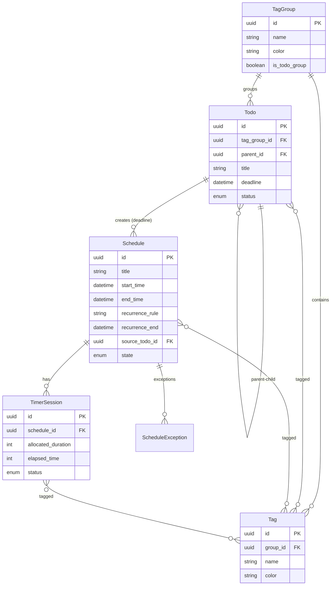

<div align="center">

<a id="top"></a>

# ⏱️ Hipster Timer Backend

**All-in-one productivity backend API for schedules, timers, and todos**

[](https://python.org)
[](https://fastapi.tiangolo.com)
[](https://strawberry.rocks)
[](https://sqlite.org)
[](https://docker.com)

[Features](#features) •
[Quick Start](#quick-start) •
[API Reference](#api-reference) •
[Architecture](#architecture) •
[Testing](#testing) •
[For Developers](#for-developers)

**🌐 [한국어](README.ko.md)**

</div>

---

<a id="overview"></a>

## 📖 Overview

**Hipster Timer Backend** is an all-in-one backend API for personal productivity management. It provides schedule management, pomodoro-style timers, hierarchical todo lists, and a flexible tag system through a unified API.

> 💡 **Note**: This project is designed for production use, backed by 400+ tests.

### Why Hipster Timer?

- 🔄 **Recurring Schedules**: Full iCalendar RRULE support — exception dates, virtual instance expansion included
- ⏰ **Timer Sessions**: Time tracking linked to schedules for measuring actual work time
- 🌳 **Hierarchical Todos**: Tree structure for complex projects — cycle detection, automatic ancestor inclusion
- 🏷️ **Unified Tag System**: Connect and filter schedules, timers, and todos with tags
- 🌏 **Timezone Support**: KST ↔ UTC conversion with various timezone formats
- 📡 **Dual API**: Use REST or GraphQL based on your preference

---

<a id="features"></a>

## ✨ Features

### 📅 Schedule

| Feature | Description |
|---------|-------------|
| **CRUD** | Create, read, update, delete schedules |
| **Recurrence** | RRULE format (`FREQ=DAILY`, `FREQ=WEEKLY;BYDAY=MO,WE,FR`) |
| **Virtual Instances** | Auto-expand recurring schedules on date range queries |
| **Exceptions** | Modify or skip specific occurrences |
| **Tag Filtering** | Filter by tag IDs or group IDs with AND conditions |
| **Timezone** | Support for `Asia/Seoul`, `+09:00`, and more |

### ⏱️ Timer

| Feature | Description |
|---------|-------------|
| **State Management** | `running` → `paused` → `completed` |
| **Time Tracking** | Measure elapsed time against allocated duration |
| **Pause/Resume** | Stop and continue sessions |
| **Tag Inheritance** | Optionally inherit tags from parent Schedule |

### ✅ Todo

| Feature | Description |
|---------|-------------|
| **Tree Structure** | Unlimited depth parent-child relationships |
| **Deadlines** | Auto-create Schedule when deadline is set |
| **Integrity Checks** | Prevent cycles, self-references, group mismatches |
| **Ancestor Inclusion** | Auto-include ancestors when filtering |
| **Stats API** | Aggregate todo counts by tag |

### 🏷️ Tag System

| Feature | Description |
|---------|-------------|
| **Group-based** | Organize tags logically with TagGroups |
| **Custom Colors** | `#RRGGBB` format color support |
| **Uniqueness** | Prevent duplicate tag names within a group |
| **Auto Cleanup** | Delete empty groups when last tag is removed |

### 🗓️ Holiday

| Feature | Description |
|---------|-------------|
| **API Integration** | Korea Astronomy and Space Science Institute public API |
| **Background Sync** | Auto-refresh holiday data on app startup |

---

<a id="quick-start"></a>

## 🚀 Quick Start

### Prerequisites

- Python 3.13+
- pip or uv

### Installation

```bash
# Clone repository
git clone https://github.com/your-username/hipster-timer-backend.git
cd hipster-timer-backend

# Install dependencies
pip install -r requirements.txt

# Set environment variables (optional)
cp .env.example .env
```

### Run

```bash
# Start development server
uvicorn app.main:app --port 2614 --reload

# Or run with Docker
docker compose up
```

Once the server starts:
- 📖 REST API: http://localhost:2614/docs (Swagger UI)
- 🔮 GraphQL: http://localhost:2614/v1/graphql (Apollo Sandbox)

---

<a id="api-reference"></a>

## 📚 API Reference

### REST API Endpoints

All endpoints use the `/v1` prefix.

#### Schedules

```http
GET    /v1/schedules                    # Get schedules by date range
POST   /v1/schedules                    # Create new schedule
GET    /v1/schedules/{id}               # Get specific schedule
PATCH  /v1/schedules/{id}               # Update schedule
DELETE /v1/schedules/{id}               # Delete schedule
GET    /v1/schedules/{id}/timers        # Get timers for schedule
GET    /v1/schedules/{id}/timers/active # Get active timer
```

**Query Parameters:**

| Parameter | Type | Description |
|-----------|------|-------------|
| `start_date` | datetime | Start date (required) |
| `end_date` | datetime | End date (required) |
| `timezone` | string | Timezone (e.g., `Asia/Seoul`, `+09:00`) |
| `tag_ids` | UUID[] | Tag ID filter (AND condition) |
| `group_ids` | UUID[] | Tag group ID filter |

**Example:**

```bash
# Create schedule
curl -X POST http://localhost:2614/v1/schedules \
  -H "Content-Type: application/json" \
  -d '{
    "title": "Weekly Meeting",
    "start_time": "2024-01-01T10:00:00Z",
    "end_time": "2024-01-01T12:00:00Z",
    "recurrence_rule": "FREQ=WEEKLY;BYDAY=MO",
    "recurrence_end": "2024-03-31T23:59:59Z"
  }'

# Query by date range (with timezone)
curl "http://localhost:2614/v1/schedules?start_date=2024-01-01T00:00:00Z&end_date=2024-01-31T23:59:59Z&timezone=Asia/Seoul"
```

#### Timers

```http
POST   /v1/timers                # Create timer (auto-starts)
GET    /v1/timers/{id}           # Get timer
PATCH  /v1/timers/{id}           # Update timer
DELETE /v1/timers/{id}           # Delete timer
PATCH  /v1/timers/{id}/pause     # Pause timer
PATCH  /v1/timers/{id}/resume    # Resume timer
POST   /v1/timers/{id}/stop      # Stop timer
```

**Query Parameters:**

| Parameter | Type | Description |
|-----------|------|-------------|
| `include_schedule` | bool | Include linked Schedule |
| `tag_include_mode` | string | `none`, `timer_only`, `inherit_from_schedule` |

**Example:**

```bash
# Create timer (30 min allocation)
curl -X POST http://localhost:2614/v1/timers \
  -H "Content-Type: application/json" \
  -d '{
    "schedule_id": "uuid-here",
    "title": "Focus Session",
    "allocated_duration": 1800
  }'

# Pause timer
curl -X PATCH http://localhost:2614/v1/timers/{id}/pause
```

#### Todos

```http
GET    /v1/todos          # List todos
POST   /v1/todos          # Create todo
GET    /v1/todos/{id}     # Get specific todo
PATCH  /v1/todos/{id}     # Update todo
DELETE /v1/todos/{id}     # Delete todo
GET    /v1/todos/stats    # Get statistics
```

**Example:**

```bash
# Create todo with deadline (auto-creates Schedule)
curl -X POST http://localhost:2614/v1/todos \
  -H "Content-Type: application/json" \
  -d '{
    "title": "Write Report",
    "tag_group_id": "group-uuid",
    "deadline": "2024-01-15T18:00:00Z"
  }'

# Create child todo
curl -X POST http://localhost:2614/v1/todos \
  -H "Content-Type: application/json" \
  -d '{
    "title": "Gather Materials",
    "tag_group_id": "group-uuid",
    "parent_id": "parent-todo-uuid"
  }'
```

#### Tags

```http
GET    /v1/tags/groups           # List tag groups
POST   /v1/tags/groups           # Create tag group
GET    /v1/tags/groups/{id}      # Get specific group
PATCH  /v1/tags/groups/{id}      # Update group
DELETE /v1/tags/groups/{id}      # Delete group
GET    /v1/tags                  # List tags
POST   /v1/tags                  # Create tag
DELETE /v1/tags/{id}             # Delete tag
```

#### Holidays

```http
GET    /v1/holidays              # List holidays
```

### GraphQL API

Explore the schema at `/v1/graphql` endpoint via Apollo Sandbox.

---

<a id="architecture"></a>

## 🏗️ Architecture

### Design Philosophy

This project follows **Layered Architecture**:

- **Router Layer** (`api/`): HTTP request handling, input validation
- **Service Layer** (`domain/*/service.py`): Business logic encapsulation
- **Domain Layer** (`domain/*/schema/`): DTOs, type definitions
- **Data Layer** (`models/`, `crud/`): Persistence handling

Each layer has clear responsibilities, with dependencies always pointing inward (toward Domain). This minimizes the impact of business logic changes and simplifies testing.

### Project Structure

```
hipster-timer-backend/
├── app/
│   ├── api/
│   │   └── v1/                    # API routers
│   │       ├── schedules.py
│   │       ├── timers.py
│   │       ├── todos.py
│   │       ├── tags.py
│   │       ├── holidays.py
│   │       └── graphql.py
│   ├── core/                      # Core configuration
│   │   ├── config.py              # Environment settings
│   │   ├── logging.py             # Logging setup
│   │   └── error_handlers.py      # Exception handling
│   ├── crud/                      # CRUD utilities
│   ├── db/                        # Database session
│   ├── domain/                    # Domain logic (DDD)
│   │   ├── schedule/
│   │   │   ├── service.py         # Business logic
│   │   │   ├── schema/            # DTOs, Types
│   │   │   └── exceptions.py      # Domain exceptions
│   │   ├── timer/
│   │   ├── todo/
│   │   ├── tag/
│   │   ├── holiday/
│   │   └── dateutil/              # Date/timezone utilities
│   ├── models/                    # SQLModel entities
│   │   ├── schedule.py
│   │   ├── timer.py
│   │   ├── todo.py
│   │   └── tag.py
│   ├── middleware/                # Middleware
│   └── main.py                    # App entrypoint
├── alembic/                       # DB migrations
├── tests/                         # Tests
│   ├── domain/                    # Unit tests
│   ├── test_*_e2e.py              # E2E tests
│   └── test_*_integration.py      # Integration tests
├── requirements.txt
├── Dockerfile
├── compose.yaml
└── README.md
```

### Data Model



### Tech Stack

| Category | Technology |
|----------|------------|
| **Framework** | FastAPI 0.120 |
| **ORM** | SQLModel 0.0.29 + SQLAlchemy 2.0 |
| **GraphQL** | Strawberry 0.288 |
| **Database** | SQLite (dev), PostgreSQL compatible |
| **Migration** | Alembic |
| **Validation** | Pydantic 2.12 |
| **Testing** | pytest, pytest-asyncio |
| **Container** | Docker, Docker Compose |

---

<a id="testing"></a>

## 🧪 Testing

This project validates core logic with **401 tests**. It covers various real-world scenarios including recurrence exception handling, timezone edge cases, and tree structure integrity.

```bash
# Run all tests
pytest

# Run E2E tests only
pytest -m e2e

# Run integration tests only
pytest -m integration

# Run specific domain tests
pytest tests/domain/schedule/

# Generate coverage report
pytest --cov=app --cov-report=html
```

### Test Structure

| Type | Location | Description |
|------|----------|-------------|
| **Unit** | `tests/domain/` | Individual service logic, edge case validation |
| **Integration** | `tests/test_*_integration.py` | DB integration, transaction rollback tests |
| **E2E** | `tests/test_*_e2e.py` | Full HTTP API flow tests |

---

## ⚙️ Configuration

### Environment Variables

Configure via `.env` file or environment variables.

| Variable | Description | Default |
|----------|-------------|---------|
| `DATABASE_URL` | DB connection string | `sqlite:///./schedule.db` |
| `DEBUG` | Enable debug mode | `False` |
| `LOG_LEVEL` | Log level | `INFO` |
| `HOLIDAY_API_SERVICE_KEY` | Korea Public Data Portal API key | - |
| `GRAPHQL_ENABLE_PLAYGROUND` | Enable GraphQL Sandbox | `True` |
| `GRAPHQL_ENABLE_INTROSPECTION` | Allow GraphQL introspection | `True` |

### Database Migration

```bash
# Create new migration
alembic revision --autogenerate -m "description"

# Apply migrations
alembic upgrade head

# Rollback
alembic downgrade -1
```

---

## 🐳 Docker

```bash
# Build and run
docker compose up --build

# Run in background
docker compose up -d

# View logs
docker compose logs -f
```

**Exposed Port:** `2614`

---

<a id="for-developers"></a>

## 🛠️ For Developers

A guide for those who want to fork this codebase or use it as a learning reference.

### Customization Points

| Purpose | Location | Description |
|---------|----------|-------------|
| Add new domain | `app/domain/` | Extend following existing domain structure |
| Change DB | `app/db/session.py` | Easy switch to PostgreSQL, MySQL (SQLAlchemy-based) |
| Add auth | `app/middleware/` | Add JWT or other auth logic in middleware layer |
| Add API version | `app/api/` | Create v2 router and mount in `main.py` |

### Notable Implementations

- **RRULE Recurrence**: `app/domain/schedule/` — Virtual instance expansion, exception handling
- **Hierarchical Data**: `app/domain/todo/` — Cycle detection, automatic ancestor inclusion
- **Timezone Handling**: `app/domain/dateutil/` — KST/UTC conversion utilities
- **GraphQL + REST Coexistence**: `app/api/v1/graphql.py` — Strawberry and FastAPI integration

---

## 📄 License

This project is licensed under the MIT License.

---

<div align="center">

**[⬆ Back to Top](#top)**

</div>
