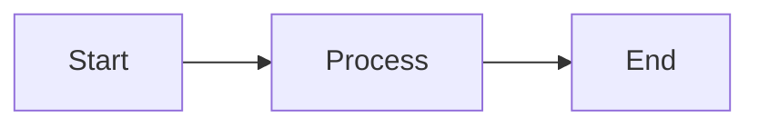

# Documentation & Translation Guide

This guide is for contributors who want to write, edit, or translate project documentation.

---

## Documentation Structure

### Folder Layout

```
docs/
├── index.ko.md              # Home (Korean)
├── index.en.md              # Home (English)
├── getting-started/
│   ├── installation.ko.md
│   ├── installation.en.md
│   └── ...
├── api/
├── guides/
├── deployment/
└── development/
```

### File Naming Convention

| Locale | Suffix | Example |
|--------|--------|---------|
| Korean (default) | `.ko.md` | `installation.ko.md` |
| English | `.en.md` | `installation.en.md` |
| Japanese (if added) | `.ja.md` | `installation.ja.md` |

- **The default language is Korean (`ko`)**.
- If an English file (`.en.md`) doesn't exist, the Korean document will be displayed at the English path (`fallback_to_default: true`).

---

## Writing New Documentation

### 1. Create the File

Create `filename.ko.md` in the appropriate folder.

```markdown
# Page Title

Content goes here...
```

### 2. Add to nav

Add an entry to the `nav` section in `mkdocs.yml`.  
**Use the filename without the locale suffix** (the i18n plugin maps automatically).

```yaml
nav:
  - Development:
    - Rate Limiting: development/rate-limit.md      # .ko.md / .en.md auto-mapped
    - Testing: development/testing.md
    - New Doc: development/new-doc.md               # Add here
```

### 3. English Version (Optional)

To provide an English version, create a `.en.md` file at the same path.

```
docs/development/new-doc.ko.md   ← Korean
docs/development/new-doc.en.md   ← English (optional)
```

If no English file exists, the Korean document will be shown at `/en/...` paths.

---

## Markdown Features

This project uses MkDocs Material theme with several extensions.

### Code Blocks

````markdown
```python
def hello():
    print("Hello, World!")
```
````

- Automatic line numbers (`anchor_linenums`)
- Copy button (`content.code.copy`)

### Admonitions (Callouts)

```markdown
!!! note "Note"
    Use this to highlight important information.

!!! warning "Warning"
    Content that requires caution.

!!! tip "Tip"
    A useful tip.
```

**Result:**

!!! note "Note"
    Use this to highlight important information.

### Collapsible Blocks

```markdown
??? info "Click to expand"
    Hidden content here.
```

### Tabs

```markdown
=== "Python"
    ```python
    print("Hello")
    ```

=== "JavaScript"
    ```javascript
    console.log("Hello");
    ```
```

### Mermaid Diagrams

````markdown

````

### Tables

```markdown
| Column1 | Column2 | Column3 |
|---------|---------|---------|
| Value1  | Value2  | Value3  |
```

---

## Adding a New Language

To add a new language (e.g., Japanese) to the project:

### 1. Edit mkdocs.yml

Add the new locale under `plugins` → `i18n` → `languages`.

```yaml
plugins:
  - i18n:
      docs_structure: suffix
      fallback_to_default: true
      languages:
        - locale: ko
          name: 한국어
          default: true
          build: true
        - locale: en
          name: English
          build: true
        - locale: ja              # Add this
          name: 日本語
          build: true
```

### 2. Create Translation Files

Create `.ja.md` files for each page you want to translate.

```
docs/index.ja.md
docs/getting-started/installation.ja.md
...
```

### 3. Fallback Behavior

- Pages without a Japanese file will display the **default language (ko) document** at `/ja/...` paths.
- The site builds normally even if translation is incomplete.

### 4. Theme Language (Optional)

To display MkDocs Material theme UI in the target language, verify the theme supports it.  
Supported languages: [MkDocs Material Localization](https://squidfunk.github.io/mkdocs-material/setup/changing-the-language/)

---

## Previewing Locally

```bash
# Install dependencies (first time only)
pip install mkdocs mkdocs-material mkdocs-static-i18n mkdocs-include-markdown-plugin mkdocs-render-swagger-plugin

# Run development server
mkdocs serve

# View in browser
# http://127.0.0.1:8000
```

### Language-specific URLs

- Korean: `http://127.0.0.1:8000/`
- English: `http://127.0.0.1:8000/en/`

---

## Style Guide

### Headings

- Use only one H1 (`#`) per page (page title)
- Use H2 (`##`) and below for sections

### Links

**Links within the same language** (recommended):

```markdown
See the [Authentication Guide](../guides/auth.en.md) for details.
```

**External links**:

```markdown
[MkDocs Official Docs](https://www.mkdocs.org/)
```

### Images

```markdown

```

Store images in the `docs/assets/` folder.

### Terminology Consistency

| English | Korean |
|---------|--------|
| Schedule | 일정 |
| Timer | 타이머 |
| Todo | 투두 |
| Tag | 태그 |
| Authentication | 인증 |
| Rate Limiting | Rate Limiting |

---

## Contribution Process

1. Fork the repository or create a branch
2. Write/edit documentation
3. Preview locally with `mkdocs serve`
4. Create a Pull Request
5. Merge after review

Documentation contributions are welcome!
