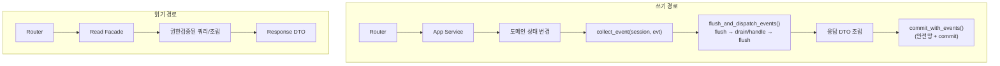

# 읽기/쓰기 분리 & 도메인 이벤트 아키텍처

> **상태**: 설계 (구현 예정) · 추적: [#50](https://github.com/onprem-hipster-timer/backend/issues/50)

이 문서는 읽기 경로와 쓰기 경로의 책임을 분리하고, 도메인 간 전파를 **외부 broker 없이** in-process Message Bus로 처리하기 위한 설계를 설명합니다. 대상 환경은 **단일 프로세스 · 단일 DB · 요청당 단일 세션 · 단일 트랜잭션 · 강한 일관성**입니다.

---

## 1. 배경

현재 구조에는 두 가지 결합 문제가 있습니다.

| 문제 | 현재 동작 | 영향 |
|------|-----------|------|
| 읽기가 DB를 변경 | GET이 `get_db_transactional`(commit 세션)을 사용. Timer 조회는 `elapsed_time`을 ORM에 누적 | RUNNING 타이머를 조회할 때마다 경과시간이 누적 커밋 ([#51](https://github.com/onprem-hipster-timer/backend/issues/51)) |
| 도메인 간 직접 호출 | `TodoService` ↔ `ScheduleService`를 서로 직접 호출 | 강결합, 순환 import, 양방향 전파 누락 ([#44](https://github.com/onprem-hipster-timer/backend/issues/44)) |

목표는 **공개 동작(계약)을 바꾸지 않고 구현 결합도만 낮추는** 것입니다.

초기 마이그레이션 범위는 Todo/Schedule 전파와 read path 정리입니다. `TagService.delete_tag_group()`처럼 다른 도메인 쓰기를 호출하는 경로도 존재하지만, 이 문서의 초기 이벤트 카탈로그에는 포함하지 않고 후속 정리 범위로 둡니다.

---

## 2. 전체 그림



- **쓰기**: 도메인 상태를 바꾼 뒤 이벤트를 수집하고, **응답을 조립하기 전에** 핸들러를 dispatch하여 자동 생성 리소스가 응답에 즉시 보이게 합니다. 모든 핸들러는 **같은 세션/트랜잭션**에서 실행되고, 하나라도 실패하면 전체 rollback합니다.
- **읽기**: read-only 세션으로 조회하고, 조립은 Read Facade가 담당합니다.

---

## 3. 읽기 경로

### 3.1 read-only 세션

GET은 `get_db`(commit 없음, rollback만)를 사용합니다. 단, 다음은 read-only 전환 전에 정리해야 합니다.

- **Timer `elapsed_time`**: 조회 시 ORM을 변경하지 않습니다. 계산을 둘로 나눕니다.
    - `calculate_display_elapsed(timer, now)` — read-only 표시용 계산
    - `accumulate_elapsed_until(timer, now)` — pause/stop 등 **write transition 전용** 누적
- **인증 parent dependency**: 모든 인증 라우터에 걸린 `get_current_user_synced`가 자체 `get_db_transactional` + 프로필 JIT sync를 엽니다. **auth-only 게이트**와 **profile-sync write 경로**로 분리해야 GET이 진짜 read-only가 됩니다.

### 3.2 Read Facade

라우터의 다중 리소스 조립 로직(`_build_timer_read_with_relations`, `_get_related_schedule_reads`)을 `app/application/read/*`(신규 레이어)로 옮깁니다. 라우터는 Facade 호출만 합니다.

!!! warning "권한 불변조건 (위반 시 정보 노출)"
    Read Facade는 raw CRUD/lazy load로 연관 리소스를 응답에 넣지 않습니다. 권한 판정은 `CurrentUser`에 강결합돼 있으므로, **연관 리소스마다** `try_get_schedule_read`/`get_*_with_access_check`로 개별 권한검증을 거칩니다. **부모 리소스 접근권한은 자식/연결 리소스 접근권한을 보장하지 않습니다** (공유 Timer를 봐도 연결 Schedule이 PRIVATE이면 숨김).

---

## 4. 쓰기 경로 — 도메인 이벤트 + Message Bus

### 4.1 이벤트

이벤트는 **발생한 도메인 사실**만 담는 불변 값 객체입니다.

```python
class EventOrigin(str, Enum):
    TODO = "todo"
    SCHEDULE = "schedule"


@dataclass(frozen=True)
class ScheduleTimeChanged:
    schedule_id: UUID
    new_start_time: datetime
    owner_id: str
    origin: EventOrigin  # 이벤트를 촉발한 source 도메인
```

!!! danger "payload 금지 사항"
    이벤트에 API DTO, ORM instance, response DTO, handler 이름, target service를 넣지 않습니다. **식별자와 도메인 사실만** 담습니다.

### 4.2 이벤트 보관 — 세션 스코프 수집

도메인 모델이 SQLModel ORM 클래스의 alias라, 엔티티에 `.events` 리스트를 직접 붙이면 SQLAlchemy 로드 시 초기화 문제가 생깁니다. 그래서 1차 구현은 **세션 스코프 수집**을 사용합니다.

| helper (`app/shared/uow.py`) | 역할 |
|------------------------------|------|
| `collect_event(session, event)` | `session.info`에 이벤트 적재 (직접 접근 금지, helper로만) |
| `drain_events(session)` | 수집된 이벤트를 꺼내 반환 |
| `clear_events(session)` | 이벤트 큐 비우기 |
| `flush_and_dispatch_events(session)` | `flush → drain/handle loop → flush` (commit 없음) |
| `commit_with_events(session)` | 위를 한 번 더 보장 후 commit |

!!! important "`session.info`는 트랜잭션 aware가 아님"
    DB rollback이 돼도 `session.info`의 이벤트 큐는 자동으로 비워지지 않습니다. SAVEPOINT/내부 예외와 섞이면 이미 취소된 변경의 이벤트가 남을 수 있으므로, **rollback 경계에서 반드시 `clear_events(session)`**를 호출합니다.

### 4.3 Message Bus

```python
# app/shared/messagebus.py
def handle(events, session):
    queue = list(events)
    seen = set()
    depth = 0

    while queue:
        if depth > MAX_DISPATCH_DEPTH:
            raise RuntimeError("Max event dispatch depth exceeded")

        event = queue.pop(0)
        key = event_key(event)  # 타입 + 주요 식별자
        if key in seen:
            continue
        seen.add(key)

        for handler in HANDLERS[type(event)]:
            handler(event, session)          # 예외는 삼키지 않고 전파

        session.flush()                       # 후속 핸들러가 앞선 변경을 조회 가능
        queue.extend(drain_events(session))   # 핸들러가 낳은 후속 이벤트 재수집
        depth += 1
```

- `register(event_type)` 데코레이터로 consumer 모듈이 핸들러를 등록합니다. 누가 들을지는 **중앙 registry**가 정하며, 이벤트 발행자는 모릅니다.
- `register_handlers()`는 **idempotent**해야 합니다(앱 startup·테스트 fixture 양쪽에서 호출되므로). 테스트용 `reset_handlers()`도 제공합니다.

### 4.4 cascade 무한루프 방지

`TodoDeadlineChanged → ScheduleTimeChanged → TodoDeadlineChanged` 같은 왕복 전파를 차단합니다.

- 이벤트 `origin` 필드 + `max_dispatch_depth` 상한 병행
- 보강: 동일 이벤트(타입+식별자) 중복 dispatch 방지

### 4.5 핸들러의 권한 불변조건

이벤트 핸들러는 내부 projection이므로 사용자 권한 검증을 우회합니다. 대신 **owner 불변조건**을 강제합니다.

- 핸들러는 변경 대상의 `owner_id == event.owner_id`를 확인한 뒤에만 수정합니다.
- `current_user`를 요구하는 기존 Service를 그대로 호출하지 않고, `owner_id` 기반 lower-level operation을 사용합니다.
- 자동 생성 리소스에 **visibility를 복사하지 않습니다** (생성 후 별도 `/visibility` API로 관리, 기본 PRIVATE).
- 삭제 핸들러는 `delete_visibility_by_resource` cleanup을 유지합니다(orphan visibility 방지).

---

## 5. 이벤트 카탈로그 (초기)

실제 모듈 간 전파가 필요한 것만 우선 정의합니다.

`ScheduleTimeChanged`, `ScheduleDeleted`, `TodoDeadlineSet/Changed/Removed`, `TodoTagsChanged`, `TodoDeleted`, `ScheduleCreatedWithTodoOption`.

!!! note "source of truth"
    Todo `deadline`이 원본, Schedule `start_time`은 그 투영입니다. `ScheduleTimeChanged`는 **`source_todo_id`가 있는(=Todo가 만든) Schedule**에 한해 Todo로 역전파하고, `origin`이 Todo면 다시 전파하지 않습니다.

!!! note "Schedule 삭제 정책"
    현재 공개 계약은 Todo `deadline` 제거 또는 Todo 삭제가 연결 Schedule을 삭제하는 방향입니다. 반대로 `source_todo_id`가 있는 Schedule을 삭제했을 때 Todo `deadline`을 자동 제거하는 동작은 현재 계약이 아니므로 초기 마이그레이션에서는 도입하지 않습니다. 필요하면 별도 정책/이슈로 다룹니다.

---

## 6. 단계별 적용

| 파트 | 내용 | 이슈 |
|------|------|------|
| 1 | 읽기가 DB를 바꾸는 문제 수정 (Timer `elapsed_time`) | [#51](https://github.com/onprem-hipster-timer/backend/issues/51) |
| 2 | GET을 진짜 read-only로 (인증 의존성 분리 포함) | [#52](https://github.com/onprem-hipster-timer/backend/issues/52) |
| 3 | 읽기 조립을 Read Facade로 | [#53](https://github.com/onprem-hipster-timer/backend/issues/53) |
| 4 | 이벤트 버스를 테스트로 고정 | [#54](https://github.com/onprem-hipster-timer/backend/issues/54) |
| 5 | Todo/Schedule 직접 호출을 이벤트로 이전 | [#55](https://github.com/onprem-hipster-timer/backend/issues/55) |
| 6 | WebSocket을 같은 commit/rollback 규칙으로 | [#49](https://github.com/onprem-hipster-timer/backend/issues/49) |

각 파트는 **기존 테스트 그린 유지**가 1차 게이트입니다. 특히 `tests/test_shared_resource_filtering.py`(부모 공유/자식 PRIVATE 은닉)는 Read Facade 이전 후에도 통과해야 합니다.

---

## 7. 참고

- [Cosmic Python — Events and the Message Bus](https://www.cosmicpython.com/book/chapter_08_events_and_message_bus.html)
- [SQLAlchemy — ORM/Session Events](https://docs.sqlalchemy.org/en/20/orm/session_events.html)
- 관련 가이드: [Todo](../guides/todo.md), [Visibility](../guides/visibility.md), [WebSocket](../api/websocket.md)
