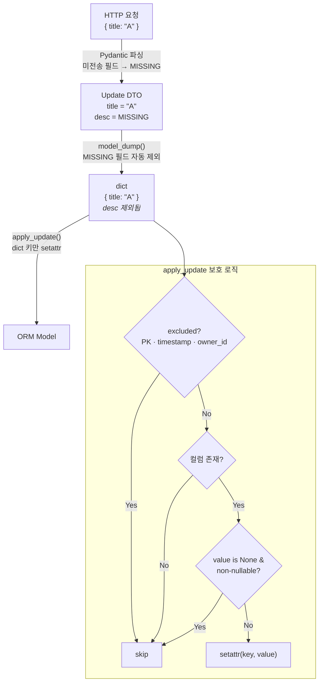

# MISSING Sentinel

이 문서는 Update DTO에서 사용하는 `MISSING` sentinel 패턴과 부분 업데이트 처리 방식을 설명합니다.

> **참고**: [Pydantic Experimental — MISSING Sentinel](https://docs.pydantic.dev/latest/concepts/experimental/#missing-sentinel)

---

## 1. 개요

Update DTO는 Pydantic의 `MISSING` sentinel을 사용하여 "값을 보내지 않음"과 "명시적으로 `null`을 보냄"을 구분합니다.

```python
from pydantic.experimental.missing_sentinel import MISSING

class TodoUpdate(CustomModel):
    title: str | None = MISSING
    description: str | None = MISSING
```

| 요청 바디 | DTO 상태 | `model_dump()` 결과 |
|-----------|----------|---------------------|
| `{}` | `title=MISSING, description=MISSING` | `{}` |
| `{"description": null}` | `title=MISSING, description=None` | `{"description": None}` |
| `{"title": "새 제목"}` | `title="새 제목", description=MISSING` | `{"title": "새 제목"}` |

`model_dump()` 호출 시 MISSING인 필드는 자동으로 제외되므로 `exclude_unset=True`가 불필요합니다.

---

## 2. 데이터 흐름



---

## 3. Update DTO 작성

```python
from pydantic.experimental.missing_sentinel import MISSING

class TodoUpdate(CustomModel):
    title: str | None = MISSING
    description: str | None = MISSING
    deadline: datetime | None = MISSING
    tag_ids: list[UUID] | None = MISSING  # 관계 필드 (서비스에서 별도 처리)
```

- 모든 필드의 기본값은 `MISSING`
- `T | None`이면 nullable, `T`이면 non-nullable
- `model_dump()` 시 `exclude_unset=True` 사용하지 않음
- 관계 필드는 서비스 레이어에서 `is MISSING` 체크 후 별도 처리

!!! warning "non-nullable 컬럼에 `null` 전송"
    `apply_update()`가 조용히 무시합니다. 에러 없이 해당 필드가 변경되지 않습니다.

---

## 4. 제한사항

!!! warning "Pydantic 실험적 기능"
    `MISSING` sentinel은 Pydantic의 **실험적(experimental)** 기능입니다.

    - Pydantic 버전 업그레이드 시 동작 변경 가능성 있음
    - Pickling 미지원
    - Pyright 1.1.402+에서 `enableExperimentalFeatures` 설정 필요
    - [PEP 661 (Draft)](https://peps.python.org/pep-0661/) 기반

---

## 관련 코드

| 파일 | 역할 |
|------|------|
| `app/models/base.py` | `UpdateMixin.apply_update()` |
| `app/domain/*/schema/dto.py` | 각 도메인의 Update DTO |
| `app/crud/*.py` | `model_dump()` → `apply_update()` 호출 |
| `tests/models/test_update_mixin.py` | apply_update 단위 테스트 |
