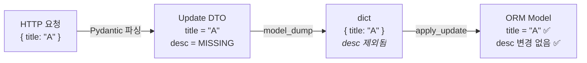

# MISSING Sentinel & Partial Update 가이드

이 문서는 Update DTO에서 사용하는 `MISSING` sentinel 패턴과 부분 업데이트 처리 방식을 설명합니다.

> **참고**: [Pydantic Experimental — MISSING Sentinel](https://docs.pydantic.dev/latest/concepts/experimental/#missing-sentinel)

---

## 1. 개요

Update DTO는 Pydantic의 `MISSING` sentinel을 사용하여 "값을 보내지 않음"과 "명시적으로 `null`을 보냄"을 구분합니다.

```python
from pydantic.experimental.missing_sentinel import MISSING

class TodoUpdate(CustomModel):
    title: str | None = MISSING
    description: str | None = MISSING
```

| 요청 바디 | DTO 상태 | `model_dump()` 결과 |
|-----------|----------|---------------------|
| `{}` | `title=MISSING, description=MISSING` | `{}` |
| `{"description": null}` | `title=MISSING, description=None` | `{"description": None}` |
| `{"title": "새 제목"}` | `title="새 제목", description=MISSING` | `{"title": "새 제목"}` |

`model_dump()` 호출 시 MISSING인 필드는 자동으로 제외되므로 `exclude_unset=True`가 불필요합니다.

---

## 2. 데이터 흐름



1. **HTTP → DTO**: 보내지 않은 필드는 `MISSING`으로 초기화
2. **DTO → dict**: `model_dump()`가 MISSING 필드를 자동 제외
3. **dict → ORM**: `apply_update()`가 dict에 포함된 필드만 `setattr`

---

## 3. `apply_update` 보호 로직

```python
class UpdateMixin:
    def apply_update(self, update_data: dict, exclude: list = None):
        mapper = inspect(self).mapper
        columns = mapper.column_attrs

        pk_fields = {attr.key for attr in columns if any(c.primary_key for c in attr.columns)}
        timestamp_fields = frozenset(TimestampMixin.__annotations__)
        excluded = pk_fields | timestamp_fields | {"owner_id"} | set(exclude or [])

        for key, value in update_data.items():
            if key in excluded: continue    # 보호 필드 차단
            if key not in columns: continue # 비-컬럼 필드 무시
            if value is MISSING: continue   # MISSING 방어 (defensive)

            if value is None and not columns[key].columns[0].nullable:
                continue                    # non-nullable에 None 차단

            setattr(self, key, value)
```

| 순서 | 체크 | 역할 |
|------|------|------|
| 1 | `excluded` set | PK, timestamp, `owner_id` 변경 차단 |
| 2 | `key not in columns` | ORM 컬럼이 아닌 필드 무시 (`tag_ids` 등) |
| 3 | `value is MISSING` | 방어적 MISSING 체크 (수동 dict 구성 시 대비) |
| 4 | `None` + non-nullable | nullable이 아닌 컬럼에 NULL 설정 차단 |
| 5 | `setattr` | 모든 검증 통과 시 실제 반영 |

---

## 4. 프론트엔드 연동

### 핵심 규칙

| 요청 | 백엔드 동작 |
|------|------------|
| 필드 생략 (undefined) | 해당 필드 변경 없음 |
| 필드를 `null`로 전송 | 해당 필드를 NULL로 초기화 |
| 필드를 값으로 전송 | 해당 필드를 새 값으로 변경 |

```typescript
// 제목만 변경 (description 유지)
await updateTodo(id, { title: "새 제목" });
// → {"title": "새 제목"}

// description을 비움 (명시적 null)
await updateTodo(id, { description: null });
// → {"description": null}
```

!!! warning "non-nullable 컬럼에 `null` 전송 시"
    백엔드가 조용히 무시합니다. 에러는 발생하지 않지만 해당 필드도 변경되지 않습니다.
    non-nullable 필드에는 `null`을 보내지 않는 것이 바람직합니다.

---

## 5. Update DTO 작성 규칙

### 기본 패턴

```python
from pydantic.experimental.missing_sentinel import MISSING

class TodoUpdate(CustomModel):
    title: str | None = MISSING
    description: str | None = MISSING
    deadline: datetime | None = MISSING
    tag_ids: list[UUID] | None = MISSING  # 관계 필드 (서비스에서 별도 처리)
```

### 체크리스트

- [x] 모든 Update DTO 필드의 기본값은 `MISSING`
- [x] 타입 어노테이션에 `None` 포함 여부로 nullable 명시
- [x] `model_dump()` 호출 시 `exclude_unset=True` **사용하지 않음**
- [x] 관계 필드는 서비스 레이어에서 `is MISSING` 체크 후 별도 처리

### validator에서 MISSING 처리

```python
# ✅ isinstance로 실제 값인지 확인 후 비교
@field_validator("end_time")
def validate_time(cls, end_time, info):
    start_time = info.data.get("start_time")
    if isinstance(start_time, datetime) and isinstance(end_time, datetime):
        if start_time > end_time:
            raise ValueError("...")
    return end_time
```

---

## 6. 제한사항

!!! warning "Pydantic 실험적 기능"
    `MISSING` sentinel은 Pydantic의 **실험적(experimental)** 기능입니다.

    - Pydantic 버전 업그레이드 시 동작 변경 가능성 있음
    - Pickling 미지원
    - Pyright 1.1.402+에서 `enableExperimentalFeatures` 설정 필요
    - [PEP 661 (Draft)](https://peps.python.org/pep-0661/) 기반

---

## 관련 코드

| 파일 | 역할 |
|------|------|
| `app/models/base.py` | `UpdateMixin.apply_update()` |
| `app/domain/*/schema/dto.py` | 각 도메인의 Update DTO |
| `app/crud/*.py` | `model_dump()` → `apply_update()` 호출 |
| `tests/models/test_update_mixin.py` | apply_update 단위 테스트 |
