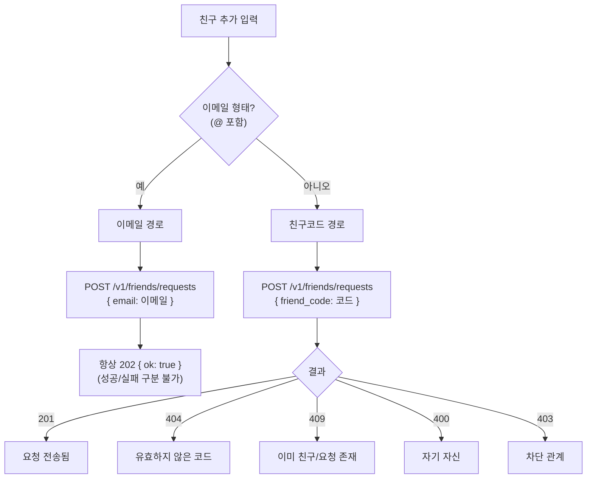

# 친구 추가 가이드 (프론트엔드 개발자용)

> **최종 업데이트**: 2026-06-14

친구 추가 UX(친구코드·이메일로 친추 보내기, 받은 요청 표시)를 구현하는 프론트엔드 개발자를 위한 가이드입니다. 친구 목록·차단 등 전체 API는 [Friend 가이드](friend.ko.md)를 참고하세요.

## 개요

이 백엔드는 **사용자 검색/디렉터리를 제공하지 않습니다.** 상대를 추가하려면 둘 중 하나가 필요합니다:

| 방법 | 식별자 | 특징 |
|------|--------|------|
| **친구코드** | 상대가 공유한 불투명 코드 | 정상 피드백(성공/실패 구분). 모든 사용자에게 존재. |
| **이메일** | 상대의 (검증된) 이메일 | **항상 `202` 균일 응답**(계정 열거 방지). 검증 이메일이 없는 사용자는 못 찾음. 저장된 검증 이메일로 매칭하되 검색/목록/응답에는 노출하지 않음. |

두 경로 모두 **단일 엔드포인트** `POST /v1/friends/requests`를 씁니다. 바디에 `email` 또는 `friend_code` 중 **정확히 하나**를 담아 어느 경로인지 **클라이언트가 명시**합니다. 둘 다·둘 다 없음·대상 값 `null`·이메일 형식 오류는 `422`.



---

## 1. 내 친구코드 가져오기 · 공유

`GET /v1/users/me`로 본인 표시정보와 친구코드를 조회합니다. 프로필이 없으면 토큰으로 자동 생성됩니다.

```http
GET /v1/users/me
Authorization: Bearer <access_token>
```

```json
{
  "id": "my-user-id",
  "display_name": "Bob",
  "avatar_url": "https://.../bob.png",
  "friend_code": "Xy7mGq2bQ1A0kF3..."
}
```

`friend_code`를 **친추 URL**이나 **QR**로 공유합니다. 예:

```typescript
async function getMyProfile(): Promise<MyProfile> {
  const res = await fetch('/v1/users/me', { headers: authHeaders() });
  return res.json();
}

// 공유용 딥링크 생성
function buildAddFriendUrl(friendCode: string): string {
  return `${location.origin}/add-friend?code=${encodeURIComponent(friendCode)}`;
}

// 예: 버튼 클릭 시
const me = await getMyProfile();
const url = buildAddFriendUrl(me.friend_code);
await navigator.clipboard.writeText(url);   // 링크 복사
// 또는 QR 라이브러리로 url을 QR 코드로 렌더링
```

!!! tip "이메일은 공유가 필요 없습니다"
    상대가 당신의 (검증된) 이메일을 이미 안다면 친구코드 공유 없이 이메일로 바로 추가할 수 있습니다. 다만 이메일 경로는 결과를 알려주지 않으므로(아래 참고), "확실한" 추가에는 친구코드가 낫습니다.

---

## 2. 친구 추가하기

### 공통 호출

```typescript
type AddFriendResult =
  | { kind: 'sent'; friendship: Friendship }   // 코드 경로 성공
  | { kind: 'submitted' }                       // 이메일 경로(항상)
  | { kind: 'invalid_code' }                    // 404
  | { kind: 'invalid_input' }                   // 422 (이메일 형식 오류 등)
  | { kind: 'already' }                         // 409
  | { kind: 'self' }                            // 400
  | { kind: 'blocked' }                         // 403
  | { kind: 'rate_limited'; retryAfter: number };// 429

async function addFriend(input: string): Promise<AddFriendResult> {
  const value = input.trim();
  // 클라이언트가 경로를 명시한다: 이메일 형태(@ 포함)면 email, 아니면 friend_code
  const body = value.includes('@') ? { email: value } : { friend_code: value };

  const res = await fetch('/v1/friends/requests', {
    method: 'POST',
    headers: { ...authHeaders(), 'Content-Type': 'application/json' },
    body: JSON.stringify(body),
  });

  if (res.status === 429) {
    return { kind: 'rate_limited', retryAfter: Number(res.headers.get('Retry-After') ?? 60) };
  }

  // 이메일 경로는 항상 202 — 성공/실패를 구분하지 않는다
  if (res.status === 202) return { kind: 'submitted' };

  // 친구코드 경로
  if (res.status === 201) return { kind: 'sent', friendship: await res.json() };
  if (res.status === 404) return { kind: 'invalid_code' };
  if (res.status === 409) return { kind: 'already' };
  if (res.status === 400) return { kind: 'self' };
  if (res.status === 403) return { kind: 'blocked' };
  if (res.status === 422) return { kind: 'invalid_input' };

  throw new Error(`Unexpected status ${res.status}`);
}
```

### 이메일 경로 — UX 주의 (중요)

이메일로 추가하면 **그 이메일이 가입돼 있든 아니든, 이미 친구든, 본인이든 응답이 항상 `202` `{ "ok": true }`** 입니다. 이는 "그 이메일이 가입돼 있는지"를 노출하지 않기 위한 **계정 열거 방지** 설계입니다.

따라서 프론트는 **성공/실패를 단정하면 안 됩니다.** 다음처럼 중립적으로 안내하세요:

```typescript
function messageFor(result: AddFriendResult): string {
  switch (result.kind) {
    case 'submitted':
      // 이메일 경로: 단정하지 말 것
      return '초대를 보냈습니다. 상대가 가입돼 있다면 받은 요청 목록에 표시됩니다.';
    case 'sent':       return '친구 요청을 보냈습니다.';
    case 'invalid_code': return '유효하지 않은 친구코드입니다.';
    case 'already':    return '이미 친구이거나 대기 중인 요청이 있습니다.';
    case 'self':       return '자기 자신은 추가할 수 없습니다.';
    case 'blocked':    return '이 사용자에게는 요청을 보낼 수 없습니다.';
    case 'invalid_input': return '입력 형식을 확인해주세요.';
    case 'rate_limited': return `요청이 많습니다. ${result.retryAfter}초 후 다시 시도하세요.`;
  }
}
```

!!! warning "하지 말 것"
    이메일 경로에서 `202`를 받았다고 "상대를 찾았습니다 / 요청이 전달됐습니다"라고 **단정하지 마세요.** 그렇게 보여주면 응답으로 가입 여부가 노출돼 열거 방지가 무력화됩니다.

### 친구코드 경로 — 정상 피드백

친구코드는 서버가 생성한 충분히 긴 무작위 토큰이라 `404`(유효하지 않은 코드) 등 **명확한 피드백**을 줘도 안전합니다. 위 `addFriend`의 분기를 그대로 사용하면 됩니다.

---

## 3. 친추 URL(딥링크) 처리

공유된 `…/add-friend?code=XXXX`로 진입했을 때:

```typescript
// 라우트 진입 시
async function handleAddFriendDeepLink() {
  const code = new URLSearchParams(location.search).get('code');
  if (!code) return;

  // (로그인 필요) 로그인 후 자동으로 친구 요청 전송
  const result = await addFriend(code);   // 코드엔 @가 없어 friend_code 경로
  showToast(messageFor(result));
}
```

!!! note "로그인 필요"
    모든 친구 API는 인증이 필요합니다. 비로그인 상태로 딥링크에 진입하면, 로그인 후 `code`를 유지했다가 친추를 전송하세요.

---

## 4. 받은 요청 표시 · 수락/거절

받은 요청에는 **요청자 표시정보**(`requester_display_name`/`requester_avatar_url`)가 포함돼 "누가 보냈는지" 보여줄 수 있습니다.

```typescript
interface PendingRequest {
  id: string;
  requester_id: string;
  addressee_id: string;
  requester_display_name?: string;  // 없으면 null
  requester_avatar_url?: string;
  created_at: string;
}

async function getReceivedRequests(): Promise<PendingRequest[]> {
  const res = await fetch('/v1/friends/requests/received', { headers: authHeaders() });
  return res.json();
}

async function acceptRequest(id: string) {
  await fetch(`/v1/friends/requests/${id}/accept`, { method: 'POST', headers: authHeaders() });
}

async function rejectRequest(id: string) {
  await fetch(`/v1/friends/requests/${id}/reject`, { method: 'POST', headers: authHeaders() });
}
```

수락 후 친구 목록(`GET /v1/friends`)에도 `display_name`/`avatar_url`이 포함됩니다.

```json
[
  { "user_id": "friend-id", "friendship_id": "uuid",
    "display_name": "Alice", "avatar_url": "https://.../a.png",
    "since": "2026-06-13T10:00:00Z" }
]
```

---

## 5. Rate Limit (429)

`POST /v1/friends/requests`는 이메일 경로의 대량 시도(열거·스팸)를 막기 위해 **60초당 20회**로 제한됩니다(다른 쓰기보다 엄격). 초과 시 `429` + `Retry-After` 헤더. 위 `addFriend`가 `rate_limited`로 반환하니, 안내 후 재시도 간격을 두세요. 자세한 동작은 [Rate Limiting 가이드](../development/rate-limit.ko.md).

---

## 6. UI/UX 권장사항

1. **단일 입력 + 안내**: "친구코드 또는 이메일"을 한 입력란으로 받고, 클라이언트가 `@` 포함 여부로 `email`/`friend_code` 필드를 골라 보냅니다(사용자는 의식할 필요 없음).
2. **이메일은 항상 중립 메시지**: "초대를 보냈습니다(가입돼 있으면 전달됨)". 절대 "찾았습니다/전송 완료"로 단정하지 마세요.
3. **내 코드 공유 UI**: `friend_code`를 복사 버튼·QR·딥링크로 제공.
4. **받은 요청에 사람 정보**: `requester_display_name`/avatar로 카드 렌더링, 없으면 placeholder.
5. **검색 없음 안내**: 사용자 목록을 훑는 UI는 만들 수 없습니다(의도된 설계). "코드나 이메일로 추가"로 안내.
6. **에러 톤**: 코드 경로는 명확히, 이메일 경로는 모호하게(설계 목적).

---

## 관련 문서

- [Friend 가이드](friend.ko.md) — 친구 목록/요청/차단 전체 API
- [인증 가이드](auth.ko.md) — Bearer 토큰
- [Rate Limiting 가이드](../development/rate-limit.ko.md) — 429 처리
