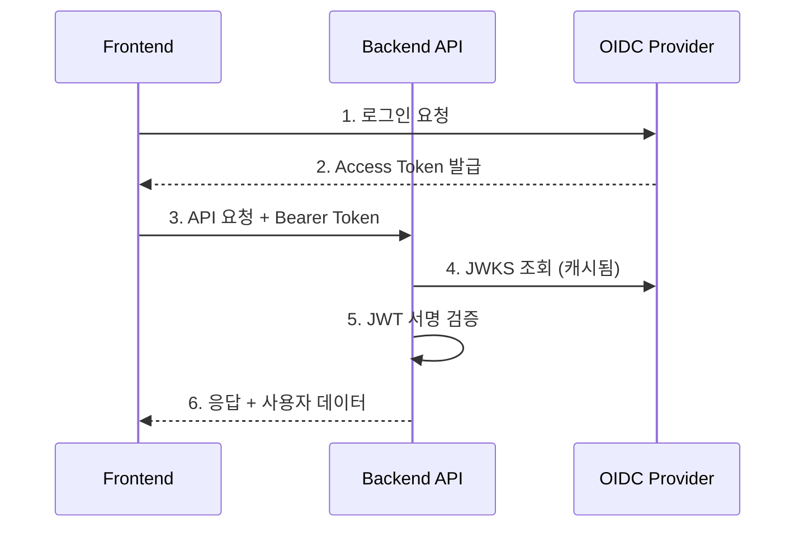
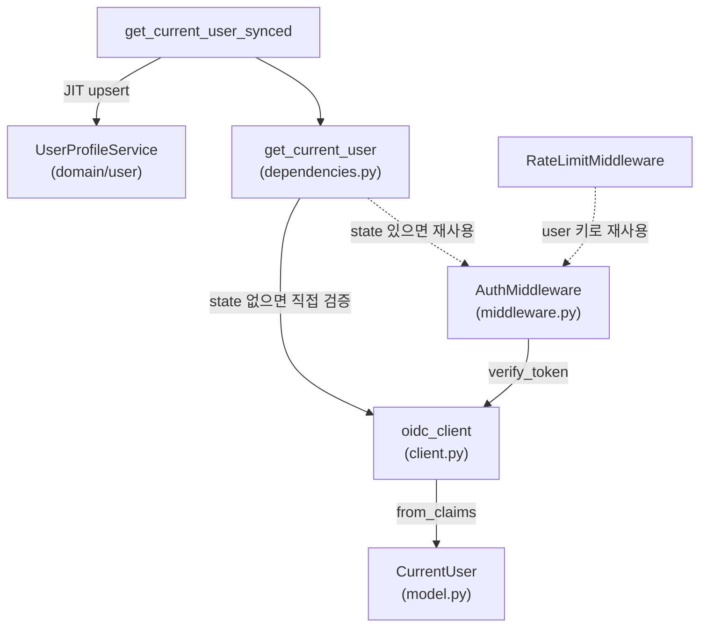

# OIDC 인증 가이드

이 문서는 백엔드 API의 OIDC 인증 시스템에 대한 가이드입니다.

## 1. 인증 아키텍처 개요

이 백엔드는 **OIDC Resource Server (Relying Party)** 로 동작합니다. 
외부 OIDC Provider(Keycloak, Auth0, Google 등)에서 발급한 JWT Access Token을 검증합니다.

### 인증 흐름


```mermaid
sequenceDiagram
    participant FE as Frontend
    participant BE as Backend API
    participant OP as OIDC Provider

    FE->>OP: 1. 로그인 요청
    OP-->>FE: 2. Access Token 발급
    FE->>BE: 3. API 요청 + Bearer Token
    BE->>OP: 4. JWKS 조회 (캐시됨)
    BE->>BE: 5. JWT 서명 검증
    BE-->>FE: 6. 응답 + 사용자 데이터
```

### 핵심 개념

| 용어 | 설명 |
|------|------|
| **OIDC Provider** | 사용자 인증을 담당하는 외부 서버 (Keycloak, Auth0, Google 등) |
| **Access Token** | OIDC Provider가 발급한 JWT, API 요청 시 사용 |
| **JWKS** | JSON Web Key Set, JWT 서명 검증에 사용되는 공개키 |
| **sub claim** | JWT 내 사용자 고유 식별자, 데이터 소유권(owner_id)에 사용 |

### 인증 모듈 구성 (객체 의존성과 역할)

인증 로직은 `app/core/auth/` 패키지에 책임별로 분리되어 있습니다. 하위호환을 위해
`from app.core.auth import X` 형태의 기존 import 경로는 그대로 동작합니다.

| 모듈 | 객체 | 역할 |
|------|------|------|
| `model.py` | `CurrentUser` | 검증된 JWT 클레임에서 추출한 인증 주체. **DB에 영속되지 않는 휘발성 값 객체**(영속 표시 프로필 `UserProfile`과 별개 개념). `from_claims()`(클레임→객체 단일 매핑)·`mock()`(OIDC 비활성화 시 주입) 제공. |
| `client.py` | `OIDCClient` / `oidc_client` (싱글톤) | 외부 OIDC Provider 통신 전담. discovery 메타데이터·JWKS를 TTL 캐싱하고, `verify_token()`으로 서명·표준 클레임(exp/nbf/iat)·issuer·audience를 검증. |
| `dependencies.py` | `get_current_user` | **인증 게이트**(실패 시 `401`). `AuthMiddleware`가 채운 `request.state.current_user`가 있으면 재사용하고, 없으면 `oidc_client`로 직접 검증. |
| `dependencies.py` | `get_optional_current_user` | 선택적 인증(미인증 허용 엔드포인트용). 토큰이 없으면 `None` 반환. |
| `dependencies.py` | `get_current_user_synced` | 인증 게이트 + 최소 표시 프로필 JIT 동기화. 인증 REST 라우터 dependency 전용(아래 「인증 라우터 구성」 참고). |
| `middleware.py` | `AuthMiddleware` | 라우팅 이전 단계에서 토큰을 **best-effort로 검증**해 `request.state.current_user`를 사전 설정(거부하지 않음). 실패/무토큰이면 `None`. |

??? info "CurrentUser와 UserProfile의 차이"

    | 구분 | `CurrentUser` | `UserProfile` |
    |------|---------------|---------------|
    | 성격 | 검증된 JWT에서 만든 요청 범위 인증 주체 | DB에 저장되는 표시 프로필/JIT 캐시 |
    | 생명주기 | 매 요청마다 토큰 검증 결과로 생성 | 로그인한 사용자의 클레임으로 upsert되어 유지 |
    | 정본성 | 인증·인가 판단의 현재 정본 | 친구 목록, 친구코드, 표시명, 아바타, 검증 이메일 인덱스용 보조 데이터 |
    | 대표 필드 | `sub`, `email`, `email_verified`, `name`, `picture`, `raw_claims` | `sub`, `iss`, `display_name`, `avatar_url`, `friend_code`, `verified_email` |
    | 실패 영향 | 없으면 인증 실패(`401`) | 동기화 실패 시 요청은 진행하고 표시정보만 degrade |

    기본 흐름은 `JWT -> CurrentUser -> UserProfile JIT 동기화 -> 도메인 서비스`입니다.
    도메인 소유권과 인가 판단은 계속 `CurrentUser.sub`를 기준으로 하고, `UserProfile`은
    다른 사용자에게 보여줄 최소 표시정보와 친구 추가용 인덱스를 제공하는 역할만 맡습니다.

    확장 기준:

    - 인증·인가 판단에 필요한 클레임은 `CurrentUser` 또는 `raw_claims`에서 읽습니다.
    - 화면 표시, 친구 검색, 외부 공유 식별자처럼 요청 밖에서도 재사용할 값은 `UserProfile`에 저장합니다.
    - API 응답 형태가 필요하면 `CurrentUser`나 `UserProfile`을 그대로 노출하지 말고 도메인 DTO를 둡니다.

    프론트엔드에서 `GET /v1/users/me`로 본인 표시정보와 `friend_code`를 사용하는 흐름은
    [친구 추가 가이드](add-friend.ko.md)와 [Friend & Visibility API 가이드](friend.ko.md)를 참고하세요.

#### 객체 의존성


```mermaid
graph TD
    MW["AuthMiddleware<br/>(middleware.py)"] -->|verify_token| OC["oidc_client<br/>(client.py)"]
    DEP["get_current_user<br/>(dependencies.py)"] -.->|state 있으면 재사용| MW
    DEP -->|state 없으면 직접 검증| OC
    SYNC["get_current_user_synced"] --> DEP
    SYNC -->|JIT upsert| UPS["UserProfileService<br/>(domain/user)"]
    OC -->|from_claims| CU["CurrentUser<br/>(model.py)"]
    RL["RateLimitMiddleware"] -.->|user 키로 재사용| MW
```

#### 요청 수명주기에서의 협력

미들웨어는 `app/main.py`에서 **AuthMiddleware가 RateLimitMiddleware보다 먼저 실행**되도록 등록됩니다.

1. **AuthMiddleware** — 토큰을 best-effort 검증해 `request.state.current_user`를 채웁니다(거부하지 않음).
2. **RateLimitMiddleware** — `request.state.current_user`를 **그대로 재사용**해 사용자 단위로 레이트 리밋을 키잉합니다(중복 토큰 검증 없음). 미인증이면 IP 기반.
3. **`get_current_user` / `get_current_user_synced`** — 엔드포인트(또는 부모 라우터) 의존성으로서 실제 `401` 게이트를 담당하며, 역시 `request.state`를 재사용합니다.

결과적으로 토큰 검증은 사실상 1회(`AuthMiddleware`)만 수행되고, 미들웨어와 의존성이
`request.state.current_user`를 공유해 중복 검증을 피합니다. `AuthMiddleware`는 게이트가
아니므로 인증 강제는 **항상 의존성 계층**에서 일어납니다.

### 인증 라우터 구성 (게이트 + JIT 프로필 동기화)

인증이 필요한 모든 REST 경로는 개별 엔드포인트마다 `Depends`를 반복하지 않고,
**부모 라우터에 인증 의존성을 한 번만 선언**하여 보호합니다.

```python
# app/api/v1/__init__.py
authed = APIRouter(prefix="/v1", dependencies=[Depends(get_current_user_synced)])
for r in (schedules_router, timers_router, tags_router, todos_router,
          meetings_router, friends_router, users_router, visibility_router):
    authed.include_router(r)
api_router.include_router(authed)
```

부모 라우터에 선언된 `get_current_user_synced`는 두 가지 일을 합니다.

1. **토큰 검증 게이트** — `get_current_user`에 위임하여 토큰을 검증합니다. 실패 시
   `401`을 반환하며, 하위 모든 인증 REST 경로에 자동으로 적용됩니다.
2. **최소 사용자 프로필 JIT 동기화** — 인증된 사용자의 표준 OIDC 클레임으로
   `UserProfile`을 upsert합니다. 덕분에 프론트가 별도 프로필 조회를 호출하지 않아도
   활성 사용자의 표시정보(이름·아바타)와 **이메일 친추 인덱스**가 준비됩니다.

동기화는 `SAVEPOINT`(`begin_nested`) 안에서 best-effort로 수행되므로, 동기화가
실패하더라도 엔드포인트 트랜잭션을 오염시키지 않고 요청을 그대로 진행합니다
(표시정보만 `None`으로 degrade). 또한 PK 조회 후 신규이거나 값이 바뀐 경우에만
기록하여 write 증폭을 방지합니다.

!!! note "공개(무인증) 라우터"
    `holidays`, `timers_ws`(WebSocket), `graphql`, `ws_playground`는 이 게이트 밖에
    별도로 등록됩니다. GraphQL은 컨텍스트 단계에서 인증을 처리합니다(5장 참고).

### 데이터 격리

모든 사용자 데이터는 `owner_id` 필드로 격리됩니다:
- Schedule, Todo, Tag, Timer 등 모든 모델에 `owner_id` 필드 존재
- `owner_id`는 JWT의 `sub` claim 값과 매칭
- 다른 사용자의 데이터에는 접근 불가 (404 반환)

### 기존 데이터 마이그레이션

마이그레이션 시 기존 데이터에 할당할 `owner_id`를 환경변수로 지정할 수 있습니다:

```bash
# 개발환경 (기본값: test-user-id)
# OIDC_ENABLED=false 시 mock 사용자와 일치하여 기존 데이터에 접근 가능
alembic upgrade head

# 프로덕션 (특정 사용자 ID 지정)
MIGRATION_DEFAULT_OWNER_ID=admin-user-oidc-sub alembic upgrade head
```

| 환경 | MIGRATION_DEFAULT_OWNER_ID | 설명 |
|------|---------------------------|------|
| 개발 | `test-user-id` (기본값) | Mock 사용자와 일치 |
| 프로덕션 | 실제 OIDC sub | 관리자 또는 기존 사용자의 sub claim |

---

## 2. 개발 환경: 인증 비활성화

로컬 개발이나 테스트 시 OIDC 인증을 비활성화할 수 있습니다.

### 방법 1: 환경변수 설정

```bash
# .env 파일
OIDC_ENABLED=false
```

### 방법 2: 환경변수 직접 지정

=== "Linux/Mac"
    ```bash
    OIDC_ENABLED=false uvicorn app.main:app --reload
    ```

=== "Windows (PowerShell)"
    ```powershell
    $env:OIDC_ENABLED="false"; uvicorn app.main:app --reload
    ```

### 인증 비활성화 시 동작

인증이 비활성화되면 모든 요청에 아래의 **Mock 사용자**가 자동으로 주입됩니다:

```json
{
  "sub": "test-user-id",
  "email": "test@example.com",
  "name": "Test User"
}
```

!!! warning "주의"
    프로덕션 환경에서는 반드시 `OIDC_ENABLED=true`로 설정하세요!

### 테스트 환경

pytest 실행 시 자동으로 인증이 비활성화됩니다 (`tests/conftest.py`에서 설정):

```python
import os
os.environ["OIDC_ENABLED"] = "false"
```

---

## 3. 프로덕션: OIDC 설정

### 환경변수 목록

| 환경변수 | 필수 | 기본값 | 설명 |
|----------|------|--------|------|
| `OIDC_ENABLED` | O | `true` | 인증 활성화 여부 |
| `OIDC_ISSUER_URL` | O | - | OIDC Provider의 Issuer URL |
| `OIDC_AUDIENCE` | O | - | Client ID (Access Token의 `aud` claim) |
| `OIDC_DISCOVERY_URL` | X | 자동 생성 | 커스텀 Discovery URL |
| `OIDC_JWKS_CACHE_TTL_SECONDS` | X | `3600` | JWKS 캐시 TTL (초) |

### 예시 설정 (.env)

```bash
# 프로덕션 설정 예시
OIDC_ENABLED=true
OIDC_ISSUER_URL=https://auth.example.com/realms/production
OIDC_AUDIENCE=my-frontend-app
OIDC_JWKS_CACHE_TTL_SECONDS=3600
```

### Docker Compose 설정

```yaml
# compose.yaml
services:
  backend:
    environment:
      - OIDC_ENABLED=true
      - OIDC_ISSUER_URL=https://auth.example.com/realms/production
      - OIDC_AUDIENCE=my-frontend-app
```

---

## 4. Well-Known 엔드포인트

### 자동 Discovery

백엔드는 OIDC Discovery를 통해 자동으로 Provider 설정을 가져옵니다:

```
Discovery URL = {OIDC_ISSUER_URL}/.well-known/openid-configuration
```

예시:
- Issuer URL: `https://auth.example.com/realms/myrealm`
- Discovery URL: `https://auth.example.com/realms/myrealm/.well-known/openid-configuration`

### 커스텀 Discovery URL

비표준 경로를 사용하는 Provider의 경우 직접 지정:

```bash
OIDC_DISCOVERY_URL=https://auth.example.com/custom/.well-known/openid-configuration
```

### Discovery에서 가져오는 정보

| 필드 | 용도 |
|------|------|
| `jwks_uri` | JWT 서명 검증을 위한 공개키 URL |
| `issuer` | 토큰 발급자 검증용 |

### JWKS 캐싱

성능 최적화를 위해 JWKS는 캐싱됩니다:
- 기본 캐시 TTL: 3600초 (1시간)
- `OIDC_JWKS_CACHE_TTL_SECONDS` 환경변수로 조정 가능
- 캐시 만료 시 자동으로 재조회

---

## 5. 프론트엔드 통합 가이드

### 인증 헤더 형식

모든 API 요청에 Bearer 토큰을 포함해야 합니다:

```
Authorization: Bearer <access_token>
```

### REST API 요청 예시

#### JavaScript (fetch)

```javascript
const accessToken = 'your-access-token';

const response = await fetch('http://localhost:8000/v1/schedules', {
  method: 'GET',
  headers: {
    'Authorization': `Bearer ${accessToken}`,
    'Content-Type': 'application/json',
  },
});

if (response.status === 401) {
  // 토큰 만료 또는 유효하지 않음 → 재로그인 필요
  redirectToLogin();
}

const data = await response.json();
```

#### Axios 인터셉터

```javascript
import axios from 'axios';

const api = axios.create({
  baseURL: 'http://localhost:8000/v1',
});

// 요청 인터셉터: 토큰 자동 추가
api.interceptors.request.use((config) => {
  const token = localStorage.getItem('access_token');
  if (token) {
    config.headers.Authorization = `Bearer ${token}`;
  }
  return config;
});

// 응답 인터셉터: 401 처리
api.interceptors.response.use(
  (response) => response,
  (error) => {
    if (error.response?.status === 401) {
      // 토큰 갱신 또는 재로그인
      handleTokenRefresh();
    }
    return Promise.reject(error);
  }
);
```

### GraphQL 요청 예시

```javascript
const query = `
  query GetCalendar($startDate: Date!, $endDate: Date!) {
    calendar(startDate: $startDate, endDate: $endDate) {
      days {
        date
        events {
          id
          title
        }
      }
    }
  }
`;

const response = await fetch('http://localhost:8000/graphql', {
  method: 'POST',
  headers: {
    'Authorization': `Bearer ${accessToken}`,
    'Content-Type': 'application/json',
  },
  body: JSON.stringify({
    query,
    variables: {
      startDate: '2026-01-01',
      endDate: '2026-01-31',
    },
  }),
});
```

### 에러 응답 처리

#### 401 Unauthorized

```json
{
  "detail": "Authorization header missing"
}
```
또는
```json
{
  "detail": "Invalid token: Signature verification failed"
}
```

**처리 방법**: 
1. Refresh Token으로 새 Access Token 요청
2. 실패 시 로그인 페이지로 리다이렉트

#### 403 Forbidden (GraphQL)

GraphQL에서 인증 없이 보호된 쿼리 실행 시:

```json
{
  "data": null,
  "errors": [
    {
      "message": "인증이 필요합니다. Authorization 헤더에 Bearer 토큰을 제공해주세요."
    }
  ]
}
```

### 토큰 갱신 (프론트엔드 책임)

Access Token 갱신은 **프론트엔드에서 OIDC Provider와 직접** 처리합니다:

```javascript
// 예시: oidc-client-ts 사용
import { UserManager } from 'oidc-client-ts';

const userManager = new UserManager({
  authority: 'https://auth.example.com/realms/myrealm',
  client_id: 'my-frontend-app',
  redirect_uri: 'http://localhost:3000/callback',
});

// 자동 토큰 갱신
userManager.events.addAccessTokenExpiring(async () => {
  try {
    await userManager.signinSilent();
  } catch (error) {
    // 갱신 실패 → 재로그인 필요
    await userManager.signinRedirect();
  }
});
```

---

## 6. OIDC Provider별 설정 예시

### Keycloak

```bash
# Keycloak 설정
OIDC_ENABLED=true
OIDC_ISSUER_URL=https://keycloak.example.com/realms/myrealm
OIDC_AUDIENCE=my-frontend-app
```

**Keycloak 설정 시 확인 사항:**
- Client 생성 시 `Access Type`: `public` (SPA) 또는 `confidential`
- `Valid Redirect URIs`: 프론트엔드 URL 등록
- `Web Origins`: CORS 설정을 위한 프론트엔드 origin

**프론트엔드 설정:**
```javascript
const oidcConfig = {
  authority: 'https://keycloak.example.com/realms/myrealm',
  client_id: 'my-frontend-app',
  redirect_uri: 'http://localhost:3000/callback',
  scope: 'openid profile email',
};
```

### Google

```bash
# Google 설정
OIDC_ENABLED=true
OIDC_ISSUER_URL=https://accounts.google.com
OIDC_AUDIENCE=your-google-client-id.apps.googleusercontent.com
```

**Google Cloud Console 설정:**
1. OAuth 2.0 클라이언트 ID 생성
2. 승인된 JavaScript 원본에 프론트엔드 URL 추가
3. 승인된 리다이렉션 URI 추가

**프론트엔드 설정:**
```javascript
const oidcConfig = {
  authority: 'https://accounts.google.com',
  client_id: 'your-google-client-id.apps.googleusercontent.com',
  redirect_uri: 'http://localhost:3000/callback',
  scope: 'openid profile email',
};
```

### Auth0

```bash
# Auth0 설정
OIDC_ENABLED=true
OIDC_ISSUER_URL=https://your-tenant.auth0.com/
OIDC_AUDIENCE=https://your-api-identifier
```

!!! warning "주의"
    Auth0의 Issuer URL은 끝에 `/`가 포함되어야 합니다.

**Auth0 Dashboard 설정:**
1. Application 생성 (Single Page Application)
2. API 생성 및 Identifier 설정
3. Allowed Callback URLs, Logout URLs, Web Origins 설정

**프론트엔드 설정:**
```javascript
const oidcConfig = {
  authority: 'https://your-tenant.auth0.com',
  client_id: 'your-auth0-client-id',
  redirect_uri: 'http://localhost:3000/callback',
  scope: 'openid profile email',
  audience: 'https://your-api-identifier',
};
```

---

## 관련 코드 참조

| 파일 | 설명 |
|------|------|
| `app/core/auth/` | OIDC 인증 패키지 (model·client·dependencies·middleware) |
| `app/core/auth/model.py` | `CurrentUser` 인증 주체 값 객체 |
| `app/core/auth/client.py` | `OIDCClient` / `oidc_client` (discovery·JWKS·토큰 검증) |
| `app/core/auth/dependencies.py` | `get_current_user` / `get_current_user_synced` 의존성 |
| `app/core/auth/middleware.py` | `AuthMiddleware` (request.state 사전 설정) |
| `app/api/v1/__init__.py` | 인증·공개 라우터 구성 (게이트 + JIT 동기화 선언) |
| `app/core/config.py` | 환경변수 설정 |
| `app/api/v1/graphql.py` | GraphQL 컨텍스트 인증 처리 |

### CurrentUser 모델

```python
class CurrentUser(BaseModel):
    sub: str                      # 사용자 고유 식별자 (owner_id로 사용)
    email: str | None = None
    email_verified: bool = False  # 이메일 기반 친추 인덱싱 조건 (OIDC email_verified)
    name: str | None = None
    picture: str | None = None    # avatar_url 출처 (OIDC picture)
    raw_claims: dict = {}         # 전체 JWT 클레임 (필요시 확장용)
```

### FastAPI Dependency 사용법

```python
from app.core.auth import CurrentUser, get_current_user

@router.get("/protected")
async def protected_endpoint(
    current_user: CurrentUser = Depends(get_current_user),
):
    return {"user_id": current_user.sub}
```

---

## FAQ

### Q: 인증 없이 빠르게 테스트하고 싶어요

`.env` 파일에 `OIDC_ENABLED=false` 추가 후 서버 재시작

### Q: 다른 사용자의 데이터가 보이지 않아요

정상입니다. 모든 데이터는 `owner_id`로 격리되어 있습니다.

### Q: 토큰 만료 시간은 어떻게 되나요?

OIDC Provider 설정에 따라 다릅니다. 일반적으로:
- Access Token: 5분 ~ 1시간
- Refresh Token: 1일 ~ 30일

### Q: JWKS 캐시가 갱신되지 않아요

서버 재시작 또는 캐시 TTL(기본 1시간) 만료를 기다리세요.
