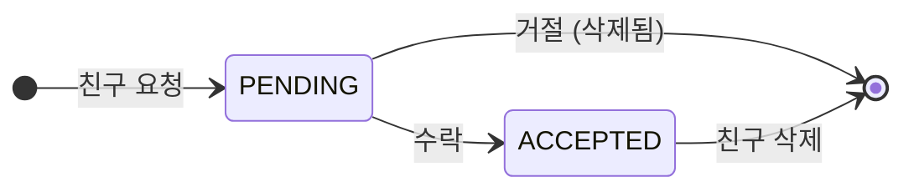

# Friend & Visibility API 가이드 (프론트엔드 개발자용)

> **최종 업데이트**: 2026-06-14

## 개요

Friend & Visibility API는 사용자 간 **친구 관계**와 **리소스 공유**를 관리합니다.

### 핵심 개념

| 개념 | 설명 |
|------|------|
| **Friendship** | 두 사용자 간의 친구 관계. 요청/수락 워크플로우를 통해 생성. |
| **친구코드(friend_code)** | 사용자별 불투명 코드(`base64url(SHA256(sub))`). 본인 코드는 `GET /v1/users/me`로 확인해 친추 URL 등으로 공유한다. 친추는 **친구코드 또는 검증된 이메일**로 보낸다(사용자 검색은 제공하지 않음). |
| **표시정보(display_name·avatar_url)** | 친구 목록/받은 요청에서 "누가"를 표시하기 위한 값. OIDC 토큰의 `name`/`picture` 클레임에서 채워지며, 친구·요청 관계가 있는 상대에 한해 노출된다. |
| **Visibility** | 리소스(Schedule, Timer, Todo, Meeting)의 공개 범위 설정. |
| **AllowList** | SELECTED_FRIENDS 레벨에서 접근을 허용할 친구 목록. |

> **참고:** 이 백엔드는 사용자 디렉터리/검색을 제공하지 않습니다. 상대를 추가하려면 상대가 공유한 `friend_code` 또는 상대의 (검증된) 이메일이 필요합니다. 이메일 경로는 계정 열거 방지를 위해 매칭 여부와 무관하게 항상 `202`를 반환합니다.

### 친구 관계 워크플로우


```mermaid
stateDiagram-v2
    direction LR
    [*] --> PENDING: 친구 요청
    PENDING --> ACCEPTED: 수락
    PENDING --> [*]: 거절 (삭제됨)
    ACCEPTED --> [*]: 친구 삭제
```

### 접근권한 레벨

| 레벨 | 설명 |
|------|------|
| `PRIVATE` | 본인만 접근 가능 (기본값) |
| `FRIENDS` | 모든 친구 접근 가능 |
| `SELECTED_FRIENDS` | 선택한 친구만 접근 가능 |
| `PUBLIC` | 모든 사용자 접근 가능 |

---

## 데이터 모델

### FriendshipStatus

```typescript
type FriendshipStatus = 
  | "pending"   // 요청 대기 중
  | "accepted"  // 친구 관계 수립
  | "blocked";  // 차단됨
```

### Friendship

```typescript
interface Friendship {
  id: string;              // UUID
  requester_id: string;    // 요청자 ID
  addressee_id: string;    // 수신자 ID
  status: FriendshipStatus;
  blocked_by?: string;     // 차단한 사용자 ID (blocked 상태일 때)
  created_at: string;      // ISO 8601
  updated_at: string;      // ISO 8601
}
```

### Friend

```typescript
interface Friend {
  user_id: string;            // 친구 사용자 ID
  friendship_id: string;      // 친구 관계 ID
  display_name?: string;      // 친구 표시명 (프로필 없으면 null)
  avatar_url?: string;        // 친구 아바타 URL (프로필 없으면 null)
  since: string;              // 친구가 된 시점 (ISO 8601)
}
```

### PendingRequest

```typescript
interface PendingRequest {
  id: string;                       // 친구 관계 ID
  requester_id: string;             // 요청자 ID
  addressee_id: string;             // 수신자 ID
  requester_display_name?: string;  // 요청자 표시명 (받은 요청에서 "누가" 표시)
  requester_avatar_url?: string;    // 요청자 아바타 URL
  created_at: string;               // ISO 8601
}
```

### MyProfile

```typescript
// GET /v1/users/me 응답 — 본인 표시정보 + 공유용 친구코드
interface MyProfile {
  id: string;              // 본인 사용자 ID (OIDC sub)
  display_name?: string;   // 표시명 (토큰 name 클레임)
  avatar_url?: string;     // 아바타 URL (토큰 picture 클레임)
  friend_code: string;     // 친추 URL에 실어 공유하는 불투명 코드
}
```

### VisibilityLevel

```typescript
type VisibilityLevel = 
  | "private"   // 본인만 (기본값)
  | "friends"   // 모든 친구
  | "selected"  // 선택한 친구
  | "public";   // 전체 공개
```

### VisibilitySettings

```typescript
interface VisibilitySettings {
  level: VisibilityLevel;
  allowed_user_ids?: string[];  // SELECTED_FRIENDS 레벨에서만 사용
}
```

---

## Friend REST API

### Base URL

```
/v1/friends
```

### 친구 목록

#### GET /friends

현재 사용자의 친구 목록을 조회합니다.

**Response 200:**
```json
[
  {
    "user_id": "friend-user-id",
    "friendship_id": "uuid",
    "display_name": "Alice",
    "avatar_url": "https://.../alice.png",
    "since": "2026-01-23T10:00:00Z"
  }
]
```

#### GET /friends/ids

친구 ID 목록만 조회합니다 (효율적인 쿼리).

**Response 200:**
```json
["friend-id-1", "friend-id-2", "friend-id-3"]
```

#### GET /friends/check/{user_id}

특정 사용자와 친구인지 확인합니다.

**Response 200:**
```json
true
```
또는
```json
false
```

---

### 내 프로필 / 친구코드

#### GET /v1/users/me

본인 표시정보와 **친구코드**를 조회합니다. 프로필이 없으면 토큰 클레임으로 자동 생성됩니다.
`friend_code`를 친추 URL(예: `https://app.example.com/add-friend?code=<friend_code>`) 등으로 공유하면 상대가 그 코드로 친구 요청을 보낼 수 있습니다.

**Response 200:**
```json
{
  "id": "my-user-id",
  "display_name": "Bob",
  "avatar_url": "https://.../bob.png",
  "friend_code": "Xy7mGq2bQ1A"
}
```

> 응답에 email은 포함되지 않습니다(이메일은 신원으로 노출/저장하지 않음).

---

### 친구 요청

#### POST /friends/requests

`email` 또는 `friend_code` 중 **정확히 하나**로 친구 요청을 보냅니다(서버가 DTO에서 검증). 둘 다 보내거나 둘 다 비우면 `422`, `email` 형식이 올바르지 않아도 `422`.

**Request Body (친구코드):**
```json
{
  "friend_code": "Xy7mGq2bQ1A"
}
```
**Request Body (이메일):**
```json
{
  "email": "alice@example.com"
}
```

##### 친구코드 경로 (`friend_code`)

상대가 `GET /v1/users/me`로 공유한 친구코드와 직접 매칭합니다. **정상 피드백**을 줍니다.

**Response 201:**
```json
{
  "id": "uuid",
  "requester_id": "my-user-id",
  "addressee_id": "target-user-id",
  "status": "pending",
  "created_at": "2026-01-23T10:00:00Z",
  "updated_at": "2026-01-23T10:00:00Z"
}
```

**Error Responses:**
- `404`: 친구코드가 유효하지 않음 (해당 코드의 사용자 없음)
- `400`: 자기 자신에게 요청
- `409`: 이미 친구이거나 대기 중인 요청 존재
- `403`: 차단 관계
- `422`: `email`·`friend_code`를 둘 다 보내거나 둘 다 비움(또는 `email` 형식 오류)

##### 이메일 경로 (`email`)

형식 검증된 `email`로, 검증된 이메일(`email_verified`)을 가진 사용자와 매칭합니다. **계정 열거를 막기 위해 항상 `202`** 를 반환합니다 — 이메일이 존재하든, 본인이든, 이미 친구든, 차단됐든 **응답이 동일**합니다(매칭되면 내부적으로만 요청이 생성됨).

**Response 202 (항상 동일):**
```json
{ "ok": true }
```

!!! note "왜 피드백이 없나요?"
    이메일은 추측 가능하므로, 성공/실패를 구분해 응답하면 "그 이메일이 가입돼 있는지"가 노출됩니다(계정 열거). 그래서 이메일 경로는 결과와 무관하게 `202`만 줍니다. 반면 친구코드는 추측 불가(고엔트로피)라 `404` 피드백을 줘도 안전합니다.

    검증된 이메일을 토큰에 주지 않는 IdP 사용자는 이메일로 찾히지 않습니다(이 경우에도 `202`). 그런 사용자도 **친구코드로는 항상 추가 가능**합니다.

!!! warning "Rate Limit"
    `POST /v1/friends/requests`는 이메일 경로의 대량 시도(열거·스팸)를 막기 위해 **다른 쓰기보다 엄격하게 60초당 20회**로 제한됩니다. 초과 시 `429`. 자세한 내용은 [Rate Limiting 가이드](../development/rate-limit.ko.md)를 참고하세요.

#### GET /friends/requests/received

받은 친구 요청 목록을 조회합니다. 각 항목에 요청자 표시정보(`requester_display_name`·`requester_avatar_url`)가 포함되어 "누가 보냈는지" 표시할 수 있습니다.

**Response 200:**
```json
[
  {
    "id": "uuid",
    "requester_id": "other-user-id",
    "addressee_id": "my-user-id",
    "requester_display_name": "Alice",
    "requester_avatar_url": "https://.../alice.png",
    "created_at": "2026-01-23T10:00:00Z"
  }
]
```

#### GET /friends/requests/sent

보낸 친구 요청 목록을 조회합니다.

**Response 200:**
```json
[
  {
    "id": "uuid",
    "requester_id": "my-user-id",
    "addressee_id": "other-user-id",
    "created_at": "2026-01-23T10:00:00Z"
  }
]
```

#### POST /friends/requests/{friendship_id}/accept

친구 요청을 수락합니다.

**Response 200:**
```json
{
  "id": "uuid",
  "requester_id": "other-user-id",
  "addressee_id": "my-user-id",
  "status": "accepted",
  "created_at": "2026-01-23T10:00:00Z",
  "updated_at": "2026-01-23T10:05:00Z"
}
```

**Error Responses:**
- `403`: 요청 수신자가 아님
- `400`: 대기 중인 요청이 아님
- `404`: 요청을 찾을 수 없음

#### POST /friends/requests/{friendship_id}/reject

친구 요청을 거절합니다 (요청 삭제).

**Response 200:**
```json
{
  "ok": true,
  "message": "Friend request rejected"
}
```

#### DELETE /friends/requests/{friendship_id}

보낸 친구 요청을 취소합니다.

**Response 200:**
```json
{
  "ok": true,
  "message": "Friend request cancelled"
}
```

---

### 친구 관리

#### DELETE /friends/{friendship_id}

친구 관계를 삭제합니다.

**Response 200:**
```json
{
  "ok": true,
  "message": "Friend removed"
}
```

---

### 차단 관리

#### POST /friends/block/{user_id}

사용자를 차단합니다.

**Response 200:**
```json
{
  "id": "uuid",
  "requester_id": "my-user-id",
  "addressee_id": "blocked-user-id",
  "status": "blocked",
  "blocked_by": "my-user-id",
  "created_at": "2026-01-23T10:00:00Z",
  "updated_at": "2026-01-23T10:00:00Z"
}
```

**차단 효과:**
- 차단된 사용자는 친구 요청을 보낼 수 없음
- 차단된 사용자는 공유된 콘텐츠에 접근할 수 없음
- 기존 친구 관계가 있었다면 차단 상태로 변경됨

#### DELETE /friends/block/{user_id}

차단을 해제합니다.

**Response 200:**
```json
{
  "ok": true,
  "message": "User unblocked"
}
```

**Note:** 본인이 차단한 경우에만 해제할 수 있습니다.

---

## 접근권한(Visibility) 설정

### 리소스 생성/수정 시 접근권한 설정

Schedule, Timer, Todo 생성/수정 시 `visibility` 필드를 포함할 수 있습니다.

#### Schedule 생성 예시

**POST /v1/schedules**
```json
{
  "title": "팀 회의",
  "start_time": "2026-01-23T10:00:00Z",
  "end_time": "2026-01-23T11:00:00Z",
  "visibility": {
    "level": "friends"
  }
}
```

#### 선택한 친구에게만 공유

```json
{
  "title": "비밀 프로젝트",
  "start_time": "2026-01-23T10:00:00Z",
  "end_time": "2026-01-23T11:00:00Z",
  "visibility": {
    "level": "selected",
    "allowed_user_ids": ["friend-id-1", "friend-id-2"]
  }
}
```

**Note:** `allowed_user_ids`에 포함된 사용자는 모두 **친구**여야 합니다.

### 접근권한 레벨별 접근 권한

| 레벨 | 소유자 | 친구 | 비친구 |
|------|--------|------|--------|
| `private` | ✅ | ❌ | ❌ |
| `friends` | ✅ | ✅ | ❌ |
| `selected` | ✅ | AllowList만 | ❌ |
| `public` | ✅ | ✅ | ✅ |

### 응답에서 접근권한 정보 확인

공유된 리소스를 조회할 때 추가 필드가 포함됩니다:

```json
{
  "id": "uuid",
  "title": "친구의 일정",
  "owner_id": "friend-user-id",
  "visibility_level": "friends",
  "is_shared": true,
  ...
}
```

---

## TypeScript 타입 정의

```typescript
// Friend Types
type FriendshipStatus = "pending" | "accepted" | "blocked";

interface Friendship {
  id: string;
  requester_id: string;
  addressee_id: string;
  status: FriendshipStatus;
  blocked_by?: string;
  created_at: string;
  updated_at: string;
}

interface Friend {
  user_id: string;
  friendship_id: string;
  since: string;
}

interface PendingRequest {
  id: string;
  requester_id: string;
  addressee_id: string;
  created_at: string;
}

// email · friend_code 중 정확히 하나
type FriendRequest =
  | { email: string }
  | { friend_code: string };

interface MyProfile {
  id: string;
  display_name?: string;
  avatar_url?: string;
  friend_code: string;
}

// Visibility Types
type VisibilityLevel = "private" | "friends" | "selected" | "public";

interface VisibilitySettings {
  level: VisibilityLevel;
  allowed_user_ids?: string[];
}

// Extended Resource Types (with visibility)
interface ScheduleWithVisibility extends Schedule {
  owner_id?: string;
  visibility_level?: VisibilityLevel;
  is_shared: boolean;
}

interface TimerWithVisibility extends Timer {
  owner_id?: string;
  visibility_level?: VisibilityLevel;
  is_shared: boolean;
}

interface TodoWithVisibility extends Todo {
  owner_id?: string;
  visibility_level?: VisibilityLevel;
  is_shared: boolean;
}

// Create/Update Types with Visibility
interface ScheduleCreateWithVisibility extends ScheduleCreate {
  visibility?: VisibilitySettings;
}

interface TimerCreateWithVisibility extends TimerCreate {
  visibility?: VisibilitySettings;
}

interface TodoCreateWithVisibility extends TodoCreate {
  visibility?: VisibilitySettings;
}
```

---

## 사용 예시

### 친구 추가 흐름 (친구코드 기반)

```typescript
// 0. (상대방) 본인 친구코드 확인 후 공유 — 예: 친추 URL/QR로 전달
const me = await (await fetch('/v1/users/me')).json();
const shareUrl = `${location.origin}/add-friend?code=${me.friend_code}`;

// 1. (나) 친구코드 또는 이메일로 요청 보내기 (둘 중 정확히 하나)
const response = await fetch('/v1/friends/requests', {
  method: 'POST',
  headers: { 'Content-Type': 'application/json' },
  body: JSON.stringify({ friend_code: 'Xy7mGq2bQ1A' }),   // 또는 { email: 'alice@example.com' }
});
// 코드 경로: 404=유효하지 않은 코드. 이메일 경로: 항상 202(열거 방지). 둘 다/둘 다 없음: 422.
const friendship = await response.json();
console.log('요청 보냄:', friendship.id);

// 2. 받은 요청 확인 (상대방) — requester_display_name으로 누가 보냈는지 표시
const requests = await fetch('/v1/friends/requests/received');
const pendingRequests = await requests.json();

// 3. 요청 수락 (상대방)
await fetch(`/v1/friends/requests/${pendingRequests[0].id}/accept`, {
  method: 'POST',
});

// 4. 친구 목록 확인 (display_name/avatar_url 포함)
const friends = await fetch('/v1/friends');
const friendList = await friends.json();
console.log('친구 목록:', friendList);
```

### 일정 공유

```typescript
// 모든 친구에게 공유되는 일정 생성
const schedule = await fetch('/v1/schedules', {
  method: 'POST',
  headers: { 'Content-Type': 'application/json' },
  body: JSON.stringify({
    title: '팀 회의',
    start_time: '2026-01-23T10:00:00Z',
    end_time: '2026-01-23T11:00:00Z',
    visibility: {
      level: 'friends',
    },
  }),
});

// 특정 친구에게만 공유
const privateSchedule = await fetch('/v1/schedules', {
  method: 'POST',
  headers: { 'Content-Type': 'application/json' },
  body: JSON.stringify({
    title: '비밀 미팅',
    start_time: '2026-01-23T14:00:00Z',
    end_time: '2026-01-23T15:00:00Z',
    visibility: {
      level: 'selected',
      allowed_user_ids: ['trusted-friend-id'],
    },
  }),
});
```

### 접근권한 변경

```typescript
// 기존 일정의 접근권한 변경
await fetch(`/v1/schedules/${scheduleId}`, {
  method: 'PATCH',
  headers: { 'Content-Type': 'application/json' },
  body: JSON.stringify({
    visibility: {
      level: 'public',
    },
  }),
});
```

---

## 주의사항

### 1. 접근권한 기본값

리소스 생성 시 `visibility`를 지정하지 않으면 **PRIVATE**으로 설정됩니다.

### 2. SELECTED_FRIENDS 검증

`selected` 레벨에서 `allowed_user_ids`에 포함된 사용자는 모두 **친구**여야 합니다. 친구가 아닌 사용자를 포함하면 `400 Bad Request`가 반환됩니다.

### 3. 차단 시 접근 제한

차단 관계에서는 양방향으로 접근이 제한됩니다:
- 차단한 사용자 → 차단된 사용자의 PUBLIC 콘텐츠도 접근 불가
- 차단된 사용자 → 차단한 사용자의 모든 콘텐츠 접근 불가

### 4. 친구 관계 삭제 시

친구 관계가 삭제되면:
- 해당 친구에게 `friends` 레벨로 공유된 콘텐츠는 더 이상 접근 불가
- `selected` 레벨의 AllowList에 있었다면 해당 항목도 자동으로 접근 불가

### 5. 소유자 우선

리소스 소유자는 접근권한 설정과 관계없이 항상 자신의 리소스에 접근할 수 있습니다.

---

## 에러 코드

| 코드 | 설명 |
|------|------|
| 400 | 잘못된 요청 (자기 자신에게 요청, 친구가 아닌 사용자 AllowList 추가 등) |
| 403 | 접근 거부 (권한 없음, 차단됨) |
| 404 | 리소스를 찾을 수 없음 |
| 409 | 충돌 (이미 친구, 중복 요청) |
