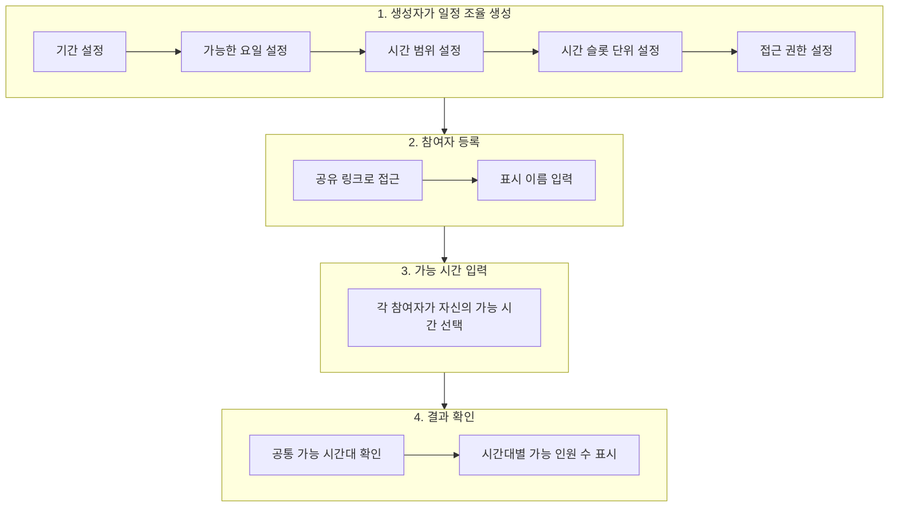

# Meeting (일정 조율) API 가이드 (프론트엔드 개발자용)

> **최종 업데이트**: 2026-01-29

## 개요

Meeting(일정 조율) API는 여러 참여자가 공통으로 가능한 시간대를 찾아 회의 일정을 조율하는 기능을 제공합니다.

### 주요 기능



### 접근 권한

| 레벨 | 설명 |
|------|------|
| `public` | 링크를 아는 모든 사용자 접근 가능 |
| `allowed_emails` | 허용된 이메일/도메인 사용자만 접근 가능 |
| `private` | 생성자만 접근 가능 (기본값) |

---

## 데이터 모델

### Meeting (일정 조율)

```typescript
interface Meeting {
  id: string;                    // UUID
  owner_id: string;              // 생성자 ID
  title: string;                 // 제목
  description?: string;          // 설명
  start_date: string;            // 시작 날짜 (YYYY-MM-DD)
  end_date: string;              // 종료 날짜 (YYYY-MM-DD)
  available_days: number[];      // 가능한 요일 (0=월, 1=화, ..., 6=일)
  start_time: string;            // 하루 시작 시간 (HH:MM:SS)
  end_time: string;              // 하루 종료 시간 (HH:MM:SS)
  time_slot_minutes: number;     // 시간 슬롯 단위 (분)
  created_at: string;            // 생성 시간 (ISO 8601)
  updated_at: string;            // 수정 시간 (ISO 8601)
  visibility_level?: string;     // 가시성 레벨
  is_shared: boolean;            // 공유된 리소스인지
}
```

### Participant (참여자)

```typescript
interface Participant {
  id: string;                    // UUID
  meeting_id: string;            // 일정 조율 ID
  user_id?: string;              // 사용자 ID (로그인한 경우)
  display_name: string;          // 표시 이름
  created_at: string;            // 등록 시간
}
```

### TimeSlot (시간 슬롯)

```typescript
interface TimeSlot {
  id: string;                    // UUID
  participant_id: string;        // 참여자 ID
  slot_date: string;             // 날짜 (YYYY-MM-DD)
  start_time: string;            // 시작 시간 (HH:MM:SS)
  end_time: string;              // 종료 시간 (HH:MM:SS)
}
```

### AvailabilityGrid (가능 시간 그리드)

```typescript
// 결과 조회 시 반환되는 그리드 형식
interface AvailabilityTimeSlot {
  time: string;   // 시간 (HH:MM)
  count: number;  // 가능한 인원 수
}

interface AvailabilityDateGroup {
  date: string;                  // 날짜 (YYYY-MM-DD)
  slots: AvailabilityTimeSlot[];
}

// 예시
const grid: AvailabilityDateGroup[] = [
  {
    date: "2024-02-02",
    slots: [
      { time: "09:00", count: 3 },
      { time: "09:30", count: 3 },
      { time: "10:00", count: 2 },
      { time: "10:30", count: 1 },
      { time: "11:00", count: 0 },
    ],
  },
  {
    date: "2024-02-05",
    slots: [
      { time: "09:00", count: 2 },
      { time: "09:30", count: 2 },
    ],
  },
];
```

---

## API 엔드포인트

### 일정 조율 관리

#### 일정 조율 생성

**POST /api/v1/meetings**

```typescript
// Request
interface MeetingCreate {
  title: string;
  description?: string;
  start_date: string;           // "2024-02-01"
  end_date: string;             // "2024-02-07"
  available_days: number[];     // [0, 2, 4] = 월, 수, 금
  start_time: string;           // "09:00:00"
  end_time: string;             // "18:00:00"
  time_slot_minutes?: number;   // 30 (기본값)
  visibility?: VisibilitySettings;
}

// Response: Meeting
```

**예시:**

```json
{
  "title": "팀 회의 일정 조율",
  "description": "다음 주 회의 일정을 조율합니다",
  "start_date": "2024-02-01",
  "end_date": "2024-02-07",
  "available_days": [0, 2, 4],
  "start_time": "09:00:00",
  "end_time": "18:00:00",
  "time_slot_minutes": 30,
  "visibility": {
    "level": "allowed_emails",
    "allowed_emails": ["alice@company.com", "bob@company.com"],
    "allowed_domains": ["company.com"]
  }
}
```

#### 일정 조율 목록 조회 (내 것만)

**GET /api/v1/meetings**

쿼리 파라미터:
- `timezone` (optional): 타임존 (예: `+09:00`, `Asia/Seoul`)

```typescript
// Response: Meeting[]
```

#### 일정 조율 상세 조회

**GET /api/v1/meetings/{meeting_id}**

쿼리 파라미터:
- `timezone` (optional): 타임존

```typescript
// Response: Meeting
```

#### 일정 조율 수정

**PATCH /api/v1/meetings/{meeting_id}**

```typescript
// Request
interface MeetingUpdate {
  title?: string;
  description?: string;
  start_date?: string;
  end_date?: string;
  available_days?: number[];
  start_time?: string;
  end_time?: string;
  time_slot_minutes?: number;
}

// Response: Meeting
```

#### 일정 조율 삭제

**DELETE /api/v1/meetings/{meeting_id}**

```typescript
// Response: 204 No Content
```

---

### 참여자 관리

#### 참여자 등록

**POST /api/v1/meetings/{meeting_id}/participate**

```typescript
// Request
interface ParticipantCreate {
  display_name: string;
}

// Response: Participant
```

**예시:**

```json
{
  "display_name": "홍길동"
}
```

---

### 가능 시간 관리

#### 가능 시간 설정/업데이트

**PUT /api/v1/meetings/{meeting_id}/availability**

쿼리 파라미터:
- `participant_id` (required): 참여자 ID

```typescript
// Request
interface TimeSlotCreate {
  slot_date: string;           // "2024-02-02"
  start_time: string;          // "09:00:00"
  end_time: string;            // "12:00:00"
}

// Request Body: TimeSlotCreate[]

// Response: TimeSlot[]
```

**예시:**

```json
[
  {
    "slot_date": "2024-02-02",
    "start_time": "09:00:00",
    "end_time": "12:00:00"
  },
  {
    "slot_date": "2024-02-05",
    "start_time": "14:00:00",
    "end_time": "18:00:00"
  }
]
```

#### 전체 가능 시간 조회

**GET /api/v1/meetings/{meeting_id}/availability**

쿼리 파라미터:
- `timezone` (optional): 타임존

```typescript
// Response
interface AvailabilityRead {
  participant: Participant;
  time_slots: TimeSlot[];
}

// Response: AvailabilityRead[]
```

---

### 결과 조회

#### 공통 가능 시간 분석

**GET /api/v1/meetings/{meeting_id}/result**

쿼리 파라미터:
- `timezone` (optional): 타임존

```typescript
// Response
interface MeetingResult {
  meeting: Meeting;
  availability_grid: AvailabilityDateGroup[];
}
```

**응답 예시:**

```json
{
  "meeting": {
    "id": "uuid-here",
    "title": "팀 회의 일정 조율",
    "start_date": "2024-02-01",
    "end_date": "2024-02-07",
    "available_days": [0, 2, 4],
    "start_time": "09:00:00",
    "end_time": "18:00:00",
    "time_slot_minutes": 30
  },
  "availability_grid": [
    {
      "date": "2024-02-02",
      "slots": [
        { "time": "09:00", "count": 3 },
        { "time": "09:30", "count": 3 },
        { "time": "10:00", "count": 2 },
        { "time": "10:30", "count": 2 },
        { "time": "11:00", "count": 1 },
        { "time": "11:30", "count": 0 },
        { "time": "12:00", "count": 0 }
      ]
    },
    {
      "date": "2024-02-05",
      "slots": [
        { "time": "09:00", "count": 2 },
        { "time": "09:30", "count": 2 },
        { "time": "10:00", "count": 3 },
        { "time": "10:30", "count": 3 }
      ]
    }
  ]
}
```

---

## TypeScript 타입 정의

```typescript
// ===== 요일 상수 =====
const DAY_OF_WEEK = {
  MONDAY: 0,
  TUESDAY: 1,
  WEDNESDAY: 2,
  THURSDAY: 3,
  FRIDAY: 4,
  SATURDAY: 5,
  SUNDAY: 6,
} as const;

const DAY_LABELS: Record<number, string> = {
  0: "월",
  1: "화",
  2: "수",
  3: "목",
  4: "금",
  5: "토",
  6: "일",
};

// ===== 가시성 설정 =====
interface VisibilitySettings {
  level: "private" | "public" | "allowed_emails";
  allowed_emails?: string[];    // ALLOWED_EMAILS 레벨에서만
  allowed_domains?: string[];   // ALLOWED_EMAILS 레벨에서만
}

// ===== Meeting 타입 =====
interface Meeting {
  id: string;
  owner_id: string;
  title: string;
  description?: string;
  start_date: string;
  end_date: string;
  available_days: number[];
  start_time: string;
  end_time: string;
  time_slot_minutes: number;
  created_at: string;
  updated_at: string;
  visibility_level?: string;
  is_shared: boolean;
}

interface MeetingCreate {
  title: string;
  description?: string;
  start_date: string;
  end_date: string;
  available_days: number[];
  start_time: string;
  end_time: string;
  time_slot_minutes?: number;
  visibility?: VisibilitySettings;
}

interface MeetingUpdate {
  title?: string;
  description?: string;
  start_date?: string;
  end_date?: string;
  available_days?: number[];
  start_time?: string;
  end_time?: string;
  time_slot_minutes?: number;
}

// ===== Participant 타입 =====
interface Participant {
  id: string;
  meeting_id: string;
  user_id?: string;
  display_name: string;
  created_at: string;
}

interface ParticipantCreate {
  display_name: string;
}

// ===== TimeSlot 타입 =====
interface TimeSlot {
  id: string;
  participant_id: string;
  slot_date: string;
  start_time: string;
  end_time: string;
}

interface TimeSlotCreate {
  slot_date: string;
  start_time: string;
  end_time: string;
}

// ===== 결과 타입 =====
interface AvailabilityTimeSlot {
  time: string;   // "HH:MM"
  count: number;
}

interface AvailabilityDateGroup {
  date: string;  // "YYYY-MM-DD"
  slots: AvailabilityTimeSlot[];
}

interface AvailabilityRead {
  participant: Participant;
  time_slots: TimeSlot[];
}

interface MeetingResult {
  meeting: Meeting;
  availability_grid: AvailabilityDateGroup[];
}
```

---

## 사용 시나리오

### 1. 일정 조율 생성 및 공유

```typescript
// 일정 조율 생성
async function createMeeting(data: MeetingCreate): Promise<Meeting> {
  const response = await fetch('/api/v1/meetings', {
    method: 'POST',
    headers: { 'Content-Type': 'application/json' },
    body: JSON.stringify(data),
  });
  
  if (!response.ok) {
    throw new Error('Failed to create meeting');
  }
  
  return response.json();
}

// 사용 예시
const meeting = await createMeeting({
  title: "프로젝트 킥오프 미팅",
  description: "전체 팀원이 참석 가능한 시간을 찾습니다",
  start_date: "2024-02-01",
  end_date: "2024-02-14",
  available_days: [0, 1, 2, 3, 4],  // 월-금
  start_time: "09:00:00",
  end_time: "18:00:00",
  time_slot_minutes: 60,
  visibility: {
    level: "allowed_emails",
    allowed_domains: ["company.com"],  // 회사 이메일만 허용
  },
});

// 공유 링크 생성
const shareUrl = `${window.location.origin}/meetings/${meeting.id}`;
```

### 2. 참여자 등록 및 시간 입력

```typescript
// 참여자 등록
async function registerParticipant(
  meetingId: string,
  displayName: string
): Promise<Participant> {
  const response = await fetch(`/api/v1/meetings/${meetingId}/participate`, {
    method: 'POST',
    headers: { 'Content-Type': 'application/json' },
    body: JSON.stringify({ display_name: displayName }),
  });
  
  return response.json();
}

// 가능 시간 설정
async function setAvailability(
  meetingId: string,
  participantId: string,
  timeSlots: TimeSlotCreate[]
): Promise<TimeSlot[]> {
  const response = await fetch(
    `/api/v1/meetings/${meetingId}/availability?participant_id=${participantId}`,
    {
      method: 'PUT',
      headers: { 'Content-Type': 'application/json' },
      body: JSON.stringify(timeSlots),
    }
  );
  
  return response.json();
}

// 사용 예시
const participant = await registerParticipant(meeting.id, "홍길동");

await setAvailability(meeting.id, participant.id, [
  { slot_date: "2024-02-02", start_time: "09:00:00", end_time: "12:00:00" },
  { slot_date: "2024-02-02", start_time: "14:00:00", end_time: "17:00:00" },
  { slot_date: "2024-02-05", start_time: "10:00:00", end_time: "15:00:00" },
]);
```

### 3. 결과 확인

```typescript
async function getMeetingResult(meetingId: string): Promise<MeetingResult> {
  const response = await fetch(`/api/v1/meetings/${meetingId}/result`);
  return response.json();
}

// 사용 예시
const result = await getMeetingResult(meeting.id);

// 가장 많은 사람이 가능한 시간대 찾기
function findBestSlots(grid: AvailabilityDateGroup[], minParticipants: number = 1) {
  const slots: { date: string; time: string; count: number }[] = [];

  for (const group of grid) {
    for (const slot of group.slots) {
      if (slot.count >= minParticipants) {
        slots.push({ date: group.date, time: slot.time, count: slot.count });
      }
    }
  }

  return slots.sort((a, b) => b.count - a.count);
}

const bestSlots = findBestSlots(result.availability_grid, 2);
console.log("2명 이상 가능한 시간대:", bestSlots);
```

---

## UI/UX 가이드라인

### 시간 그리드 표시

```
┌─────────────────────────────────────────────────────────────────────┐
│  2024년 2월                                                         │
├─────────┬─────────┬─────────┬─────────┬─────────┬─────────┬────────┤
│         │ 월(5)   │ 화      │ 수(7)   │ 목      │ 금(2)   │ 토     │
├─────────┼─────────┼─────────┼─────────┼─────────┼─────────┼────────┤
│ 09:00   │ ███ 3   │         │ ███ 3   │         │ ██ 2    │        │
│ 09:30   │ ███ 3   │         │ ███ 3   │         │ ██ 2    │        │
│ 10:00   │ ██ 2    │         │ ████ 4  │         │ █ 1     │        │
│ 10:30   │ ██ 2    │         │ ████ 4  │         │ █ 1     │        │
│ 11:00   │ █ 1     │         │ ███ 3   │         │ ░ 0     │        │
│ 11:30   │ █ 1     │         │ ███ 3   │         │ ░ 0     │        │
│ ...     │ ...     │         │ ...     │         │ ...     │        │
└─────────┴─────────┴─────────┴─────────┴─────────┴─────────┴────────┘

범례: ████ 모든 참여자 가능  ░░░ 아무도 불가능
```

### 색상 가이드

| 상태 | 색상 | 설명 |
|------|------|------|
| 모든 참여자 가능 | 🟢 진한 녹색 | count == 총 참여자 수 |
| 대부분 가능 | 🟡 연한 녹색 | count >= 총 참여자 수 * 0.7 |
| 일부 가능 | 🟠 노란색 | count >= 총 참여자 수 * 0.3 |
| 소수 가능 | 🔴 연한 빨간색 | count > 0 |
| 불가능 | ⚪ 회색 | count == 0 |

### 참여자 선택 UI

```typescript
// 시간 슬롯 선택 컴포넌트 예시
function TimeSlotSelector({
  meeting,
  participantId,
  onSave,
}: {
  meeting: Meeting;
  participantId: string;
  onSave: (slots: TimeSlotCreate[]) => void;
}) {
  const [selectedSlots, setSelectedSlots] = useState<Set<string>>(new Set());

  // 클릭 또는 드래그로 시간 선택
  const handleSlotClick = (date: string, time: string) => {
    const key = `${date}_${time}`;
    const newSlots = new Set(selectedSlots);
    
    if (newSlots.has(key)) {
      newSlots.delete(key);
    } else {
      newSlots.add(key);
    }
    
    setSelectedSlots(newSlots);
  };

  // 연속된 시간을 TimeSlotCreate 형식으로 변환
  const convertToTimeSlots = (): TimeSlotCreate[] => {
    // ... 연속된 시간대를 합치는 로직
  };

  return (
    <div className="time-grid">
      {/* 날짜별 시간 그리드 렌더링 */}
    </div>
  );
}
```

---

## 에러 처리

### 에러 코드

| 코드 | 상황 | 설명 |
|------|------|------|
| `400` | 잘못된 요청 | 필수 필드 누락, 잘못된 날짜 형식 등 |
| `401` | 인증 필요 | 로그인이 필요한 작업 |
| `403` | 접근 거부 | 권한이 없는 리소스 접근 |
| `404` | 찾을 수 없음 | 존재하지 않는 일정 조율 |

### 에러 응답 예시

```json
// 403 Forbidden - 접근 권한 없음
{
  "detail": "You don't have permission to access this meeting"
}

// 404 Not Found - 존재하지 않음
{
  "detail": "Meeting not found"
}

// 400 Bad Request - 잘못된 요일
{
  "detail": "available_days must contain integers 0-6"
}
```

### 에러 처리 예시

```typescript
async function handleMeetingError(response: Response): Promise<never> {
  const error = await response.json();
  
  switch (response.status) {
    case 400:
      throw new Error(`잘못된 요청: ${error.detail}`);
    case 401:
      throw new Error('로그인이 필요합니다');
    case 403:
      throw new Error('이 일정 조율에 접근할 권한이 없습니다');
    case 404:
      throw new Error('일정 조율을 찾을 수 없습니다');
    default:
      throw new Error(error.detail || '알 수 없는 오류가 발생했습니다');
  }
}
```

---

## 주의사항

### 1. 요일 인덱스

요일은 **0부터 시작**합니다 (Python의 `weekday()` 방식):

| 인덱스 | 요일 |
|--------|------|
| 0 | 월요일 |
| 1 | 화요일 |
| 2 | 수요일 |
| 3 | 목요일 |
| 4 | 금요일 |
| 5 | 토요일 |
| 6 | 일요일 |

### 2. 시간 형식

- 날짜: `YYYY-MM-DD` (예: `2024-02-01`)
- 시간: `HH:MM:SS` (예: `09:00:00`)
- 결과 그리드의 시간 키: `HH:MM` (예: `09:00`)

### 3. 타임존

- 서버는 UTC로 시간을 저장합니다
- `timezone` 쿼리 파라미터로 응답 시간을 변환할 수 있습니다
- 예: `?timezone=+09:00` 또는 `?timezone=Asia/Seoul`

### 4. 접근 권한

- `ALLOWED_EMAILS` 레벨에서는 로그인이 필수입니다
- `PUBLIC` 레벨에서도 현재는 로그인이 필요합니다 (추후 비인증 접근 지원 예정)

### 5. 참여자 식별

- 로그인한 사용자의 참여자는 `user_id`가 설정됩니다
- 같은 `user_id`로 중복 참여자 등록은 제한될 수 있습니다

### 6. 시간 슬롯 업데이트

- `PUT /availability`는 기존 시간 슬롯을 **전체 교체**합니다
- 부분 업데이트가 아니라 전체 목록을 보내야 합니다

---

## 관련 문서

- [Visibility API 가이드](./visibility.ko.md) - 접근 권한 관리
- [Auth API 가이드](./auth.ko.md) - 인증
