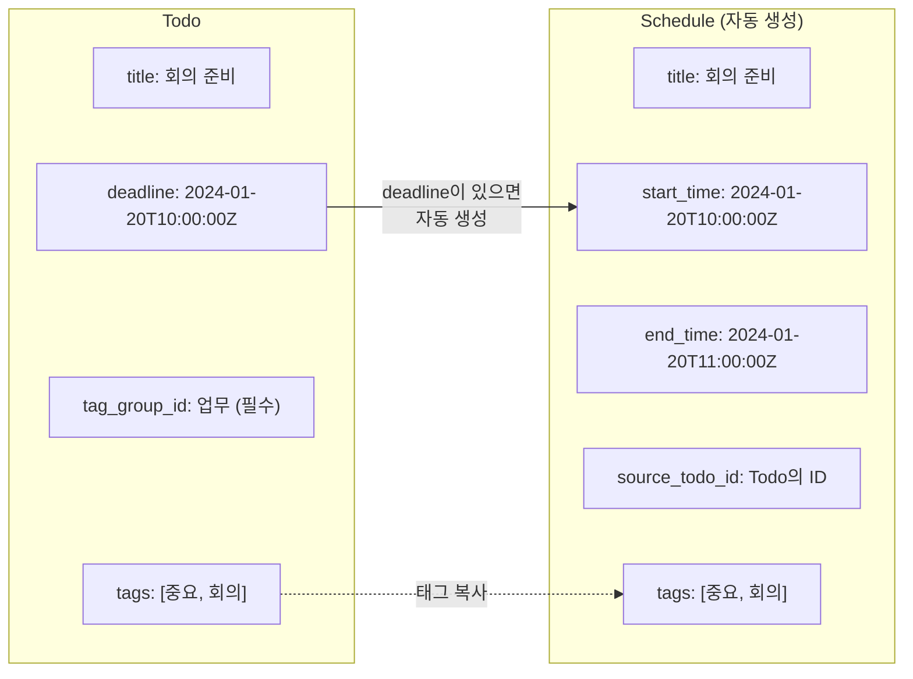

# Todo API 가이드 (프론트엔드 개발자용)

> **최종 업데이트**: 2026-01-11

## 개요

이 API는 **Todo**, **Schedule**, **Tag**를 관리하는 기능을 제공합니다.

### 핵심 개념

| 개념 | 설명 |
|------|------|
| **Todo** | 할 일 항목. 독립적인 엔티티로 존재합니다. |
| **Schedule** | 캘린더 일정. Todo에 deadline이 있으면 자동으로 생성됩니다. |
| **TagGroup** | 태그를 묶는 그룹. Todo는 반드시 하나의 그룹에 속해야 합니다. |
| **Tag** | 세부 분류용 태그. TagGroup에 속하며, Todo/Schedule에 연결할 수 있습니다. |

### Todo와 Schedule의 관계



---

## 데이터 모델

### Todo

```typescript
interface Todo {
  id: string;              // UUID
  title: string;           // 제목
  description?: string;    // 설명 (선택)
  deadline?: string;       // 마감일시 (ISO 8601, 선택)
  tag_group_id: string;    // 소속 그룹 ID (필수)
  parent_id?: string;      // 부모 Todo ID (트리 구조용, 선택)
  status: TodoStatus;      // 상태
  created_at: string;      // 생성일시
  tags: Tag[];             // 연결된 태그 목록
  schedules: Schedule[];   // 연관된 Schedule 목록
  include_reason: TodoIncludeReason; // 목록에 포함된 이유 (항상 포함)
}

type TodoStatus = 
  | "UNSCHEDULED"  // 일정 미지정
  | "SCHEDULED"    // 일정 지정됨
  | "DONE"         // 완료
  | "CANCELLED";   // 취소됨

type TodoIncludeReason =
  | "MATCH"     // 필터 조건에 직접 매칭된 Todo (또는 필터 미사용 시)
  | "ANCESTOR"; // 필터에 매칭된 Todo의 조상이라서 포함된 Todo
```

### Schedule

```typescript
interface Schedule {
  id: string;               // UUID
  title: string;            // 제목
  description?: string;     // 설명 (선택)
  start_time: string;       // 시작 시간 (ISO 8601)
  end_time: string;         // 종료 시간 (ISO 8601)
  recurrence_rule?: string; // 반복 규칙 (RRULE 형식, 선택)
  recurrence_end?: string;  // 반복 종료일 (선택)
  parent_id?: string;       // 반복 일정 원본 ID (가상 인스턴스인 경우)
  source_todo_id?: string;  // 연결된 Todo ID (Todo에서 생성된 경우)
  state: ScheduleState;     // 상태
  created_at: string;       // 생성일시
  tags: Tag[];              // 연결된 태그 목록
}

type ScheduleState = "PLANNED" | "IN_PROGRESS" | "COMPLETED";
```

### TagGroup & Tag

```typescript
interface TagGroup {
  id: string;                        // UUID
  name: string;                      // 그룹명
  color: string;                     // 색상 코드 (#RRGGBB)
  description?: string;              // 설명 (선택)
  goal_ratios?: Record<string, number>; // 태그별 목표 비율 (선택)
  is_todo_group: boolean;            // Todo 그룹 여부
  created_at: string;
  updated_at: string;
  tags: Tag[];                       // 그룹에 속한 태그 목록
}

interface Tag {
  id: string;           // UUID
  name: string;         // 태그명
  color: string;        // 색상 코드 (#RRGGBB)
  description?: string; // 설명 (선택)
  group_id: string;     // 소속 그룹 ID
  created_at: string;
  updated_at: string;
}
```

---

## REST API

### Base URL

```
/v1
```

### Todo API

#### Todo 생성

```http
POST /v1/todos
Content-Type: application/json

{
  "title": "회의 준비",
  "description": "프레젠테이션 자료 준비",
  "tag_group_id": "550e8400-e29b-41d4-a716-446655440000",
  "tag_ids": ["660e8400-e29b-41d4-a716-446655440001"],
  "deadline": "2024-01-20T10:00:00Z",
  "parent_id": null,
  "status": "UNSCHEDULED"
}
```

| 필드 | 타입 | 필수 | 설명 |
|------|------|------|------|
| `title` | string | ✅ | Todo 제목 |
| `description` | string | ❌ | 설명 |
| `tag_group_id` | UUID | ✅ | **필수!** 소속 그룹 ID |
| `tag_ids` | UUID[] | ❌ | 연결할 태그 ID 목록 |
| `deadline` | datetime | ❌ | 마감일시 (있으면 Schedule 자동 생성) |
| `parent_id` | UUID | ❌ | 부모 Todo ID (트리 구조) |
| `status` | string | ❌ | 상태 (기본값: `UNSCHEDULED`) |

**응답 (201 Created):**

```json
{
  "id": "770e8400-e29b-41d4-a716-446655440002",
  "title": "회의 준비",
  "description": "프레젠테이션 자료 준비",
  "deadline": "2024-01-20T10:00:00Z",
  "tag_group_id": "550e8400-e29b-41d4-a716-446655440000",
  "parent_id": null,
  "status": "UNSCHEDULED",
  "created_at": "2024-01-15T09:00:00Z",
  "include_reason": "MATCH",
  "tags": [
    {
      "id": "660e8400-e29b-41d4-a716-446655440001",
      "name": "중요",
      "color": "#FF0000",
      "group_id": "550e8400-e29b-41d4-a716-446655440000"
    }
  ],
  "schedules": [
    {
      "id": "880e8400-e29b-41d4-a716-446655440003",
      "title": "회의 준비",
      "start_time": "2024-01-20T10:00:00Z",
      "end_time": "2024-01-20T11:00:00Z",
      "source_todo_id": "770e8400-e29b-41d4-a716-446655440002",
      "state": "PLANNED",
      "tags": [...]
    }
  ]
}
```

#### Todo 목록 조회

```http
GET /v1/todos
GET /v1/todos?group_ids=uuid1&group_ids=uuid2
GET /v1/todos?tag_ids=uuid1&tag_ids=uuid2
```

| 파라미터 | 타입 | 설명 |
|---------|------|------|
| `group_ids` | UUID[] | `tag_group_id`가 해당 그룹인 Todo만 조회 |
| `tag_ids` | UUID[] | 지정된 태그를 **모두** 포함한 Todo만 조회 (AND 방식) |

> ✅ **필터링 시 트리(orphan) 처리**
> - `tag_ids`로 필터링하면, **매칭된 Todo + 그 Todo의 모든 조상(ancestor)** 을 함께 반환합니다.
> - 이때 각 Todo에는 `include_reason`이 항상 포함됩니다.
>   - 매칭된 Todo: `include_reason = "MATCH"`
>   - 조상 Todo: `include_reason = "ANCESTOR"`
> - `tag_ids`를 사용하지 않으면, 반환되는 모든 Todo는 `include_reason = "MATCH"` 입니다.

> ✅ **정렬 규칙 (백엔드 기본 정렬)**
> - status 순서: `UNSCHEDULED` → `SCHEDULED` → `DONE` → `CANCELLED`
> - 같은 status 내에서는:
>   - deadline이 있는 항목이 먼저 (null은 뒤)
>   - deadline 오름차순
>   - created_at 내림차순

> ✅ **트리 무결성 (백엔드 보장)**
> - `parent_id`는 존재하는 Todo여야 합니다. (없으면 400)
> - 자기 자신을 부모로 설정할 수 없습니다. (400)
> - 부모/자식 Todo의 `tag_group_id`는 반드시 같아야 합니다. (400)
> - 순환 참조(cycle)를 만들 수 없습니다. (400)

#### Todo 단건 조회

```http
GET /v1/todos/{todo_id}
```

#### Todo 수정

```http
PATCH /v1/todos/{todo_id}
Content-Type: application/json

{
  "title": "수정된 제목",
  "deadline": "2024-01-25T14:00:00Z",
  "tag_ids": ["tag-uuid-1", "tag-uuid-2"],
  "status": "SCHEDULED"
}
```

> ⚠️ **deadline 변경 시 동작:**
> - deadline 추가: 새 Schedule 생성 (태그도 복사)
> - deadline 변경: 기존 Schedule 시간 업데이트
> - deadline 제거 (null): 기존 Schedule 삭제

> ⚠️ **tag_ids 변경 시 동작:**
> - Todo의 태그 업데이트
> - 연결된 Schedule의 태그도 함께 동기화

#### Todo 삭제

```http
DELETE /v1/todos/{todo_id}
```

> ⚠️ **삭제 동작:**
> - 삭제된 Todo에 연결된 Schedule은 함께 삭제됩니다.
> - **자식 Todo는 삭제되지 않고 루트로 승격됩니다** (parent_id가 NULL로 변경)
> - 자식 Todo에 연결된 Schedule은 그대로 유지됩니다.

#### Todo 통계 조회

```http
GET /v1/todos/stats
GET /v1/todos/stats?group_id=uuid
```

**응답:**

```json
{
  "group_id": "550e8400-e29b-41d4-a716-446655440000",
  "total_count": 15,
  "by_tag": [
    { "tag_id": "uuid1", "tag_name": "중요", "count": 5 },
    { "tag_id": "uuid2", "tag_name": "회의", "count": 3 }
  ]
}
```

---

### TagGroup API

#### 그룹 생성

```http
POST /v1/tags/groups
Content-Type: application/json

{
  "name": "업무",
  "color": "#FF5733",
  "description": "업무 관련 항목",
  "is_todo_group": true
}
```

#### 그룹 목록 조회 (태그 포함)

```http
GET /v1/tags/groups
```

#### 그룹 수정

```http
PATCH /v1/tags/groups/{group_id}
```

#### 그룹 삭제

```http
DELETE /v1/tags/groups/{group_id}
```

> ⚠️ CASCADE 삭제: 그룹에 속한 모든 태그도 함께 삭제됩니다.

---

### Tag API

#### 태그 생성

```http
POST /v1/tags
Content-Type: application/json

{
  "name": "중요",
  "color": "#FF0000",
  "group_id": "550e8400-e29b-41d4-a716-446655440000"
}
```

#### 태그 목록 조회

```http
GET /v1/tags
```

#### 태그 수정

```http
PATCH /v1/tags/{tag_id}
```

#### 태그 삭제

```http
DELETE /v1/tags/{tag_id}
```

---

## GraphQL API

### Endpoint

```
POST /v1/graphql
```

개발 환경에서는 Apollo Sandbox UI를 통해 쿼리 테스트 가능합니다.

### Calendar 쿼리

캘린더 뷰에 필요한 일정 데이터를 조회합니다.

```graphql
query GetCalendar($startDate: Date!, $endDate: Date!, $tagFilter: TagFilterInput) {
  calendar(startDate: $startDate, endDate: $endDate, tagFilter: $tagFilter) {
    days {
      date
      events {
        id
        title
        description
        startAt
        endAt
        createdAt
        isRecurring
        parentId
        instanceStart
        tags {
          id
          name
          color
          groupId
        }
      }
    }
  }
}
```

**Variables:**

```json
{
  "startDate": "2024-01-01",
  "endDate": "2024-01-31",
  "tagFilter": {
    "tagIds": ["660e8400-e29b-41d4-a716-446655440001"],
    "groupIds": null
  }
}
```

### 태그 필터링 규칙

| 필터 | 방식 | 설명 |
|------|------|------|
| `tagIds` | AND | 지정된 태그를 **모두** 포함한 일정만 반환 |
| `groupIds` | OR | 해당 그룹의 태그 중 **하나라도** 있으면 반환 |

```graphql
# 태그 필터링 입력 타입
input TagFilterInput {
  tagIds: [UUID!]    # AND 방식
  groupIds: [UUID!]  # OR 방식 (그룹 내 태그)
}
```

### 응답 타입

```graphql
type Calendar {
  days: [Day!]!
}

type Day {
  date: Date!
  events: [Event!]!
}

type Event {
  id: UUID!
  title: String!
  description: String
  startAt: DateTime!
  endAt: DateTime!
  createdAt: DateTime!
  isRecurring: Boolean!
  parentId: UUID           # 반복 일정 원본 ID
  instanceStart: DateTime  # 가상 인스턴스 시작 시간 (수정/삭제용)
  tags: [TagType!]!
}

type TagType {
  id: UUID!
  name: String!
  color: String!
  description: String
  groupId: UUID!
  createdAt: DateTime!
  updatedAt: DateTime!
}
```

---

## 주요 기능

### 1. Todo-Schedule 자동 연동

Todo에 `deadline`을 설정하면 Schedule이 자동으로 생성됩니다.

```typescript
// deadline이 있는 Todo 생성
const response = await fetch('/v1/todos', {
  method: 'POST',
  headers: { 'Content-Type': 'application/json' },
  body: JSON.stringify({
    title: "프로젝트 마감",
    tag_group_id: groupId,
    tag_ids: [urgentTagId],
    deadline: "2024-01-20T18:00:00Z"  // deadline 설정
  })
});

const todo = await response.json();

// ✅ todo.schedules에 자동 생성된 Schedule 포함
console.log(todo.schedules[0]);
// {
//   id: "...",
//   title: "프로젝트 마감",
//   start_time: "2024-01-20T18:00:00Z",
//   end_time: "2024-01-20T19:00:00Z",  // deadline + 1시간
//   source_todo_id: todo.id,
//   tags: [{ name: "긴급", ... }]  // Todo의 태그가 복사됨
// }
```

### 2. 태그 동기화

Todo의 태그를 수정하면 연결된 Schedule의 태그도 자동으로 동기화됩니다.

```typescript
// Todo 태그 수정
await fetch(`/v1/todos/${todoId}`, {
  method: 'PATCH',
  headers: { 'Content-Type': 'application/json' },
  body: JSON.stringify({
    tag_ids: [newTag1, newTag2]  // 태그 변경
  })
});

// ✅ 연결된 Schedule의 태그도 자동으로 동기화됨
```

### 3. 트리 구조 Todo

Todo는 부모-자식 관계를 통해 트리 구조로 구성할 수 있습니다.

```typescript
// 부모 Todo 생성
const parentTodo = await createTodo({
  title: "프로젝트",
  tag_group_id: groupId
});

// 자식 Todo 생성
const childTodo = await createTodo({
  title: "1단계: 설계",
  tag_group_id: groupId,
  parent_id: parentTodo.id  // 부모 지정
});
```

### 4. Schedule에서 Todo 생성

기존 Schedule에서 연관된 Todo를 생성할 수 있습니다. 두 가지 방법을 지원합니다.

#### 방법 1: Schedule 생성 시 Todo도 함께 생성

```typescript
// Schedule 생성 시 create_todo_options 옵션 사용
const response = await fetch('/v1/schedules', {
  method: 'POST',
  headers: { 'Content-Type': 'application/json' },
  body: JSON.stringify({
    title: "회의 준비",
    start_time: "2024-01-20T10:00:00Z",
    end_time: "2024-01-20T12:00:00Z",
    tag_ids: [tagId],
    create_todo_options: {
      tag_group_id: groupId  // Todo가 속할 그룹 (필수)
    }
  })
});

const schedule = await response.json();
// ✅ schedule.source_todo_id에 자동 생성된 Todo ID 포함
```

#### 방법 2: 기존 Schedule에서 Todo 생성 (수동 API)

```typescript
// 기존 Schedule에서 Todo 생성
const response = await fetch(`/v1/schedules/${scheduleId}/todo?tag_group_id=${groupId}`, {
  method: 'POST',
  headers: { 'Content-Type': 'application/json' }
});

const todo = await response.json();
// ✅ Todo 생성됨
// - title, description: Schedule에서 복사
// - deadline: Schedule의 start_time
// - tags: Schedule의 태그가 복사됨
// - status: SCHEDULED
```

> ⚠️ **제약사항**: 이미 Todo와 연결된 Schedule에서는 다시 Todo를 생성할 수 없습니다 (400 에러).

### 5. 캘린더 태그 필터링

GraphQL Calendar 쿼리에서 태그로 일정을 필터링할 수 있습니다.

```typescript
// 특정 태그가 있는 일정만 조회
const query = `
  query GetFilteredCalendar($startDate: Date!, $endDate: Date!, $tagFilter: TagFilterInput) {
    calendar(startDate: $startDate, endDate: $endDate, tagFilter: $tagFilter) {
      days {
        date
        events { id title tags { name } }
      }
    }
  }
`;

const variables = {
  startDate: "2024-01-01",
  endDate: "2024-01-31",
  tagFilter: {
    tagIds: [urgentTagId]  // "긴급" 태그가 있는 일정만
  }
};
```

---

## TypeScript 타입 정의

```typescript
// ============================================================
// Enums
// ============================================================

export type TodoStatus = "UNSCHEDULED" | "SCHEDULED" | "DONE" | "CANCELLED";
export type ScheduleState = "PLANNED" | "IN_PROGRESS" | "COMPLETED";

// ============================================================
// Tag & TagGroup
// ============================================================

export interface Tag {
  id: string;
  name: string;
  color: string;
  description?: string;
  group_id: string;
  created_at: string;
  updated_at: string;
}

export interface TagGroup {
  id: string;
  name: string;
  color: string;
  description?: string;
  goal_ratios?: Record<string, number>;
  is_todo_group: boolean;
  created_at: string;
  updated_at: string;
  tags: Tag[];
}

export interface TagGroupCreate {
  name: string;
  color: string;
  description?: string;
  is_todo_group?: boolean;
}

export interface TagCreate {
  name: string;
  color: string;
  description?: string;
  group_id: string;
}

// ============================================================
// Schedule
// ============================================================

export interface Schedule {
  id: string;
  title: string;
  description?: string;
  start_time: string;
  end_time: string;
  recurrence_rule?: string;
  recurrence_end?: string;
  parent_id?: string;
  source_todo_id?: string;
  state: ScheduleState;
  created_at: string;
  tags: Tag[];
}

// ============================================================
// Todo
// ============================================================

export interface Todo {
  id: string;
  title: string;
  description?: string;
  deadline?: string;
  tag_group_id: string;
  parent_id?: string;
  status: TodoStatus;
  created_at: string;
  tags: Tag[];
  schedules: Schedule[];
}

export interface TodoCreate {
  title: string;
  description?: string;
  tag_group_id: string;   // 필수!
  tag_ids?: string[];
  deadline?: string;
  parent_id?: string;
  status?: TodoStatus;
}

export interface TodoUpdate {
  title?: string;
  description?: string;
  tag_group_id?: string;
  tag_ids?: string[];
  deadline?: string;
  parent_id?: string;
  status?: TodoStatus;
}

// ============================================================
// API Response Types
// ============================================================

export interface TodoStats {
  group_id?: string;
  total_count: number;
  by_tag: TagStat[];
}

export interface TagStat {
  tag_id: string;
  tag_name: string;
  count: number;
}

// ============================================================
// GraphQL Types
// ============================================================

export interface GqlEvent {
  id: string;
  title: string;
  description?: string;
  startAt: string;
  endAt: string;
  createdAt: string;
  isRecurring: boolean;
  parentId?: string;
  instanceStart?: string;
  tags: GqlTag[];
}

export interface GqlTag {
  id: string;
  name: string;
  color: string;
  description?: string;
  groupId: string;
  createdAt: string;
  updatedAt: string;
}

export interface GqlDay {
  date: string;
  events: GqlEvent[];
}

export interface GqlCalendar {
  days: GqlDay[];
}

export interface TagFilterInput {
  tagIds?: string[];
  groupIds?: string[];
}
```

---

## 사용 예시

### 전체 워크플로우 예시

```typescript
// 1. 태그 그룹 생성
const groupResponse = await fetch('/v1/tags/groups', {
  method: 'POST',
  headers: { 'Content-Type': 'application/json' },
  body: JSON.stringify({
    name: "업무",
    color: "#4A90D9",
    is_todo_group: true
  })
});
const group = await groupResponse.json();

// 2. 태그 생성
const tagResponse = await fetch('/v1/tags', {
  method: 'POST',
  headers: { 'Content-Type': 'application/json' },
  body: JSON.stringify({
    name: "긴급",
    color: "#FF4444",
    group_id: group.id
  })
});
const tag = await tagResponse.json();

// 3. Todo 생성 (deadline 포함 → Schedule 자동 생성)
const todoResponse = await fetch('/v1/todos', {
  method: 'POST',
  headers: { 'Content-Type': 'application/json' },
  body: JSON.stringify({
    title: "프로젝트 마감",
    description: "최종 보고서 제출",
    tag_group_id: group.id,
    tag_ids: [tag.id],
    deadline: "2024-01-20T18:00:00Z"
  })
});
const todo = await todoResponse.json();

console.log("생성된 Todo:", todo);
console.log("자동 생성된 Schedule:", todo.schedules[0]);

// 4. 캘린더에서 조회 (GraphQL)
const calendarQuery = `
  query {
    calendar(startDate: "2024-01-01", endDate: "2024-01-31") {
      days {
        date
        events {
          id
          title
          startAt
          tags { name color }
        }
      }
    }
  }
`;

const calendarResponse = await fetch('/v1/graphql', {
  method: 'POST',
  headers: { 'Content-Type': 'application/json' },
  body: JSON.stringify({ query: calendarQuery })
});
const calendarData = await calendarResponse.json();

// 5. 태그로 필터링된 캘린더 조회
const filteredQuery = `
  query GetFiltered($tagFilter: TagFilterInput) {
    calendar(startDate: "2024-01-01", endDate: "2024-01-31", tagFilter: $tagFilter) {
      days {
        date
        events { id title }
      }
    }
  }
`;

const filteredResponse = await fetch('/v1/graphql', {
  method: 'POST',
  headers: { 'Content-Type': 'application/json' },
  body: JSON.stringify({
    query: filteredQuery,
    variables: {
      tagFilter: { tagIds: [tag.id] }
    }
  })
});
```

### React Hook 예시

```typescript
import { useState, useEffect } from 'react';

// Todo 목록 조회 훅
function useTodos(groupId?: string) {
  const [todos, setTodos] = useState<Todo[]>([]);
  const [loading, setLoading] = useState(true);
  const [error, setError] = useState<Error | null>(null);

  useEffect(() => {
    const fetchTodos = async () => {
      try {
        const params = groupId ? `?group_ids=${groupId}` : '';
        const response = await fetch(`/v1/todos${params}`);
        if (!response.ok) throw new Error('Failed to fetch todos');
        const data = await response.json();
        setTodos(data);
      } catch (err) {
        setError(err as Error);
      } finally {
        setLoading(false);
      }
    };

    fetchTodos();
  }, [groupId]);

  return { todos, loading, error };
}

// Todo 생성 훅
function useCreateTodo() {
  const [loading, setLoading] = useState(false);

  const createTodo = async (data: TodoCreate): Promise<Todo> => {
    setLoading(true);
    try {
      const response = await fetch('/v1/todos', {
        method: 'POST',
        headers: { 'Content-Type': 'application/json' },
        body: JSON.stringify(data)
      });
      
      if (!response.ok) {
        const error = await response.json();
        throw new Error(error.detail || 'Failed to create todo');
      }
      
      return await response.json();
    } finally {
      setLoading(false);
    }
  };

  return { createTodo, loading };
}

// 사용 예시
function TodoList() {
  const { todos, loading } = useTodos();
  const { createTodo } = useCreateTodo();

  const handleCreate = async () => {
    const newTodo = await createTodo({
      title: "새 할 일",
      tag_group_id: "group-uuid",
      deadline: new Date().toISOString()
    });
    console.log("생성됨:", newTodo);
  };

  if (loading) return <div>로딩 중...</div>;

  return (
    <div>
      <button onClick={handleCreate}>Todo 추가</button>
      {todos.map(todo => (
        <div key={todo.id}>
          <h3>{todo.title}</h3>
          <p>상태: {todo.status}</p>
          <p>태그: {todo.tags.map(t => t.name).join(', ')}</p>
          {todo.deadline && <p>마감: {todo.deadline}</p>}
        </div>
      ))}
    </div>
  );
}
```

---

## 주의사항

### 1. tag_group_id는 필수

Todo 생성 시 반드시 `tag_group_id`를 지정해야 합니다.

```typescript
// ❌ 에러: tag_group_id 누락
await fetch('/v1/todos', {
  method: 'POST',
  body: JSON.stringify({ title: "할 일" })  // 422 에러 발생
});

// ✅ 올바른 사용
await fetch('/v1/todos', {
  method: 'POST',
  body: JSON.stringify({
    title: "할 일",
    tag_group_id: groupId  // 필수!
  })
});
```

### 2. deadline 설정 시 Schedule 자동 생성

- Schedule의 `start_time`은 Todo의 `deadline`과 동일
- Schedule의 `end_time`은 `deadline + 1시간`으로 자동 설정
- Todo의 태그가 Schedule에 자동으로 복사됨

### 3. 태그 동기화

Todo의 태그를 수정하면 연결된 모든 Schedule의 태그도 함께 업데이트됩니다.

### 4. 삭제 시 동작

- **Todo 삭제**:
  - 해당 Todo에 연결된 Schedule은 함께 삭제
  - 자식 Todo는 삭제되지 않고 루트로 승격 (parent_id → NULL)
  - 자식 Todo에 연결된 Schedule은 유지됨
- **TagGroup 삭제** → 그룹 내 모든 Tag도 함께 삭제 (CASCADE)

### 5. 날짜/시간 형식

모든 datetime 필드는 **ISO 8601** 형식을 사용합니다.

```typescript
// ✅ 올바른 형식
"2024-01-20T10:00:00Z"      // UTC
"2024-01-20T19:00:00+09:00" // 타임존 포함

// GraphQL Date 필드 (날짜만)
"2024-01-20"
```

---

## API 요약

### Todo API

| Method | Endpoint | 설명 |
|--------|----------|------|
| POST | `/v1/todos` | Todo 생성 |
| GET | `/v1/todos` | Todo 목록 조회 |
| GET | `/v1/todos/{id}` | Todo 단건 조회 |
| PATCH | `/v1/todos/{id}` | Todo 수정 |
| DELETE | `/v1/todos/{id}` | Todo 삭제 |
| GET | `/v1/todos/stats` | Todo 통계 조회 |

### Tag API

| Method | Endpoint | 설명 |
|--------|----------|------|
| POST | `/v1/tags/groups` | 태그 그룹 생성 |
| GET | `/v1/tags/groups` | 태그 그룹 목록 조회 |
| PATCH | `/v1/tags/groups/{id}` | 태그 그룹 수정 |
| DELETE | `/v1/tags/groups/{id}` | 태그 그룹 삭제 |
| POST | `/v1/tags` | 태그 생성 |
| GET | `/v1/tags` | 태그 목록 조회 |
| PATCH | `/v1/tags/{id}` | 태그 수정 |
| DELETE | `/v1/tags/{id}` | 태그 삭제 |

### Schedule API (Todo 연동)

| Method | Endpoint | 설명 |
|--------|----------|------|
| POST | `/v1/schedules` | Schedule 생성 (`create_todo_options`로 Todo 동시 생성 가능) |
| POST | `/v1/schedules/{id}/todo` | 기존 Schedule에서 Todo 생성 |

### GraphQL API

| Query | 설명 |
|-------|------|
| `calendar(startDate, endDate, tagFilter)` | 캘린더 데이터 조회 |

---

이 가이드를 참고하여 프론트엔드에서 Todo와 관련 기능을 구현하세요!
