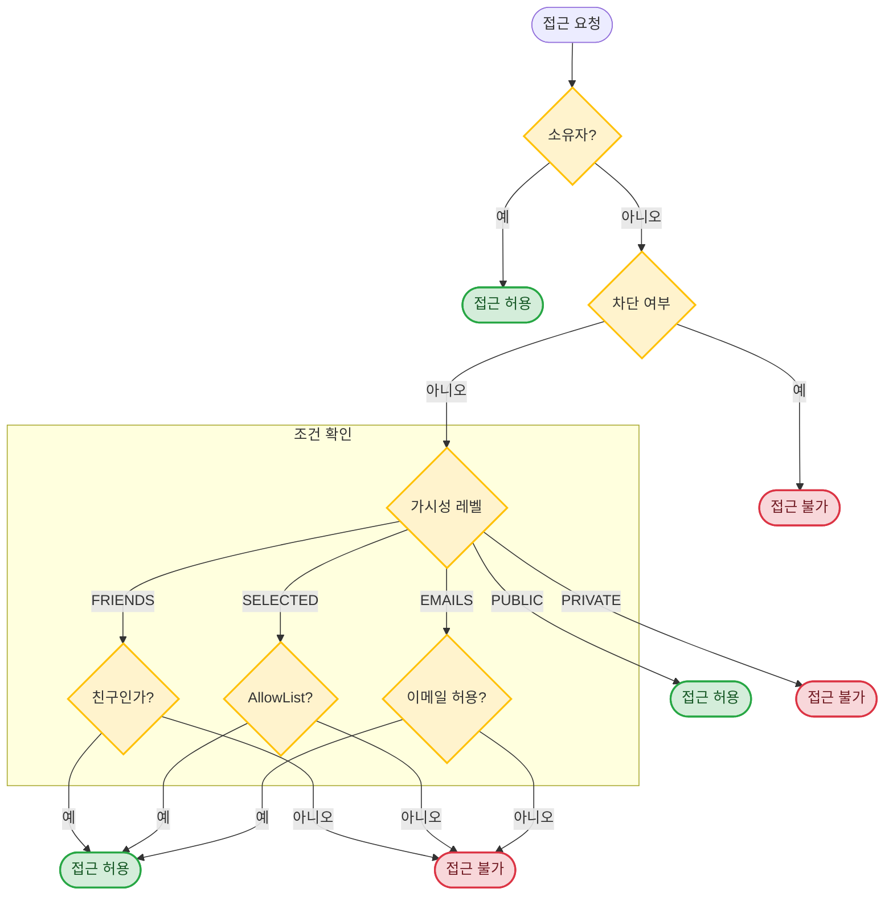

# Visibility (가시성) API 가이드 (프론트엔드 개발자용)

> **최종 업데이트**: 2026-01-29

## 개요

Visibility(가시성) 시스템은 리소스(Schedule, Timer, Todo, Meeting)의 **공유 범위**를 제어합니다.

### 지원 리소스

| 리소스 | 설명 |
|--------|------|
| **Schedule** | 일정 |
| **Timer** | 타이머 |
| **Todo** | 할 일 |
| **Meeting** | 일정 조율 |

### 가시성 레벨

| 레벨 | 설명 |
|------|------|
| `PRIVATE` | 본인만 접근 가능 (기본값) |
| `SELECTED` | 선택한 친구만 접근 가능 (AllowList 기반) |
| `FRIENDS` | 모든 친구 접근 가능 |
| `ALLOWED_EMAILS` | 허용된 이메일/도메인만 접근 가능 (비친구 포함) |
| `PUBLIC` | 모든 사용자 접근 가능 |

> **참고**: `ALLOWED_EMAILS`는 친구 관계와 무관하게 이메일 또는 도메인 기반으로 접근을 허용합니다.

### 접근 제어 규칙



---

## 데이터 모델

### VisibilityLevel (가시성 레벨)

```typescript
type VisibilityLevel = 
  | "private"         // 본인만 (기본값)
  | "friends"         // 모든 친구
  | "selected"        // 선택한 친구만 (AllowList)
  | "allowed_emails"  // 허용된 이메일/도메인만 (비친구 포함)
  | "public";         // 전체 공개
```

### ResourceType (리소스 타입)

```typescript
type ResourceType = 
  | "schedule"
  | "timer"
  | "todo"
  | "meeting";
```

### VisibilitySettings (가시성 설정 - 입력용)

```typescript
interface VisibilitySettings {
  level: VisibilityLevel;
  allowed_user_ids?: string[];  // "selected" 레벨에서만 사용
  allowed_emails?: string[];    // "allowed_emails" 레벨에서만 사용
  allowed_domains?: string[];   // "allowed_emails" 레벨에서만 사용
}
```

### VisibilityRead (가시성 조회 결과)

```typescript
interface VisibilityRead {
  id: string;                   // UUID
  resource_type: ResourceType;
  resource_id: string;          // UUID
  owner_id: string;             // 소유자 ID
  level: VisibilityLevel;
  allowed_user_ids: string[];   // AllowList 사용자 목록 (SELECTED)
  allowed_emails: string[];     // 허용된 이메일 목록 (ALLOWED_EMAILS)
  allowed_domains: string[];    // 허용된 도메인 목록 (ALLOWED_EMAILS)
  created_at: string;           // ISO 8601
  updated_at: string;           // ISO 8601
}
```

### 공유된 리소스 응답 필드

모든 리소스(Schedule, Timer, Todo) 조회 시 가시성 관련 필드가 포함됩니다:

```typescript
interface ResourceWithVisibility {
  // ... 기본 리소스 필드 ...
  
  owner_id?: string;                // 소유자 ID (공유된 리소스일 때)
  visibility_level?: VisibilityLevel;  // 가시성 레벨
  is_shared: boolean;               // 공유된 리소스인지 (타인 소유)
}
```

---

## 가시성 설정 방법

### 리소스 생성 시 가시성 설정

모든 리소스(Schedule, Timer, Todo) 생성 시 `visibility` 필드를 포함할 수 있습니다.

#### 예시: Schedule 생성

**POST /api/v1/schedules**

```json
{
  "title": "팀 회의",
  "start_time": "2026-01-28T10:00:00Z",
  "end_time": "2026-01-28T11:00:00Z",
  "visibility": {
    "level": "friends"
  }
}
```

#### 예시: Timer 생성 (선택한 친구에게만)

**POST /api/v1/timers**

```json
{
  "schedule_id": "uuid-here",
  "visibility": {
    "level": "selected",
    "allowed_user_ids": ["friend-id-1", "friend-id-2"]
  }
}
```

#### 예시: Todo 생성 (전체 공개)

**POST /api/v1/todos**

```json
{
  "title": "공개 할 일",
  "tag_group_id": "uuid-here",
  "visibility": {
    "level": "public"
  }
}
```

#### 예시: Meeting 생성 (이메일/도메인 기반 접근 허용)

**POST /api/v1/meetings**

```json
{
  "title": "프로젝트 회의 일정 조율",
  "start_date": "2024-02-01",
  "end_date": "2024-02-07",
  "available_days": [0, 2, 4],
  "start_time": "09:00:00",
  "end_time": "18:00:00",
  "visibility": {
    "level": "allowed_emails",
    "allowed_emails": ["external@partner.com", "consultant@vendor.net"],
    "allowed_domains": ["company.com"]
  }
}
```

> **참고**: `allowed_emails` 레벨은 친구 관계 없이 특정 이메일 주소 또는 도메인의 사용자에게 접근을 허용합니다. 회사 외부 인원과의 협업에 유용합니다.

### 리소스 수정 시 가시성 변경

**PATCH /api/v1/schedules/{id}**

```json
{
  "visibility": {
    "level": "private"
  }
}
```

### 가시성 기본값

`visibility` 필드를 지정하지 않으면 **PRIVATE**으로 설정됩니다.

---

## 공유 리소스 조회

### scope 파라미터

리소스 조회 API에서 `scope` 파라미터를 사용하여 조회 범위를 지정합니다:

| scope | 설명 |
|-------|------|
| `mine` | 내 리소스만 (기본값) |
| `shared` | 공유된 타인의 리소스만 |
| `all` | 내 리소스 + 공유된 리소스 |

#### Schedule 조회 예시

**GET /api/v1/schedules?start_date=2026-01-01&end_date=2026-01-31&scope=all**

```json
[
  {
    "id": "my-schedule-id",
    "title": "내 일정",
    "owner_id": "my-user-id",
    "is_shared": false,
    "visibility_level": null
  },
  {
    "id": "shared-schedule-id",
    "title": "친구의 공유 일정",
    "owner_id": "friend-user-id",
    "is_shared": true,
    "visibility_level": "friends"
  }
]
```

#### Timer 조회 예시

**GET /api/v1/timers?scope=shared**

```json
[
  {
    "id": "timer-id",
    "owner_id": "friend-user-id",
    "is_shared": true,
    "visibility_level": "public"
  }
]
```

#### Todo 조회 예시

**GET /api/v1/todos/{group_id}?scope=all**

```json
{
  "items": [
    {
      "id": "todo-id",
      "title": "공유된 할 일",
      "owner_id": "friend-user-id",
      "is_shared": true,
      "visibility_level": "selected"
    }
  ]
}
```

---

## TypeScript 타입 정의

```typescript
// ===== 가시성 타입 =====

type VisibilityLevel = "private" | "friends" | "selected" | "allowed_emails" | "public";

type ResourceType = "schedule" | "timer" | "todo" | "meeting";

type ResourceScope = "mine" | "shared" | "all";

// 가시성 설정 (생성/수정 시 사용)
interface VisibilitySettings {
  level: VisibilityLevel;
  allowed_user_ids?: string[];   // "selected" 레벨에서만
  allowed_emails?: string[];     // "allowed_emails" 레벨에서만
  allowed_domains?: string[];    // "allowed_emails" 레벨에서만
}

// 가시성 조회 결과
interface VisibilityRead {
  id: string;
  resource_type: ResourceType;
  resource_id: string;
  owner_id: string;
  level: VisibilityLevel;
  allowed_user_ids: string[];
  allowed_emails: string[];      // 허용된 이메일 목록
  allowed_domains: string[];     // 허용된 도메인 목록
  created_at: string;
  updated_at: string;
}

// ===== 리소스 생성 타입 (가시성 포함) =====

interface ScheduleCreate {
  title: string;
  description?: string;
  start_time: string;  // ISO 8601
  end_time: string;    // ISO 8601
  recurrence_rule?: string;
  recurrence_end?: string;
  tag_ids?: string[];
  visibility?: VisibilitySettings;
}

interface TimerCreate {
  schedule_id?: string;
  todo_id?: string;
  visibility?: VisibilitySettings;
}

interface TodoCreate {
  title: string;
  description?: string;
  tag_group_id: string;
  deadline?: string;
  parent_id?: string;
  visibility?: VisibilitySettings;
}

// ===== 리소스 수정 타입 (가시성 포함) =====

interface ScheduleUpdate {
  title?: string;
  description?: string;
  start_time?: string;
  end_time?: string;
  visibility?: VisibilitySettings;
}

interface TimerUpdate {
  // Timer 필드...
  visibility?: VisibilitySettings;
}

interface TodoUpdate {
  title?: string;
  description?: string;
  deadline?: string;
  visibility?: VisibilitySettings;
}

// ===== 리소스 조회 타입 (가시성 정보 포함) =====

interface ScheduleRead {
  id: string;
  title: string;
  description?: string;
  start_time: string;
  end_time: string;
  created_at: string;
  // 가시성 관련 필드
  owner_id?: string;
  visibility_level?: VisibilityLevel;
  is_shared: boolean;
}

interface TimerRead {
  id: string;
  started_at?: string;
  ended_at?: string;
  elapsed_seconds: number;
  is_running: boolean;
  // 가시성 관련 필드
  owner_id?: string;
  visibility_level?: VisibilityLevel;
  is_shared: boolean;
}

interface TodoRead {
  id: string;
  title: string;
  description?: string;
  deadline?: string;
  status: string;
  created_at: string;
  // 가시성 관련 필드
  owner_id?: string;
  visibility_level?: VisibilityLevel;
  is_shared: boolean;
}

// ===== 유틸리티 타입 =====

// 가시성 레벨 표시 텍스트
const VISIBILITY_LABELS: Record<VisibilityLevel, string> = {
  private: "비공개",
  friends: "친구 공개",
  selected: "일부 친구 공개",
  allowed_emails: "이메일 허용",
  public: "전체 공개",
};

// 가시성 레벨 아이콘 (예시)
const VISIBILITY_ICONS: Record<VisibilityLevel, string> = {
  private: "🔒",
  friends: "👥",
  selected: "👤",
  allowed_emails: "📧",
  public: "🌐",
};
```

---

## 사용 예시

### 가시성 설정 UI 컴포넌트

```typescript
// 가시성 선택 드롭다운
function VisibilitySelector({
  value,
  onChange,
  friends,
  showEmailOption = false,  // Meeting 등에서 이메일 옵션 표시
}: {
  value: VisibilitySettings;
  onChange: (settings: VisibilitySettings) => void;
  friends: Friend[];
  showEmailOption?: boolean;
}) {
  const handleLevelChange = (level: VisibilityLevel) => {
    onChange({
      level,
      allowed_user_ids: level === "selected" ? [] : undefined,
      allowed_emails: level === "allowed_emails" ? [] : undefined,
      allowed_domains: level === "allowed_emails" ? [] : undefined,
    });
  };

  const handleAllowedUsersChange = (userIds: string[]) => {
    onChange({
      level: "selected",
      allowed_user_ids: userIds,
    });
  };

  const handleAllowedEmailsChange = (emails: string[], domains: string[]) => {
    onChange({
      level: "allowed_emails",
      allowed_emails: emails,
      allowed_domains: domains,
    });
  };

  return (
    <div>
      <select value={value.level} onChange={(e) => handleLevelChange(e.target.value)}>
        <option value="private">🔒 비공개</option>
        <option value="friends">👥 모든 친구</option>
        <option value="selected">👤 일부 친구</option>
        {showEmailOption && (
          <option value="allowed_emails">📧 이메일/도메인 허용</option>
        )}
        <option value="public">🌐 전체 공개</option>
      </select>

      {value.level === "selected" && (
        <FriendMultiSelect
          friends={friends}
          selected={value.allowed_user_ids || []}
          onChange={handleAllowedUsersChange}
        />
      )}

      {value.level === "allowed_emails" && (
        <EmailDomainInput
          emails={value.allowed_emails || []}
          domains={value.allowed_domains || []}
          onChange={handleAllowedEmailsChange}
        />
      )}
    </div>
  );
}

// 이메일/도메인 입력 컴포넌트 예시
function EmailDomainInput({
  emails,
  domains,
  onChange,
}: {
  emails: string[];
  domains: string[];
  onChange: (emails: string[], domains: string[]) => void;
}) {
  return (
    <div>
      <div>
        <label>허용할 이메일 주소</label>
        <TagInput
          values={emails}
          onChange={(newEmails) => onChange(newEmails, domains)}
          placeholder="user@example.com"
        />
      </div>
      <div>
        <label>허용할 도메인 (해당 도메인의 모든 이메일 허용)</label>
        <TagInput
          values={domains}
          onChange={(newDomains) => onChange(emails, newDomains)}
          placeholder="company.com"
        />
      </div>
    </div>
  );
}
```

### 일정 생성 (가시성 포함)

```typescript
async function createScheduleWithVisibility(
  schedule: Omit<ScheduleCreate, 'visibility'>,
  visibility: VisibilitySettings
): Promise<ScheduleRead> {
  const response = await fetch('/api/v1/schedules', {
    method: 'POST',
    headers: { 'Content-Type': 'application/json' },
    body: JSON.stringify({
      ...schedule,
      visibility,
    }),
  });

  if (!response.ok) {
    const error = await response.json();
    throw new Error(error.detail);
  }

  return response.json();
}

// 사용 예시
const schedule = await createScheduleWithVisibility(
  {
    title: "팀 미팅",
    start_time: "2026-01-28T10:00:00Z",
    end_time: "2026-01-28T11:00:00Z",
  },
  {
    level: "selected",
    allowed_user_ids: ["colleague-id-1", "colleague-id-2"],
  }
);
```

### 가시성 변경

```typescript
async function updateVisibility(
  resourceType: ResourceType,
  resourceId: string,
  visibility: VisibilitySettings
): Promise<void> {
  const endpoints: Record<ResourceType, string> = {
    schedule: `/api/v1/schedules/${resourceId}`,
    timer: `/api/v1/timers/${resourceId}`,
    todo: `/api/v1/todos/${resourceId}`,
  };

  const response = await fetch(endpoints[resourceType], {
    method: 'PATCH',
    headers: { 'Content-Type': 'application/json' },
    body: JSON.stringify({ visibility }),
  });

  if (!response.ok) {
    const error = await response.json();
    throw new Error(error.detail);
  }
}

// 사용 예시: 일정을 친구 공개로 변경
await updateVisibility('schedule', scheduleId, { level: 'friends' });

// 사용 예시: 할 일을 비공개로 변경
await updateVisibility('todo', todoId, { level: 'private' });
```

### 공유된 리소스 조회

```typescript
async function fetchSchedules(
  startDate: Date,
  endDate: Date,
  scope: ResourceScope = 'mine'
): Promise<ScheduleRead[]> {
  const params = new URLSearchParams({
    start_date: startDate.toISOString(),
    end_date: endDate.toISOString(),
    scope,
  });

  const response = await fetch(`/api/v1/schedules?${params}`);
  return response.json();
}

// 내 일정만 조회
const mySchedules = await fetchSchedules(start, end, 'mine');

// 공유된 일정만 조회
const sharedSchedules = await fetchSchedules(start, end, 'shared');

// 모든 일정 조회 (내 것 + 공유된 것)
const allSchedules = await fetchSchedules(start, end, 'all');
```

### 공유된 리소스와 내 리소스 구분하여 표시

```typescript
function ScheduleList({ schedules }: { schedules: ScheduleRead[] }) {
  const mySchedules = schedules.filter(s => !s.is_shared);
  const sharedSchedules = schedules.filter(s => s.is_shared);

  return (
    <div>
      <section>
        <h2>내 일정</h2>
        {mySchedules.map(schedule => (
          <ScheduleItem key={schedule.id} schedule={schedule} />
        ))}
      </section>

      {sharedSchedules.length > 0 && (
        <section>
          <h2>공유된 일정</h2>
          {sharedSchedules.map(schedule => (
            <ScheduleItem 
              key={schedule.id} 
              schedule={schedule}
              showOwner={true}
            />
          ))}
        </section>
      )}
    </div>
  );
}

function ScheduleItem({ 
  schedule, 
  showOwner = false 
}: { 
  schedule: ScheduleRead; 
  showOwner?: boolean;
}) {
  return (
    <div className={schedule.is_shared ? 'shared-item' : ''}>
      <h3>{schedule.title}</h3>
      {showOwner && <span>by {schedule.owner_id}</span>}
      {schedule.visibility_level && (
        <span className="visibility-badge">
          {VISIBILITY_ICONS[schedule.visibility_level]}
        </span>
      )}
    </div>
  );
}
```

---

## UI/UX 가이드라인

### 가시성 표시 아이콘

| 레벨 | 아이콘 | 설명 |
|------|--------|------|
| `private` | 🔒 | 자물쇠 - 비공개 |
| `friends` | 👥 | 사람들 - 친구 공개 |
| `selected` | 👤 | 한 사람 - 선택한 친구 |
| `allowed_emails` | 📧 | 이메일 - 허용된 이메일/도메인 |
| `public` | 🌐 | 지구본 - 전체 공개 |

### 가시성 선택 UI 권장사항

1. **기본값 명시**: "비공개(기본)"으로 표시
2. **친구 선택 UI**: `selected` 레벨 선택 시 친구 멀티 선택 UI 표시
3. **경고 표시**: `public` 선택 시 "모든 사용자가 볼 수 있습니다" 경고
4. **친구 제한**: AllowList에 친구만 추가 가능함을 안내

### 공유된 리소스 표시 권장사항

1. **시각적 구분**: 공유된 리소스는 배경색/테두리로 구분
2. **소유자 표시**: 공유된 리소스에는 소유자 정보 표시
3. **읽기 전용 표시**: 공유된 리소스는 수정 불가능함을 표시
4. **가시성 배지**: 리소스의 가시성 레벨을 아이콘으로 표시

### 예시: 캘린더 뷰

```
┌────────────────────────────────────────────────────────────────┐
│  January 2026                                                  │
├────────────────────────────────────────────────────────────────┤
│  28 (Mon)                                                      │
│  ┌──────────────────────────────────────────────────────────┐  │
│  │ 🔒 내 개인 일정                                          │  │
│  └──────────────────────────────────────────────────────────┘  │
│  ┌──────────────────────────────────────────────────────────┐  │
│  │ 👥 팀 회의                        shared by @friend      │  │
│  └──────────────────────────────────────────────────────────┘  │
│  ┌──────────────────────────────────────────────────────────┐  │
│  │ 🌐 공개 이벤트                    shared by @organizer   │  │
│  └──────────────────────────────────────────────────────────┘  │
└────────────────────────────────────────────────────────────────┘
```

---

## 주의사항

### 1. 가시성 기본값

리소스 생성 시 `visibility`를 지정하지 않으면 **PRIVATE**으로 설정됩니다.

### 2. SELECTED 레벨 제약사항

- `allowed_user_ids`에 포함된 사용자는 모두 **친구**여야 합니다.
- 친구가 아닌 사용자를 포함하면 `400 Bad Request` 에러가 발생합니다.
- 친구 관계가 삭제되면 해당 친구는 AllowList에서 자동으로 접근 권한을 잃습니다.

### 2-1. ALLOWED_EMAILS 레벨 특징

- **친구 관계와 무관**하게 이메일 또는 도메인 기반으로 접근을 허용합니다.
- 외부 협력사, 파트너 등 친구가 아닌 사용자와 공유할 때 유용합니다.
- `allowed_emails`: 특정 이메일 주소만 허용 (예: `["alice@partner.com"]`)
- `allowed_domains`: 해당 도메인의 모든 이메일 허용 (예: `["company.com"]` → `anyone@company.com` 허용)
- 서브도메인은 **정확히 매칭**되어야 합니다 (`sub.example.com` ≠ `example.com`)
- 허용 목록이 비어있으면 아무도 접근할 수 없습니다 (소유자 제외)

### 3. 차단 시 접근 제한

차단 관계에서는 **양방향**으로 접근이 제한됩니다:
- 차단한 사용자 → 차단된 사용자의 PUBLIC 콘텐츠도 접근 불가
- 차단된 사용자 → 차단한 사용자의 모든 콘텐츠 접근 불가

### 4. 친구 관계 삭제 시

친구 관계가 삭제되면:
- 해당 친구에게 `friends` 레벨로 공유된 콘텐츠 접근 불가
- `selected` 레벨의 AllowList에 있었다면 해당 항목도 접근 불가

### 5. 소유자 우선 권한

리소스 소유자는 가시성 설정과 관계없이 **항상** 자신의 리소스에 접근할 수 있습니다.

### 6. 공유된 리소스는 읽기 전용

공유된 리소스(`is_shared: true`)는 수정하거나 삭제할 수 없습니다. 소유자만 수정 권한이 있습니다.

### 7. 연관 리소스의 가시성

- Todo의 Schedule이 공유되면, 해당 Schedule에서 Todo 정보를 볼 수 있습니다.
- Timer가 공유되면, 연관된 Schedule/Todo 정보도 함께 조회됩니다.

---

## 에러 처리

### 에러 코드

| 코드 | 상황 | 설명 |
|------|------|------|
| `400` | 잘못된 요청 | 친구가 아닌 사용자를 AllowList에 추가 시도 |
| `403` | 접근 거부 | 가시성 권한이 없는 리소스 접근 시도 |
| `404` | 찾을 수 없음 | 존재하지 않는 리소스 또는 가시성 설정 |

### 에러 응답 예시

#### 친구가 아닌 사용자 AllowList 추가 시

**400 Bad Request**

```json
{
  "detail": "Cannot share with non-friend users in SELECTED_FRIENDS mode"
}
```

#### 권한이 없는 리소스 접근 시

**403 Forbidden**

```json
{
  "detail": "You don't have permission to access this resource"
}
```

### 에러 처리 예시 코드

```typescript
async function handleVisibilityError(response: Response): Promise<never> {
  const error = await response.json();
  
  switch (response.status) {
    case 400:
      if (error.detail.includes('non-friend')) {
        throw new Error('선택한 사용자 중 친구가 아닌 사람이 있습니다.');
      }
      throw new Error('잘못된 요청입니다.');
    
    case 403:
      throw new Error('이 리소스에 접근할 권한이 없습니다.');
    
    case 404:
      throw new Error('리소스를 찾을 수 없습니다.');
    
    default:
      throw new Error(error.detail || '알 수 없는 오류가 발생했습니다.');
  }
}

// 사용 예시
async function updateScheduleVisibility(id: string, visibility: VisibilitySettings) {
  const response = await fetch(`/api/v1/schedules/${id}`, {
    method: 'PATCH',
    headers: { 'Content-Type': 'application/json' },
    body: JSON.stringify({ visibility }),
  });

  if (!response.ok) {
    await handleVisibilityError(response);
  }

  return response.json();
}
```

---

## 관련 문서

- [Friend API 가이드](./friend.ko.md) - 친구 관계 관리
- [Schedule API 가이드](./schedule.ko.md) - 일정 관리
- [Timer API 가이드](./timer.ko.md) - 타이머 관리
- [Todo API 가이드](./todo.ko.md) - 할 일 관리
- [Meeting API 가이드](./meeting.ko.md) - 일정 조율 (ALLOWED_EMAILS 레벨 주 사용처)