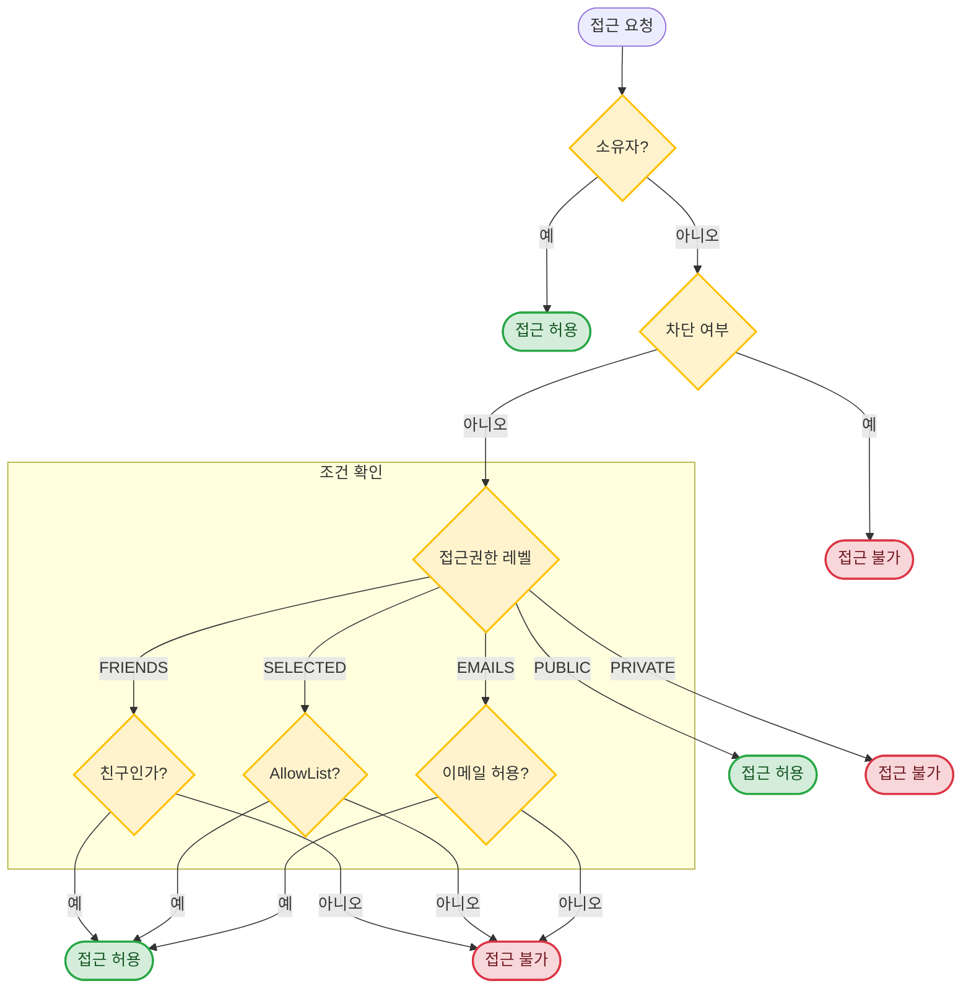

# Visibility (접근권한) API 가이드 (프론트엔드 개발자용)

> **최종 업데이트**: 2026-03-08

## 개요

Visibility(접근권한) 시스템은 리소스(Schedule, Timer, Todo, Meeting)의 **공유 범위**를 제어합니다.

!!! warning "Breaking Change — 중앙 집중형 Visibility API"
    **`v2026.03.08`부터 접근권한 설정 방식이 변경되었습니다.**

    - **이전**: 리소스 생성/수정 시 `visibility` 필드를 함께 전달
    - **현재**: 독립된 **`/v1/visibility/{resource_type}/{resource_id}`** 엔드포인트를 통해 별도 관리

    리소스의 Create/Update DTO에서 `visibility` 필드가 **완전히 제거**되었습니다.
    접근권한은 리소스 생성 후 별도 API를 호출하여 설정합니다.

    ```diff
    # Before (제거됨)
    - POST /v1/schedules
    - { "title": "회의", "visibility": { "level": "friends" } }

    # After (현재)
    + POST /v1/schedules
    + { "title": "회의" }
    + PUT /v1/visibility/schedule/{id}
    + { "level": "friends" }
    ```

### 변경 사유

??? note "왜 분리했나요?"
    **기존 방식의 문제점:**

    1. **코드 중복**: Schedule, Timer, Todo, Meeting 4개 도메인 서비스에 동일한 visibility 처리 로직이 반복
    2. **결합도**: 각 도메인의 Create/Update DTO와 Service가 visibility 모델에 직접 의존
    3. **일관성 부재**: 도메인마다 visibility 처리 방식이 미묘하게 달라 버그 가능성 증가
    4. **테스트 복잡도**: 모든 도메인 테스트에서 visibility 관련 테스트가 혼재

    **분리 후 장점:**

    1. **단일 책임 원칙(SRP)**: 접근권한 로직이 하나의 컨트롤러에서 일관되게 관리됨
    2. **도메인 독립성**: 각 도메인 서비스가 visibility를 알 필요 없이 핵심 로직에만 집중
    3. **API 일관성**: 모든 리소스 타입에 대해 동일한 `PUT/GET/DELETE` 패턴 적용
    4. **유지보수성**: visibility 로직 변경 시 단일 지점만 수정

### 지원 리소스

| 리소스 | `resource_type` |
|--------|-----------------|
| **Schedule** | `schedule` |
| **Timer** | `timer` |
| **Todo** | `todo` |
| **Meeting** | `meeting` |

### 접근권한 레벨

| 레벨 | 설명 |
|------|------|
| `PRIVATE` | 본인만 접근 가능 (기본값) |
| `SELECTED` | 선택한 친구만 접근 가능 (AllowList 기반) |
| `FRIENDS` | 모든 친구 접근 가능 |
| `ALLOWED_EMAILS` | 허용된 이메일/도메인만 접근 가능 (비친구 포함) |
| `PUBLIC` | 모든 사용자 접근 가능 |

> **참고**: `ALLOWED_EMAILS`는 친구 관계와 무관하게 이메일 또는 도메인 기반으로 접근을 허용합니다.

### 접근 제어 규칙



---

## Visibility API 엔드포인트

### 엔드포인트 요약

```http
PUT    /v1/visibility/{resource_type}/{resource_id}   # 접근권한 설정/변경
GET    /v1/visibility/{resource_type}/{resource_id}   # 접근권한 조회
DELETE /v1/visibility/{resource_type}/{resource_id}   # 접근권한 삭제 (PRIVATE 복귀)
```

!!! info "소유권 검증"
    모든 Visibility API는 **리소스 소유자만** 호출할 수 있습니다.
    소유자가 아닌 사용자가 호출하면 `403 Forbidden`이 반환됩니다.

### PUT — 접근권한 설정/변경

**`PUT /v1/visibility/{resource_type}/{resource_id}`**

=== "친구 공개"
    ```json
    {
      "level": "friends"
    }
    ```

=== "선택한 친구"
    ```json
    {
      "level": "selected",
      "allowed_user_ids": ["friend-id-1", "friend-id-2"]
    }
    ```

=== "이메일/도메인"
    ```json
    {
      "level": "allowed_emails",
      "allowed_emails": ["external@partner.com"],
      "allowed_domains": ["company.com"]
    }
    ```

=== "전체 공개"
    ```json
    {
      "level": "public"
    }
    ```

**응답** (`200 OK`):

```json
{
  "id": "uuid",
  "resource_type": "schedule",
  "resource_id": "uuid",
  "owner_id": "user-id",
  "level": "friends",
  "allowed_user_ids": [],
  "allowed_emails": [],
  "allowed_domains": [],
  "created_at": "2026-03-08T10:00:00Z"
}
```

### GET — 접근권한 조회

**`GET /v1/visibility/{resource_type}/{resource_id}`**

- `200 OK`: 접근권한 설정 반환
- `404 Not Found`: 접근권한이 설정되지 않은 경우 (PRIVATE 기본값)

### DELETE — 접근권한 삭제

**`DELETE /v1/visibility/{resource_type}/{resource_id}`**

접근권한 설정을 삭제하여 **PRIVATE**(기본값)으로 복귀시킵니다.

- `200 OK`: `{ "ok": true }`

---

## 데이터 모델

### VisibilityLevel (접근권한 레벨)

```typescript
type VisibilityLevel =
  | "private"         // 본인만 (기본값)
  | "friends"         // 모든 친구
  | "selected"        // 선택한 친구만 (AllowList)
  | "allowed_emails"  // 허용된 이메일/도메인만 (비친구 포함)
  | "public";         // 전체 공개
```

### ResourceType (리소스 타입)

```typescript
type ResourceType =
  | "schedule"
  | "timer"
  | "todo"
  | "meeting";
```

### VisibilityUpdate (접근권한 설정 - 입력용)

```typescript
interface VisibilityUpdate {
  level: VisibilityLevel;
  allowed_user_ids?: string[];  // "selected" 레벨에서만 사용
  allowed_emails?: string[];    // "allowed_emails" 레벨에서만 사용
  allowed_domains?: string[];   // "allowed_emails" 레벨에서만 사용
}
```

### VisibilityRead (접근권한 조회 결과)

```typescript
interface VisibilityRead {
  id: string;                   // UUID
  resource_type: ResourceType;
  resource_id: string;          // UUID
  owner_id: string;             // 소유자 ID
  level: VisibilityLevel;
  allowed_user_ids: string[];   // AllowList 사용자 목록 (SELECTED)
  allowed_emails: string[];     // 허용된 이메일 목록 (ALLOWED_EMAILS)
  allowed_domains: string[];    // 허용된 도메인 목록 (ALLOWED_EMAILS)
  created_at: string;           // ISO 8601
}
```

### 공유된 리소스 응답 필드

모든 리소스(Schedule, Timer, Todo) 조회 시 접근권한 관련 필드가 포함됩니다:

```typescript
interface ResourceWithVisibility {
  // ... 기본 리소스 필드 ...

  owner_id?: string;                // 소유자 ID (공유된 리소스일 때)
  visibility_level?: VisibilityLevel;  // 접근권한 레벨
  is_shared: boolean;               // 공유된 리소스인지 (타인 소유)
}
```

---

## 사용 흐름

### 리소스 생성 후 접근권한 설정

!!! note "2단계 흐름"
    리소스 생성과 접근권한 설정은 **별도 요청**으로 처리합니다.

#### 예시: Schedule 생성 + 접근권한 설정

**1단계: Schedule 생성**

```http
POST /v1/schedules
```
```json
{
  "title": "팀 회의",
  "start_time": "2026-01-28T10:00:00Z",
  "end_time": "2026-01-28T11:00:00Z"
}
```

**2단계: 접근권한 설정**

```http
PUT /v1/visibility/schedule/{schedule_id}
```
```json
{
  "level": "friends"
}
```

#### 예시: Meeting 생성 + 이메일 기반 접근 허용

**1단계: Meeting 생성**

```http
POST /v1/meetings
```
```json
{
  "title": "프로젝트 회의 일정 조율",
  "start_date": "2024-02-01",
  "end_date": "2024-02-07",
  "available_days": [0, 2, 4],
  "start_time": "09:00:00",
  "end_time": "18:00:00"
}
```

**2단계: 접근권한 설정**

```http
PUT /v1/visibility/meeting/{meeting_id}
```
```json
{
  "level": "allowed_emails",
  "allowed_emails": ["external@partner.com", "consultant@vendor.net"],
  "allowed_domains": ["company.com"]
}
```

#### 예시: Timer 생성 + 접근권한 설정 (WebSocket → REST)

!!! info "Timer는 WebSocket으로 생성됩니다"
    Timer는 REST가 아닌 **WebSocket**으로 생성되며, WS 페이로드에는 `visibility` 필드가 없습니다.
    접근권한을 설정하려면 WS 응답에서 `timer.id`를 받은 후 **별도의 REST 호출**이 필요합니다.

**1단계: Timer 생성 (WebSocket)**

```json
// → 서버로 전송
{
  "type": "timer.create",
  "payload": {
    "title": "집중 모드",
    "allocated_duration": 3600
  }
}

// ← 서버 응답 (timer.created)
{
  "type": "timer.created",
  "payload": {
    "timer": {
      "id": "timer-uuid",
      "title": "집중 모드",
      "status": "RUNNING",
      ...
    }
  }
}
```

**2단계: 접근권한 설정 (REST)**

```http
PUT /v1/visibility/timer/{timer-uuid}
```
```json
{
  "level": "friends"
}
```

??? tip "권장: Lazy Visibility 패턴"
    Timer는 **개인 집중 도구**이므로 기본값 `PRIVATE`이 자연스럽습니다.
    생성 시점에 visibility를 즉시 설정하기보다, 사용자가 **"공유" 버튼을 누를 때**만
    `PUT /v1/visibility/timer/{id}`를 호출하는 **Lazy 방식**을 권장합니다.

    ```
    Timer 생성 (WS)  →  기본 PRIVATE으로 사용
                         └→ 사용자가 "공유" 클릭 시에만  →  PUT /v1/visibility/timer/{id}
    ```

    **장점:**

    - WS 생성 직후 REST 호출 실패에 대한 에러 처리가 불필요
    - 대부분의 타이머는 비공개로 사용되므로 불필요한 API 호출 제거
    - UX 흐름이 단순해짐 (생성 → 바로 타이머 시작)

### 접근권한 변경

기존 설정을 덮어씁니다. 별도의 `PATCH`가 아니라 **`PUT`**으로 전체 교체합니다.

```http
PUT /v1/visibility/schedule/{schedule_id}
```
```json
{
  "level": "public"
}
```

### 접근권한 삭제 (비공개 복귀)

```http
DELETE /v1/visibility/schedule/{schedule_id}
```

### 접근권한 기본값

접근권한을 설정하지 않은 리소스는 **PRIVATE**으로 동작합니다.

---

## 공유 리소스 조회

### scope 파라미터

리소스 조회 API에서 `scope` 파라미터를 사용하여 조회 범위를 지정합니다:

| scope | 설명 |
|-------|------|
| `mine` | 내 리소스만 (기본값) |
| `shared` | 공유된 타인의 리소스만 |
| `all` | 내 리소스 + 공유된 리소스 |

#### Schedule 조회 예시

**GET /v1/schedules?start_date=2026-01-01&end_date=2026-01-31&scope=all**

```json
[
  {
    "id": "my-schedule-id",
    "title": "내 일정",
    "owner_id": "my-user-id",
    "is_shared": false,
    "visibility_level": null
  },
  {
    "id": "shared-schedule-id",
    "title": "친구의 공유 일정",
    "owner_id": "friend-user-id",
    "is_shared": true,
    "visibility_level": "friends"
  }
]
```

---

## TypeScript 타입 정의

```typescript
// ===== 접근권한 타입 =====

type VisibilityLevel = "private" | "friends" | "selected" | "allowed_emails" | "public";

type ResourceType = "schedule" | "timer" | "todo" | "meeting";

type ResourceScope = "mine" | "shared" | "all";

// 접근권한 설정 (PUT 요청 시 사용)
interface VisibilityUpdate {
  level: VisibilityLevel;
  allowed_user_ids?: string[];   // "selected" 레벨에서만
  allowed_emails?: string[];     // "allowed_emails" 레벨에서만
  allowed_domains?: string[];    // "allowed_emails" 레벨에서만
}

// 접근권한 조회 결과
interface VisibilityRead {
  id: string;
  resource_type: ResourceType;
  resource_id: string;
  owner_id: string;
  level: VisibilityLevel;
  allowed_user_ids: string[];
  allowed_emails: string[];
  allowed_domains: string[];
  created_at: string;
}

// ===== 리소스 생성 타입 (visibility 필드 없음) =====

interface ScheduleCreate {
  title: string;
  description?: string;
  start_time: string;  // ISO 8601
  end_time: string;    // ISO 8601
  recurrence_rule?: string;
  recurrence_end?: string;
  tag_ids?: string[];
}

interface TimerCreate {
  schedule_id?: string;
  todo_id?: string;
}

interface TodoCreate {
  title: string;
  description?: string;
  tag_group_id: string;
  deadline?: string;
  parent_id?: string;
}

// ===== 리소스 수정 타입 (visibility 필드 없음) =====

interface ScheduleUpdate {
  title?: string;
  description?: string;
  start_time?: string;
  end_time?: string;
}

interface TimerUpdate {
  // Timer 필드...
}

interface TodoUpdate {
  title?: string;
  description?: string;
  deadline?: string;
}

// ===== 리소스 조회 타입 (접근권한 정보 포함) =====

interface ScheduleRead {
  id: string;
  title: string;
  description?: string;
  start_time: string;
  end_time: string;
  created_at: string;
  owner_id?: string;
  visibility_level?: VisibilityLevel;
  is_shared: boolean;
}

interface TimerRead {
  id: string;
  started_at?: string;
  ended_at?: string;
  elapsed_seconds: number;
  is_running: boolean;
  owner_id?: string;
  visibility_level?: VisibilityLevel;
  is_shared: boolean;
}

interface TodoRead {
  id: string;
  title: string;
  description?: string;
  deadline?: string;
  status: string;
  created_at: string;
  owner_id?: string;
  visibility_level?: VisibilityLevel;
  is_shared: boolean;
}

// ===== 유틸리티 타입 =====

const VISIBILITY_LABELS: Record<VisibilityLevel, string> = {
  private: "비공개",
  friends: "친구 공개",
  selected: "일부 친구 공개",
  allowed_emails: "이메일 허용",
  public: "전체 공개",
};

const VISIBILITY_ICONS: Record<VisibilityLevel, string> = {
  private: "🔒",
  friends: "👥",
  selected: "👤",
  allowed_emails: "📧",
  public: "🌐",
};
```

---

## 사용 예시

### 접근권한 설정/변경 함수

```typescript
async function setVisibility(
  resourceType: ResourceType,
  resourceId: string,
  settings: VisibilityUpdate
): Promise<VisibilityRead> {
  const response = await fetch(
    `/api/v1/visibility/${resourceType}/${resourceId}`,
    {
      method: "PUT",
      headers: { "Content-Type": "application/json" },
      body: JSON.stringify(settings),
    }
  );

  if (!response.ok) {
    await handleVisibilityError(response);
  }
  return response.json();
}

// 사용 예시
await setVisibility("schedule", scheduleId, { level: "friends" });
await setVisibility("todo", todoId, { level: "public" });
await setVisibility("meeting", meetingId, {
  level: "allowed_emails",
  allowed_domains: ["company.com"],
});
```

### 접근권한 조회/삭제

```typescript
async function getVisibility(
  resourceType: ResourceType,
  resourceId: string
): Promise<VisibilityRead | null> {
  const response = await fetch(
    `/api/v1/visibility/${resourceType}/${resourceId}`
  );
  if (response.status === 404) return null;
  return response.json();
}

async function deleteVisibility(
  resourceType: ResourceType,
  resourceId: string
): Promise<void> {
  await fetch(`/api/v1/visibility/${resourceType}/${resourceId}`, {
    method: "DELETE",
  });
}
```

### 리소스 생성 + 접근권한 설정 (2단계)

```typescript
async function createScheduleWithVisibility(
  schedule: ScheduleCreate,
  visibility?: VisibilityUpdate
): Promise<ScheduleRead> {
  // 1단계: 리소스 생성
  const createResponse = await fetch("/api/v1/schedules", {
    method: "POST",
    headers: { "Content-Type": "application/json" },
    body: JSON.stringify(schedule),
  });
  const created = await createResponse.json();

  // 2단계: 접근권한 설정 (선택)
  if (visibility) {
    await setVisibility("schedule", created.id, visibility);
  }

  return created;
}

// 사용 예시
const schedule = await createScheduleWithVisibility(
  {
    title: "팀 미팅",
    start_time: "2026-01-28T10:00:00Z",
    end_time: "2026-01-28T11:00:00Z",
  },
  {
    level: "selected",
    allowed_user_ids: ["colleague-id-1", "colleague-id-2"],
  }
);
```

### Timer 접근권한 설정 (WS 생성 후 REST)

```typescript
// Timer는 WebSocket으로 생성되므로 visibility 설정은 별도 REST 호출
function setupTimerVisibility(ws: WebSocket) {
  ws.addEventListener("message", async (event) => {
    const msg = JSON.parse(event.data);

    if (msg.type === "timer.created") {
      const timerId = msg.payload.timer.id;

      // 사용자가 공유를 원하는 경우에만 호출 (Lazy 패턴)
      if (userWantsToShare) {
        await setVisibility("timer", timerId, { level: "friends" });
      }
    }
  });
}
```

### 접근권한 설정 UI 컴포넌트

```typescript
function VisibilitySelector({
  value,
  onChange,
  friends,
  showEmailOption = false,
}: {
  value: VisibilityUpdate;
  onChange: (settings: VisibilityUpdate) => void;
  friends: Friend[];
  showEmailOption?: boolean;
}) {
  const handleLevelChange = (level: VisibilityLevel) => {
    onChange({
      level,
      allowed_user_ids: level === "selected" ? [] : undefined,
      allowed_emails: level === "allowed_emails" ? [] : undefined,
      allowed_domains: level === "allowed_emails" ? [] : undefined,
    });
  };

  return (
    <div>
      <select value={value.level} onChange={(e) => handleLevelChange(e.target.value)}>
        <option value="private">🔒 비공개</option>
        <option value="friends">👥 모든 친구</option>
        <option value="selected">👤 일부 친구</option>
        {showEmailOption && (
          <option value="allowed_emails">📧 이메일/도메인 허용</option>
        )}
        <option value="public">🌐 전체 공개</option>
      </select>

      {value.level === "selected" && (
        <FriendMultiSelect
          friends={friends}
          selected={value.allowed_user_ids || []}
          onChange={(ids) => onChange({ level: "selected", allowed_user_ids: ids })}
        />
      )}

      {value.level === "allowed_emails" && (
        <EmailDomainInput
          emails={value.allowed_emails || []}
          domains={value.allowed_domains || []}
          onChange={(emails, domains) =>
            onChange({ level: "allowed_emails", allowed_emails: emails, allowed_domains: domains })
          }
        />
      )}
    </div>
  );
}
```

### 공유된 리소스 조회

```typescript
async function fetchSchedules(
  startDate: Date,
  endDate: Date,
  scope: ResourceScope = "mine"
): Promise<ScheduleRead[]> {
  const params = new URLSearchParams({
    start_date: startDate.toISOString(),
    end_date: endDate.toISOString(),
    scope,
  });

  const response = await fetch(`/api/v1/schedules?${params}`);
  return response.json();
}

// 내 일정만 조회
const mySchedules = await fetchSchedules(start, end, "mine");

// 공유된 일정만 조회
const sharedSchedules = await fetchSchedules(start, end, "shared");

// 모든 일정 조회 (내 것 + 공유된 것)
const allSchedules = await fetchSchedules(start, end, "all");
```

---

## UI/UX 가이드라인

### 접근권한 표시 아이콘

| 레벨 | 아이콘 | 설명 |
|------|--------|------|
| `private` | 🔒 | 자물쇠 - 비공개 |
| `friends` | 👥 | 사람들 - 친구 공개 |
| `selected` | 👤 | 한 사람 - 선택한 친구 |
| `allowed_emails` | 📧 | 이메일 - 허용된 이메일/도메인 |
| `public` | 🌐 | 지구본 - 전체 공개 |

### 접근권한 선택 UI 권장사항

1. **기본값 명시**: "비공개(기본)"으로 표시
2. **친구 선택 UI**: `selected` 레벨 선택 시 친구 멀티 선택 UI 표시
3. **경고 표시**: `public` 선택 시 "모든 사용자가 볼 수 있습니다" 경고
4. **친구 제한**: AllowList에 친구만 추가 가능함을 안내

### 공유된 리소스 표시 권장사항

1. **시각적 구분**: 공유된 리소스는 배경색/테두리로 구분
2. **소유자 표시**: 공유된 리소스에는 소유자 정보 표시
3. **읽기 전용 표시**: 공유된 리소스는 수정 불가능함을 표시
4. **접근권한 배지**: 리소스의 접근권한 레벨을 아이콘으로 표시

### 예시: 캘린더 뷰

```
┌────────────────────────────────────────────────────────────────┐
│  January 2026                                                  │
├────────────────────────────────────────────────────────────────┤
│  28 (Mon)                                                      │
│  ┌──────────────────────────────────────────────────────────┐  │
│  │ 🔒 내 개인 일정                                          │  │
│  └──────────────────────────────────────────────────────────┘  │
│  ┌──────────────────────────────────────────────────────────┐  │
│  │ 👥 팀 회의                        shared by @friend      │  │
│  └──────────────────────────────────────────────────────────┘  │
│  ┌──────────────────────────────────────────────────────────┐  │
│  │ 🌐 공개 이벤트                    shared by @organizer   │  │
│  └──────────────────────────────────────────────────────────┘  │
└────────────────────────────────────────────────────────────────┘
```

---

## 주의사항

### 1. 접근권한 기본값

리소스 생성 시 접근권한을 설정하지 않으면 **PRIVATE**으로 동작합니다.

### 2. SELECTED 레벨 제약사항

- `allowed_user_ids`에 포함된 사용자는 모두 **친구**여야 합니다.
- 친구가 아닌 사용자를 포함하면 `400 Bad Request` 에러가 발생합니다.
- 친구 관계가 삭제되면 해당 친구는 AllowList에서 자동으로 접근 권한을 잃습니다.

### 2-1. ALLOWED_EMAILS 레벨 특징

- **친구 관계와 무관**하게 이메일 또는 도메인 기반으로 접근을 허용합니다.
- 외부 협력사, 파트너 등 친구가 아닌 사용자와 공유할 때 유용합니다.
- `allowed_emails`: 특정 이메일 주소만 허용 (예: `["alice@partner.com"]`)
- `allowed_domains`: 해당 도메인의 모든 이메일 허용 (예: `["company.com"]` → `anyone@company.com` 허용)
- 서브도메인은 **정확히 매칭**되어야 합니다 (`sub.example.com` ≠ `example.com`)
- 허용 목록이 비어있으면 아무도 접근할 수 없습니다 (소유자 제외)

### 3. 차단 시 접근 제한

차단 관계에서는 **양방향**으로 접근이 제한됩니다:
- 차단한 사용자 → 차단된 사용자의 PUBLIC 콘텐츠도 접근 불가
- 차단된 사용자 → 차단한 사용자의 모든 콘텐츠 접근 불가

### 4. 친구 관계 삭제 시

친구 관계가 삭제되면:
- 해당 친구에게 `friends` 레벨로 공유된 콘텐츠 접근 불가
- `selected` 레벨의 AllowList에 있었다면 해당 항목도 접근 불가

### 5. 소유자 우선 권한

리소스 소유자는 접근권한 설정과 관계없이 **항상** 자신의 리소스에 접근할 수 있습니다.

### 6. 공유된 리소스는 읽기 전용

공유된 리소스(`is_shared: true`)는 수정하거나 삭제할 수 없습니다. 소유자만 수정 권한이 있습니다.

### 7. 연관 리소스의 접근권한

- Todo의 Schedule이 공유되면, 해당 Schedule에서 Todo 정보를 볼 수 있습니다.
- Timer가 공유되면, 연관된 Schedule/Todo 정보도 함께 조회됩니다.

---

## 에러 처리

### 에러 코드

| 코드 | 상황 | 설명 |
|------|------|------|
| `400` | 잘못된 요청 | 친구가 아닌 사용자를 AllowList에 추가 시도 |
| `403` | 접근 거부 | 소유자가 아닌 사용자가 접근권한 설정 시도 / 접근권한 권한이 없는 리소스 접근 |
| `404` | 찾을 수 없음 | 존재하지 않는 리소스 또는 접근권한 미설정 리소스 조회 |

### 에러 처리 예시 코드

```typescript
async function handleVisibilityError(response: Response): Promise<never> {
  const error = await response.json();

  switch (response.status) {
    case 400:
      if (error.detail.includes("non-friend")) {
        throw new Error("선택한 사용자 중 친구가 아닌 사람이 있습니다.");
      }
      throw new Error("잘못된 요청입니다.");

    case 403:
      throw new Error("이 리소스에 접근할 권한이 없습니다.");

    case 404:
      throw new Error("리소스를 찾을 수 없습니다.");

    default:
      throw new Error(error.detail || "알 수 없는 오류가 발생했습니다.");
  }
}
```

---

## 관련 문서

- [Friend API 가이드](./friend.ko.md) - 친구 관계 관리
- [Schedule API 가이드](./schedule.ko.md) - 일정 관리
- [Timer API 가이드](./timer.ko.md) - 타이머 관리
- [Todo API 가이드](./todo.ko.md) - 할 일 관리
- [Meeting API 가이드](./meeting.ko.md) - 일정 조율 (ALLOWED_EMAILS 레벨 주 사용처)
